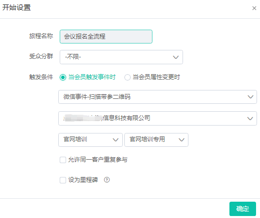
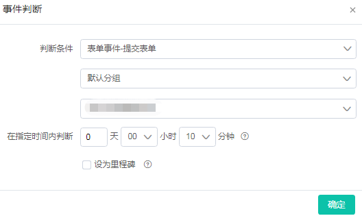
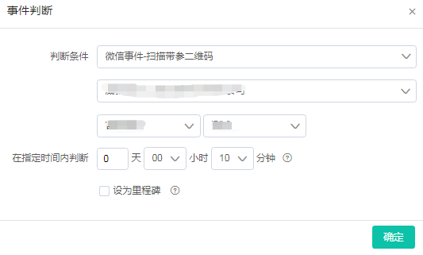
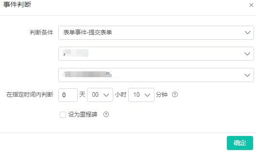
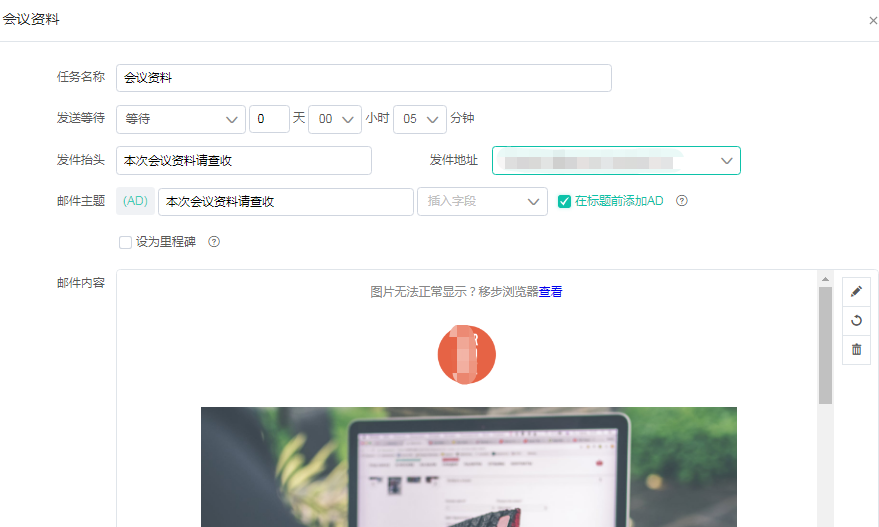

# 会议全流程自动化

我们以一个会议的流程来说明营销自动化的流程。

### 1.本次内容背景

邀请我们现有客户参加会议

### 2.目的

收集客户的具体信息，完善客户画像，获取更多的信息已备之后使用

### 3.难点

1. 会议从准备到完成时间周期较长，人力成本太大
2. 收集到的信息无法与客户做关联，或者关联耗时较长
3. 无法将客户在不同渠道的信息打通。

### 4.分析方法

1. 拆分任务，会议可在三个阶段收集信息：报名-签到-结束
2. 分别确定每个阶段可收集的数据，且让流程进行自动化运行

### 5.方案

建立一个会议全自动化流程，包含报名-签到-结束（也可拆分为多个，此处按照一个流程举例）。

#### 优势

1. 通过方案我们可以让整个会议全自动的进行
2. 在合理的时间段将用户的信息收集到平台内，且不会引起用户反感
3. 平台会将数据通过Dmartech系统进行内部数据清洗后，最终将用户的所有数据打通，实现用户画像的建设。

### 解析步骤-报名

#### 第一步.确定开始的节点-开始设置

1.首先在二维码列表和表单内创建好表单和二维码

2.受众分群：不限

3.触发条件：当会员触发事件时-微信事件-扫描带参二维码-公众号-二维码名称

#### 第二步.模板消息-通知用户

扫码后会在公众号内给用户推模板消息，告知用户可点击模板报名

#### 第三步.事件判断-可以判断用户是否打开表单

事件判断可判断扫码的这些用户哪些打开表单，哪些未打开。

#### 第四步.添加标签

若是用户没有打开表单可以给这些用户打上“未打开报名表单”的标签进行识别

#### 第五步.事件判断-是否提交报名表单

若是用户打开表单，我们就可以在表单内以报名来收集用户的部分信息

#### 第六步.添加标签

若是用户未提交表单，我们同样可以给这部分用户打标签“打开未提交”来区分

#### 第七步.添加标签

若是用户提交表单，我们需要打上“已报名”的标签，为了未来的签到提供基础帮助

#### 第八步.短信提醒

在会议开始的前一天可以自动发送短信来提醒用户

**以上就是会议全流程旅程内报名阶段的搭建流程和规则**

### 解析步骤-签到阶段

#### 第一步.事件判断-通过扫码确定是否签到

当会议开始签到时，可让用户扫描新二维码来签到

#### 第二步.添加标签-通过是否扫码来确定签到人数

所有扫码的用户默认为已签到，我们会打上“已签到”标签；而所有未扫码的用户我们会打上“未签到”的标签。

#### 第三步.模板消息-扫码签到成功发送通知

所有扫码的用户代表签到成功，且通过下发模板消息来给到用户提醒，起告知的作用。

**以上就是会议全流程旅程内签到阶段的搭建流程和规则**

### 解析步骤-结束阶段

#### 第一步.事件判断-获取资料

当会议结束后，我们可以让用户扫描新二维码填写表单，主要是填写邮箱地址，我们来将本次的资料发到用户的邮箱内。

#### 第二步.添加标签-通过是否提交来确定人数

未提交的我们可以打上“未领取”的标签，已提交的可以打上“已领取”的标签

#### 第三步.邮件-下发会议资料

通过表单收集到的邮箱，可以将本次会议资料发送到对方邮箱内

通过营销旅程搭建的会议全流程，可以按照各自活动内容和要求，在用户无感知或者自愿的情况下收集到信息，有利于我们搭建用户画像。

