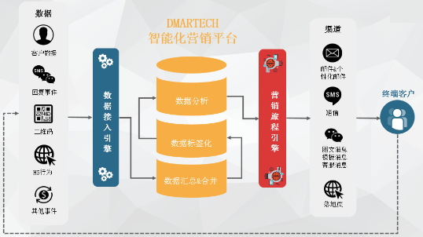

# Dmartech是什么？

### 1.Dmartech简介

Dmartech是一款SaaS软件，无需安装与下载，连接网络即可登入系统获取服务与数据。

为了保障良好的使用体验，建议采用**Google Chrome浏览器（谷歌浏览器）**登录系统进行操作。

Dmartech是一款智慧营销平台，基于SCRM、营销旅程等模块，实现数据与场景的紧密结合，为企业打造从 全渠道数据连接、营销自动化、多维数据分析到场景应用及定制开发的营销闭环。

### 2.Dmartech产品优势

* 私有化部署
* 数据多渠道采集建模
* 多维度数据分析
* 自动化营销

### 3.Dmartech数据安全问题

* 在线数据方面，主要是以HTTPS安全访问模式防止数据泄露； 
* 关于落盘数据，主要是对关键信息进行加密存储防止数据泄漏后关键信息的遗失；
* 运维方面，我们公司有完善的数据灾备和恢复机制；每日进行备份；
* 数据的使用方面，我们有完整的数据访问权限控制机制，即ISO27001认证； 
* 企业版的客户可以进行更细致的数据权限划分，敏感字段（如手机，邮箱等）屏蔽，及创建数据共享规则；
* 数据的导入导出，这类操作都有全面的日志记录，可随时追溯查询； 
* 对于数据分析和计算之类的场景，在使用时也都是使用沙盒、脱敏等措施来保障关键数据等安全性。 
* 全程SSL加密安全连接/企业信息独立算法加密/24小时反恶意探测7层加密/企业账号访问三重权限控制机制。





