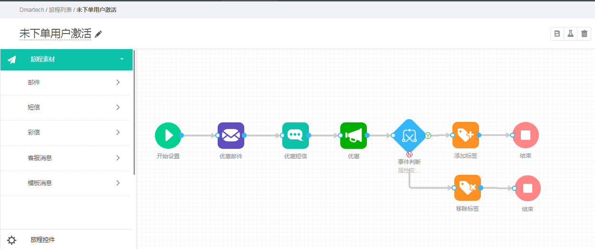
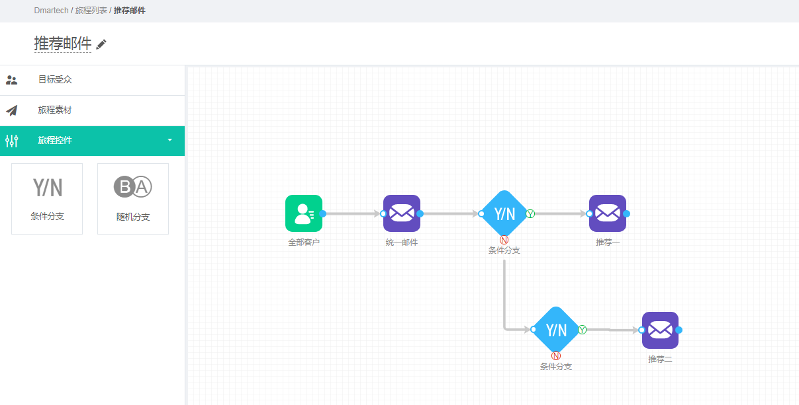
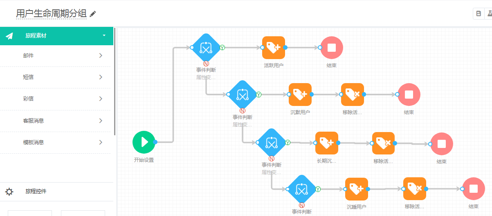
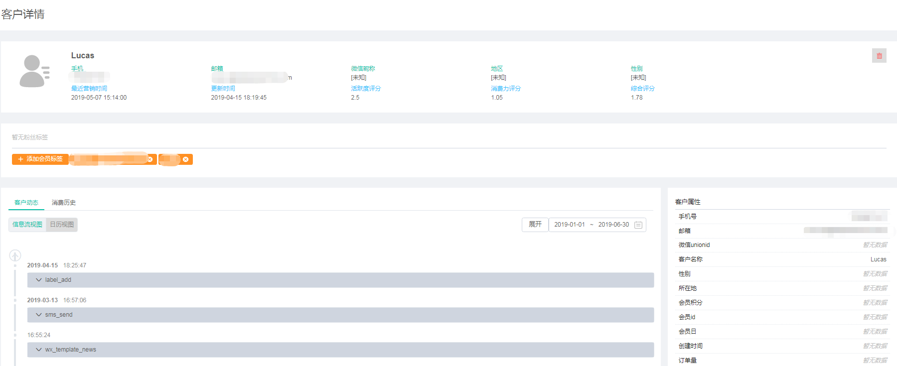

# Dmartech怎么做

为了让您更加直观的知道我们怎么做，这里简单举个电商用户生命周期的例子。

### **以电商用户生命周期举例**

以下是简单且常见的电商用户生命周期，用户进入产品后一共经历五个阶段

### 常见问题：

> **1.用户来到产品就是我们的真实用户**
>
> 其实并非这样，真实的用户是最少完成过一次产品的核心流程对于电商来说即完成一次购买闭环，且当前还在活跃状态。
>
> **2.只要经过了新手期的用户就不会离开我们产品**
>
> 用户可以在任何时候离开产品，只要他们发现产品对他们没有任何帮助的时候，所以我们要让所有用户都集中到成熟期。
>
> **3.我们只要将产品内的优质商品推荐给用户，用户就会来购买**
>
> 其实用户关心的是自己真正需要的，而不是热门的。
>
> **4.流失的用户就不会再回来使用产品**
>
> 若营销做得好，且确实有商品是流失用户所需要的，那么当流失用户有自己需要的商品仍会回来购买；且吸引一个新用户转化成本是召回流失用户的10倍不止，所以召回流失用户是必要的。

### Dmartech解决方案

**1.给潜在用户建立自动化营销，让其进入新手期**

使用Dmartech自动化营销功能给注册未下单的潜在客户打标签，统一定时通过不同渠道发送营销内容，结合您的平台可查看到用户最终是否被激活下单

**2.个性化推送邮件-给用户推荐包含他喜欢的商品的邮件**

根据用户打开邮件内链接所属的商品，推荐类似商品的邮件

**3.建立用户生命周期旅程，给符合条件的用户打上标签，所有用户所处阶段一目了然**

可查看到当前每个用户的生命周期、习惯、历史行为和消费历史等，针对不同用户结合2的个性化邮件，精细化运营用户。



