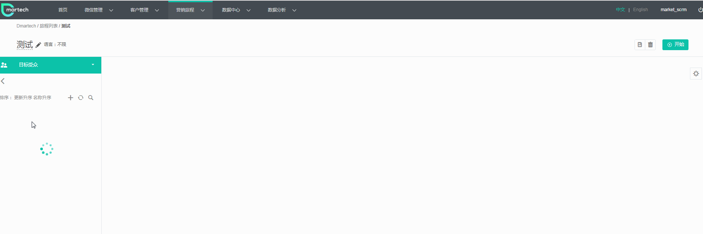
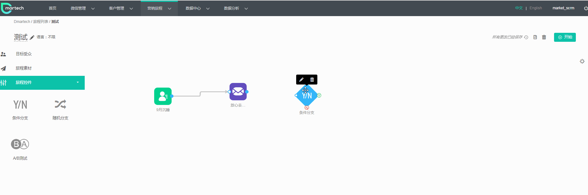
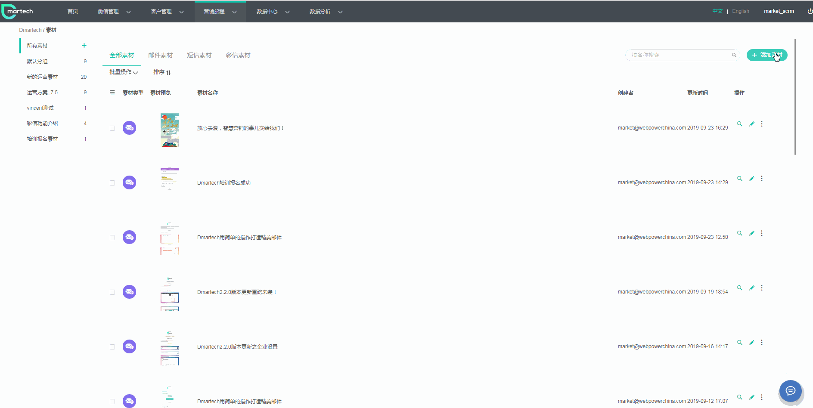
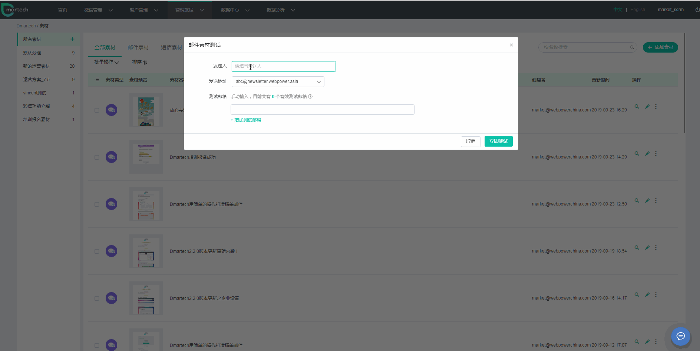
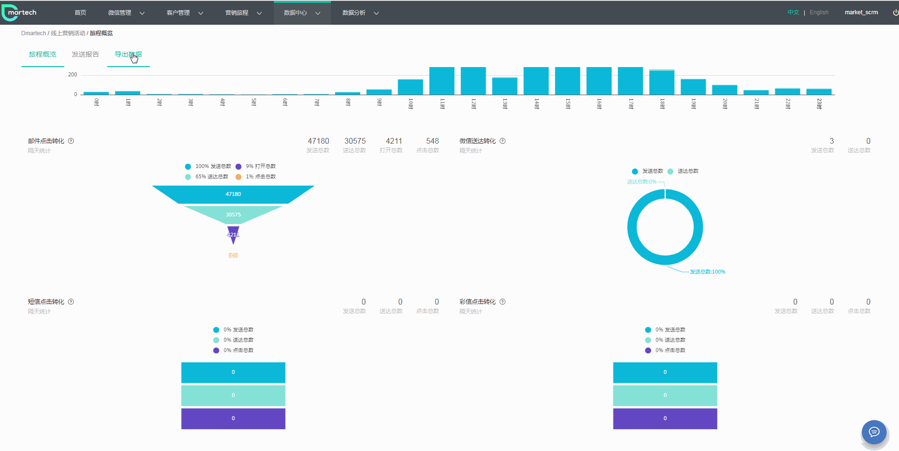

# Dmartech功能介绍

### 邮件篇

#### 邮件发送如何更高效

告别冗长的发送流程，简单拖拽，搞定单次发送。

邮件效果不理想？没关系，再给48小时没打开邮件的用户发条短信吧，很简单，只需2步就搞定。

#### 邮件制作如何更高效

还在为邮件制作苦恼吗？要找人设计，要求人Coding，别人还要排期来做.....有了拖拽编辑器一切就简单许多啦！一个人就能快速搞定！不信你瞧：

快速把制作好的发送给自己看看效果：

#### 邮件及短信报告

报告也很简单直观，想导出原始数据还是发送数据，完全没问题！

