# Forms Creation and Management

Forms are an important tool for collecting contact information. Dmartech can not only create forms to collect form information, but also use form events \(e.g., open form, and submit form\) as important filter criteria of the marketing journey, and trigger different journey settings based on the content of the form. Form is an important marketing tool and means.

## Create a form

**Step 1** Choose **Marketing &gt; Form** from the main menu. The forms list page is displayed. 

There is a built-in group named default group in Dmartech. Click next to All grouping to create a new group by yourself: enter Group Name, select the superior group \(All grouping by default\). You can create up to 4 levels of groups under All grouping. The new form will be created in default group if no group is added. 

Generally, it is recommended to set groups according to marketing scene or creator or department because it is easy to find and manage forms.

**Step 2** Click “Add Form“ at the top right corner to start form creation.

**Step 3** To set which group will the form belong to, you can select an existing group, or you can directly create a new group by selecting create group. The default selected group is the selected group when clicking Add Form button. Then click Dmartech form in create method.

**Step 4** In the form Setting page, set Form name and HTML name. HTML name is used to name the HTML file when exporting the HTML code of the form. The edit area includes three part: field list, display area and field setting area from left to right. 

Click the field on the left to add the field to the display area. Among all fields in the field list, some commonly used fields can be found in contact information and can be used by just clicking. Click the field type in Field type to add the corresponding type of field in the display area. The Field Name of the field needs to be set manually.

Step 5Click the field in the display area to set the corresponding parameters in the Field setting area. Different field types have different parameters. 

For example, if you need to set a field named Country, click the Drop list field type, and then set parameters below on the right side: 

* **Field Name**: Country 
* **HTML name**: Country 
* **Drop-down options**: It is supported to add items manually or upload from an excel file. 
* **Custom default options**: Set the default option. For example, the default country is China. 
* **Prompt**: Set prompt text which will be displayed below the field. 
* **Verification**: Set the field verification such as whether it is required and custom error prompt \(a prompt when the item is incorrectly filled in\).

Among them, the Subscription field is associated with the system's global subscription. If the form submitter submits a subscription as "Yes", it will enter the subscription group. 

**Step 6** After setting all the fields of the form, click “next step" at the bottom right corner to enter the Field Matching tab page. The purpose of this step is to match the fields set in the form with the user attributes of Dmartech so that the data collected by the form can be imported to Dmartech correctly. 

Just to select the corresponding field name of Dmartech meta data from the drop-down list on the right.

**NOTE** 

_Before creating the form, it is required to create all the form fields by choosing Data center &gt; Meta data &gt; User properties in advance._

**Step 7** __After matching all fields, click "complete" to complete the creation of the form. You can view the form link, form QR code and "export HTML" at the top right side of the page, and you can place the form by copying the form link or scanning the QR code. 

Generally, it is recommended to test whether the form content is correct and whether the data can import to Dmartech successfully after submitting it first. The scenarios of various verification errors should also be considered. 

Click "export HTML"  to download the HTML code of the form, which can be used for secondary development and style design.

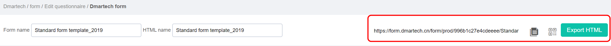

**Step 8** The form set includes 5 parts as the figure shows below: Setting and Field Matching are the required settings to create a form. The other three parts of the setting can be set according to the requirements after the form is created.

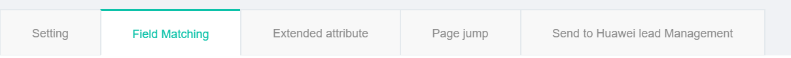

i.Extended attribute Tab Page 

The extended attribute is an additional attribute value added after the form, and it is used to mark the data source. Set an extended value and click "+" to continue inputting \(up to 3 can be added\). Then click "Generate link" to generate a link with extended values. You can copy it and use the link in other places.

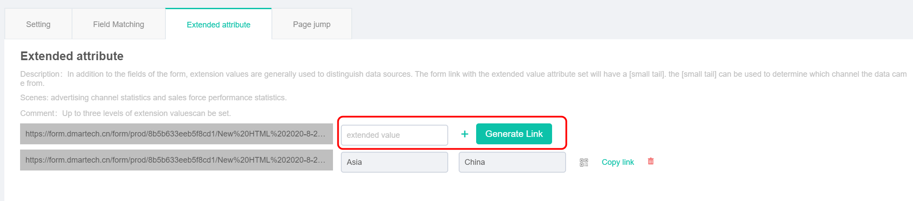

For example, if you add Asia, China for extended values, and the generated form link is as follows:[https://form.dmartech.cn/form/prod/8b5b633eeb5f8cd1/New%20HTML%202020-8-24%2013:58:34.html?id=507&x\_field\_1=Asia&x\_field\_2=China&x\_field\_3=](https://form.dmartech.cn/form/prod/8b5b633eeb5f8cd1/New%20HTML%202020-8-24%2013:58:34.html?id=507&x_field_1=Asia&x_field_2=China&x_field_3=)

ii.Page jump Tab Page Page

 jump setting is to set how to jump after the form is submitted. The scenarios include successful submission and failed submission. 

The default jump method is jumps to a specified link according to the hidden field, which is configured in the form by GOTOURL field. The specified link will be jumped to if the field has a value. Otherwise, it will be based on the set Default submit page jump to jump to Default success.

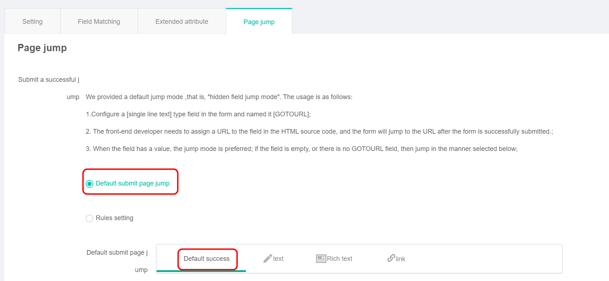

After submission:

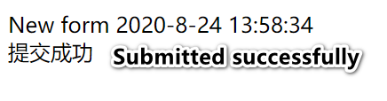

You can also set the text, Rich text, and link to jump after submission. 

All users will be jumped to the same page after submitting the form with the above jump method.

 If you want to jump to a different page based on the value submitted by the user in the form, please select Rules settings.

**NOTE** 

_Different jump pages can only be set according to the value of one field._

Set the field name, then fill in the Field value and which link address will be jumped to. 

For example, select the field named interested\_product and set other parameters as the figure shows below. Then the router product page will be jumped to when the field value equals router. The mobile product page will be jumped to when the field value equals mobile. The homepage of HUAWEI online shopping mall will be jumped to when the user does not submit any set value.

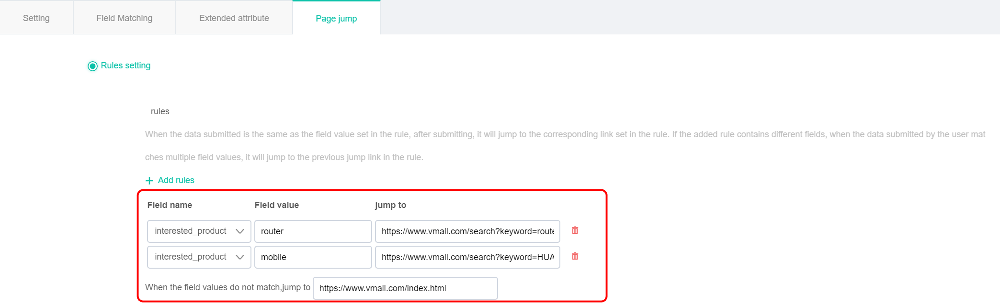

Set a link to the failed page in Submit a failed jump link which is used in the case of failed submission.

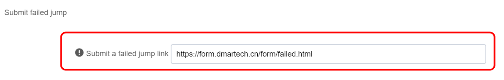

iii.Send to Huawei lead Management Tab Page 

Dmartech supports send collected data to HUAWEI lead management system. The default setting is to Send all form data, which indicates all the data collected in the form will be synchronously sent to the HUAWEI lead management system in real-time.

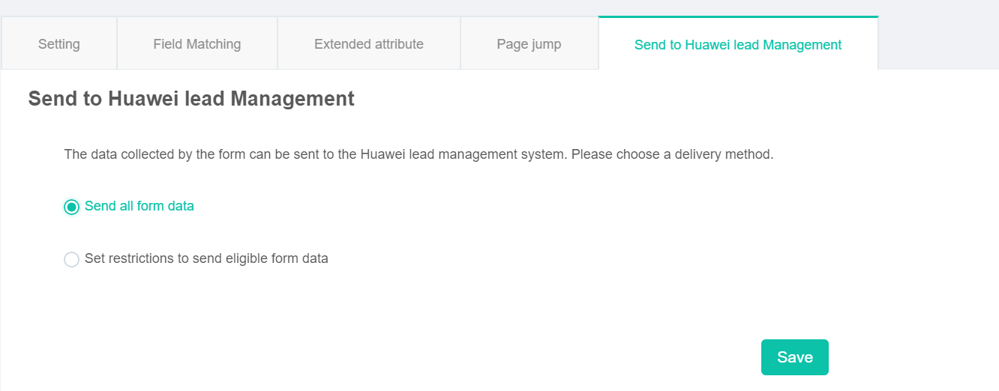

If you only need to send data that meets some filter criteria, just select Set restrictions to send eligible form data to set filter criteria.

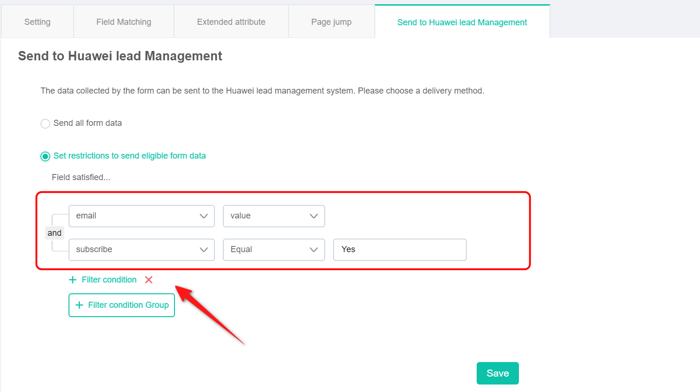

Click "filter condition group" to add a condition group, and click "filter condition" to add a specific filter criterion in the condition group, such as email has value. The relation between Condition groups and filter criteria can be freely set with and or or.

 Click "save" after the settings are completed. After the form is released, the data submitted by the submitter will be automatically sent to the HUAWEI lead management system according to the set rules. 

**Step 9** You can share the form with other accounts after setting the form. Click the icon in the Actions column of the forms list page, you can choose which account to share with and check the permissions that the sharer can operate.

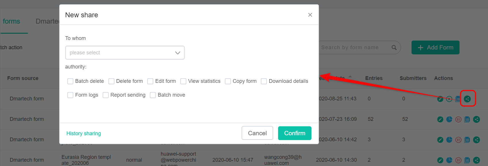

All of the above is how to create a Dmartech form.

### View the Report of Form 

Choose Marketing &gt; Form from the main menu. In the Actions column of the forms list page to view the form submission statistics report, which shows the times and numbers of form submissions, and the submitted information details table.

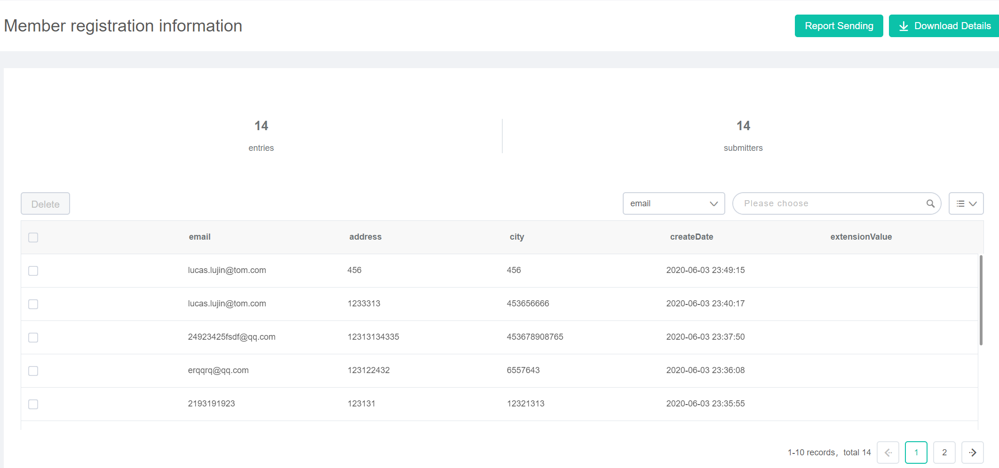

