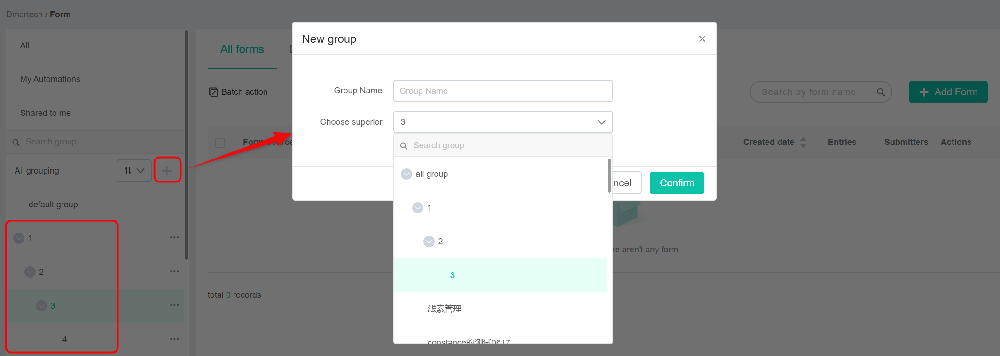
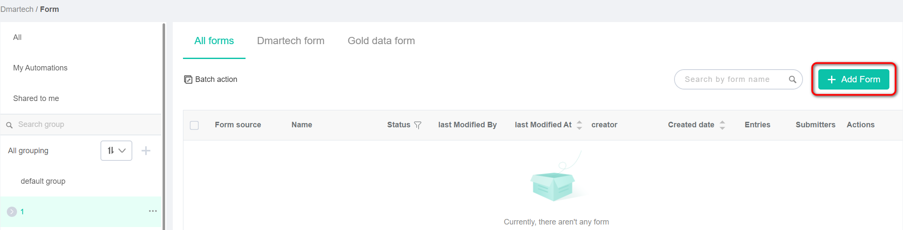
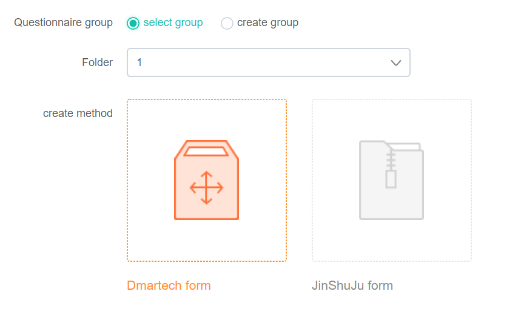
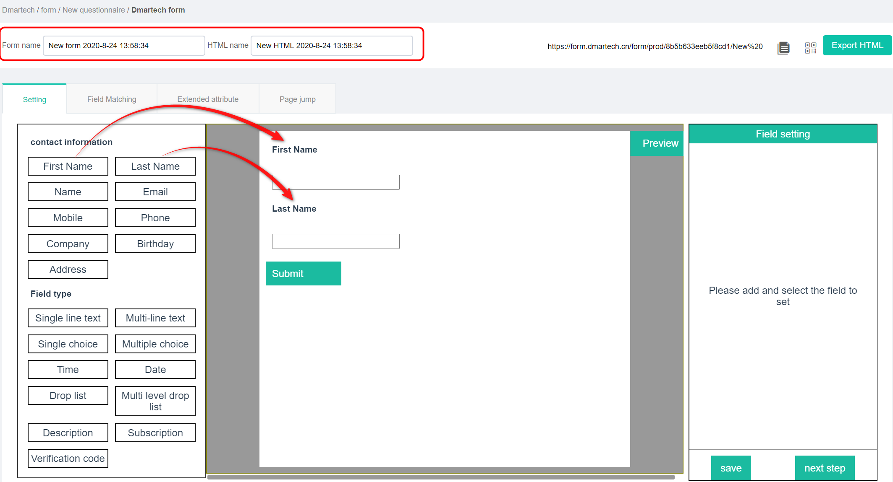
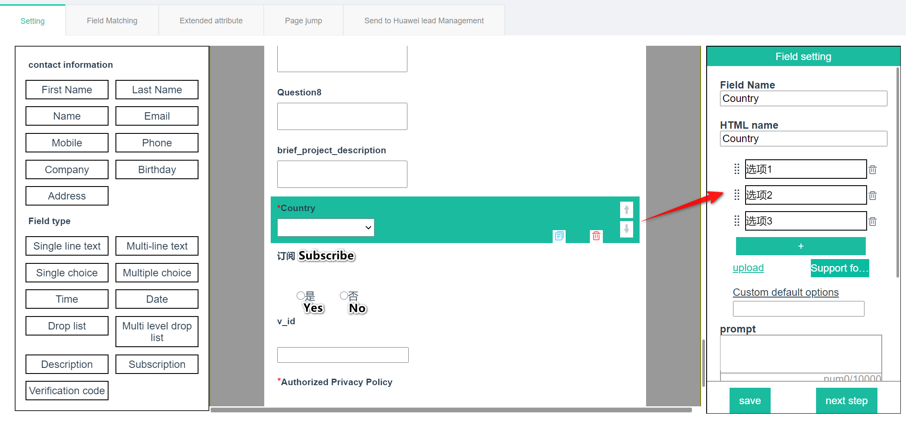
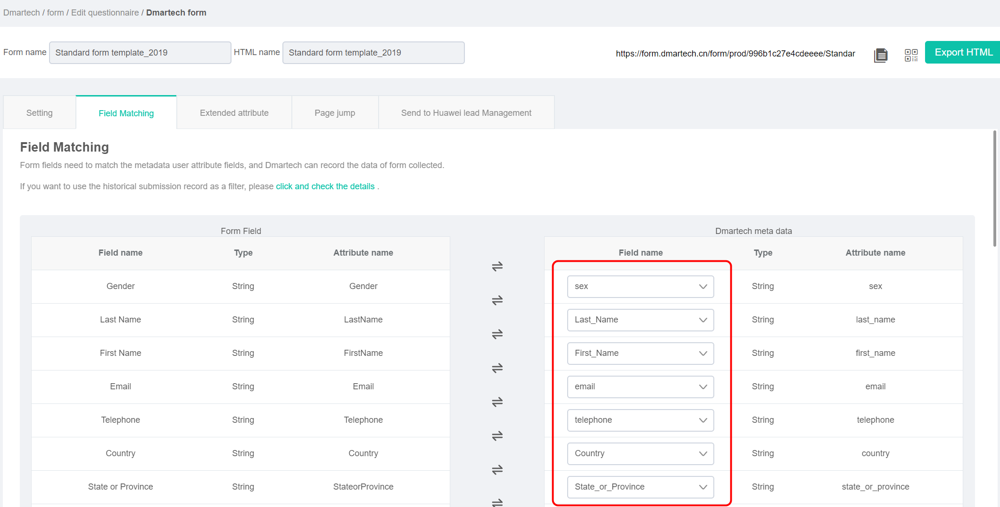

# Forms Creation and Management

Forms are an important tool for collecting contact information. Dmartech can not only create forms to collect form information, but also use form events \(e.g., open form, and submit form\) as important filter criteria of the marketing journey, and trigger different journey settings based on the content of the form. Form is an important marketing tool and means.

## Create a form

**Step 1** Choose **Marketing &gt; Form** from the main menu. The forms list page is displayed. 

There is a built-in group named default group in Dmartech. Click next to All grouping to create a new group by yourself: enter Group Name, select the superior group \(All grouping by default\). You can create up to 4 levels of groups under All grouping. The new form will be created in default group if no group is added. 

Generally, it is recommended to set groups according to marketing scene or creator or department because it is easy to find and manage forms.

**Step 2** Click “Add Form“ at the top right corner to start form creation.

**Step 3** To set which group will the form belong to, you can select an existing group, or you can directly create a new group by selecting create group. The default selected group is the selected group when clicking Add Form button. Then click Dmartech form in create method.

**Step 4** In the form Setting page, set Form name and HTML name. HTML name is used to name the HTML file when exporting the HTML code of the form. The edit area includes three part: field list, display area and field setting area from left to right. 

Click the field on the left to add the field to the display area. Among all fields in the field list, some commonly used fields can be found in contact information and can be used by just clicking. Click the field type in Field type to add the corresponding type of field in the display area. The Field Name of the field needs to be set manually.

Step 5Click the field in the display area to set the corresponding parameters in the Field setting area. Different field types have different parameters. 

For example, if you need to set a field named Country, click the Drop list field type, and then set parameters below on the right side: 

* **Field Name**: Country 
* **HTML name**: Country 
* **Drop-down options**: It is supported to add items manually or upload from an excel file. 
* **Custom default options**: Set the default option. For example, the default country is China. 
* **Prompt**: Set prompt text which will be displayed below the field. 
* **Verification**: Set the field verification such as whether it is required and custom error prompt \(a prompt when the item is incorrectly filled in\).

Among them, the Subscription field is associated with the system's global subscription. If the form submitter submits a subscription as "Yes", it will enter the subscription group. 

**Step 6** After setting all the fields of the form, click at the bottom right corner to enter the Field Matching tab page. The purpose of this step is to match the fields set in the form with the user attributes of Dmartech so that the data collected by the form can be imported to Dmartech correctly. 

Just to select the corresponding field name of Dmartech meta data from the drop-down list on the right.

**NOTE** 

_Before creating the form, it is required to create all the form fields by choosing Data center &gt; Meta data &gt; User properties in advance._

**Step 7** __After matching all fields, click to complete the creation of the form. You can view the form link, form QR code and at the top right side of the page, and you can place the form by copying the form link or scanning the QR code. Generally, it is recommended to test whether the form content is correct and whether the data can import to Dmartech successfully after submitting first. The scenarios of various verification errors should also be considered. Click to download the HTML code of the form, which can be used for secondary development and style design.

