# 企业设置

依次点击平台右上角“账户名称”-“企业设置”进入企业设置操作界面。

## 组织成员\(标准版、专业版客户专享\)

设置组织架构以及各部门的成员账号。左侧为组织架构部门树，“新建部门”建立部门架构，点击右上角“新建成员账号”，可创建成员账号。

 创建成员账号时，设置子账号基本信息、所属部门、所属安全组（子账号的权限为该安全组设置的权限）、模块许可（子账号许可的模块，未许可模块不可用）。

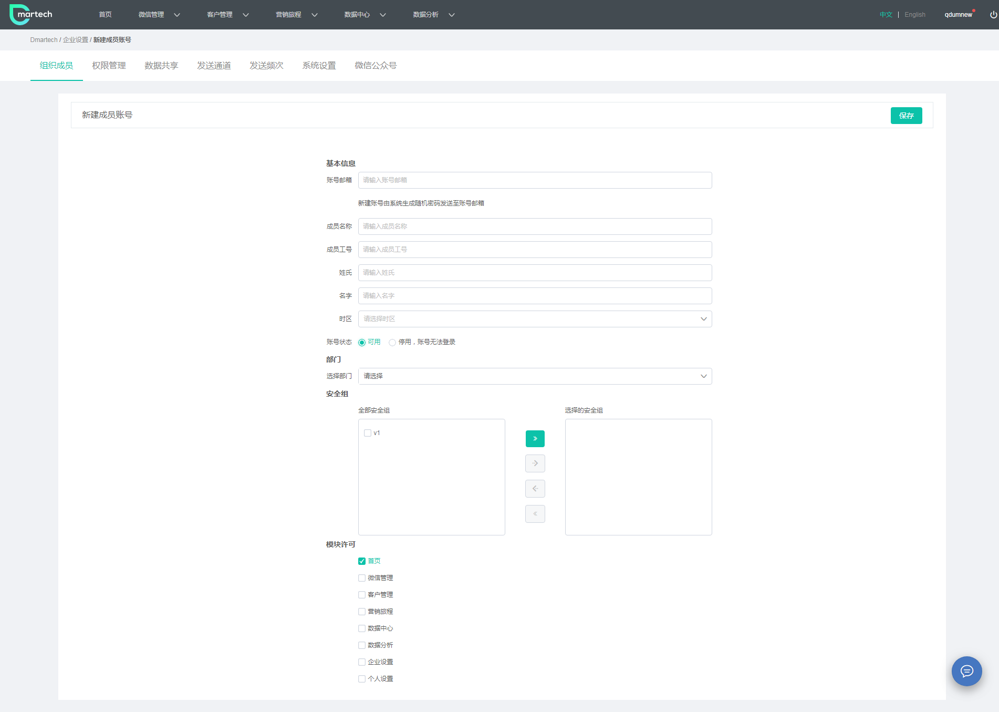

## 权限管理\(标准版、专业版客户专享\)

### 安全组

权限管理为安全组配置操作权限、管理权限和数据权限。安全组分组管理，左侧为安全组分组，点击右上角“新建安全组”进行创建。

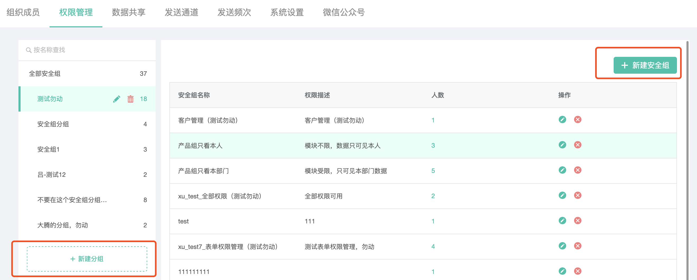

首先创建安全组基本信息：名称、分组、复制安全组、描述等。 其中,复制安全组：可使用已创建好的安全组，功能类似于复制安全组。

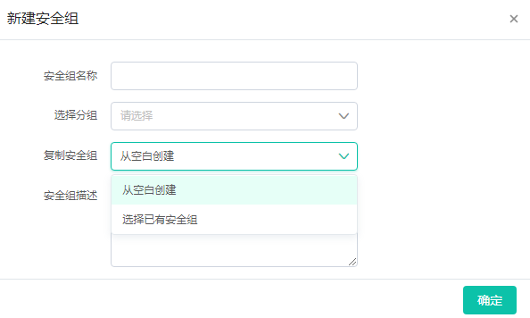

基本信息创建后，便可为安全组配置权限。

### 操作权限

勾选功能权限，配置安全组可操作的页面和可执行功能，不勾选代表无法查看相关页面、无法执行相关功能。

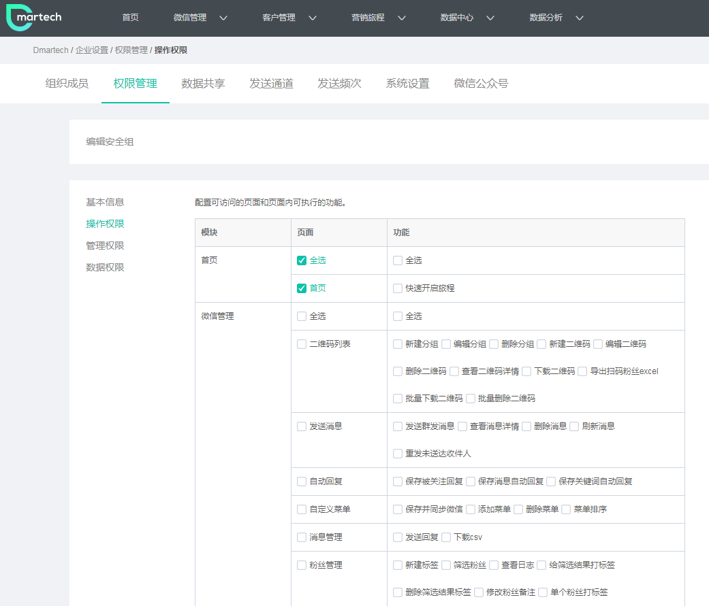

### 管理权限

勾选管理权限，配置安全组关于“企业设置”模块内的功能权限，不勾选代表无法查看相关页面、无法执行相关功能。

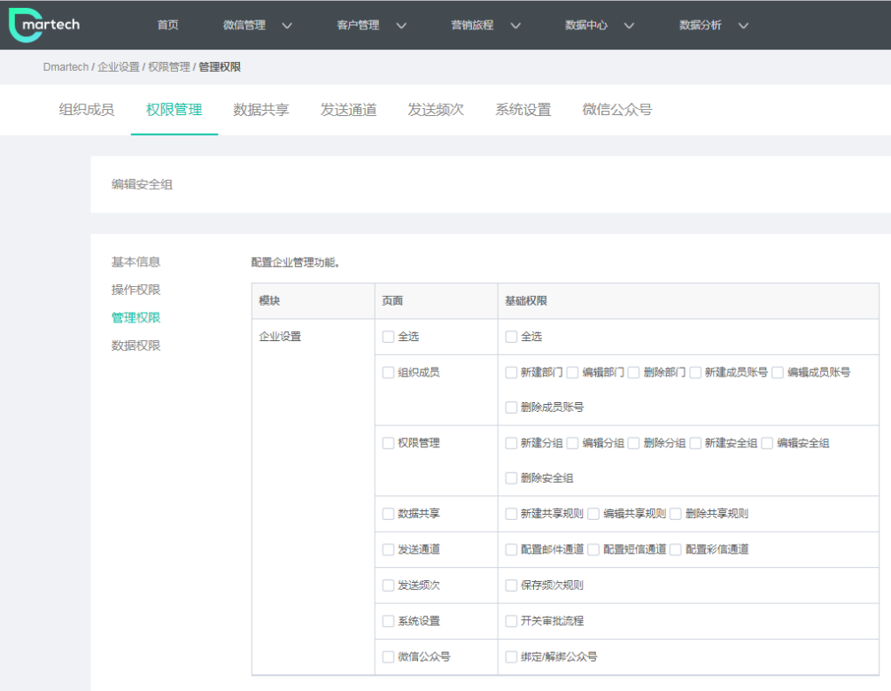

### 数据权限

勾选数据权限，配置账号可见的数据范围 

a\)全组织数据：所有成员账号内的数据 

b\)本人数据：仅此账号的数据 

c\)本部门数据：组织架构中与账号在同一层级内的数据 

d\)下级部门数据：组织架构中账号所在层级的下一层级内的数据 

e\)共享数据：通过“数据共享”共享到的数据

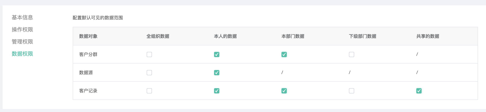

### 字段权限

字段是元数据-用户属性内的所有字段，勾选后此成员可见该字段

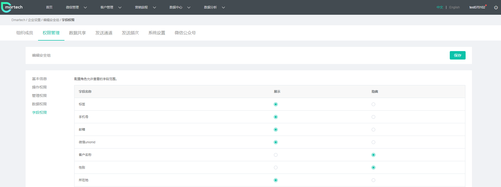

## 数据共享（专业版客户专享）

数据共享是将本账号内的数据共享给其他安全组。

#### 客户共享：

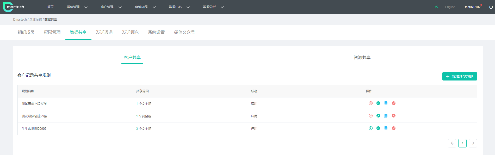

点击“添加共享规则”创建共享规则

a）规则名称：所创建规则的名称 

b）共享数据：通过条件筛选出所要共享的数据 

c）安全组：选择要将数据共享给哪个安全组 

注：规则名称后开关代表是否启用这个规则，打开则代表将数据共享给了选中的安全组。

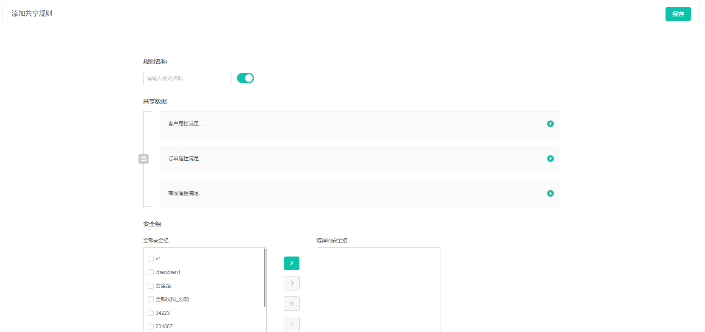

#### 资源共享

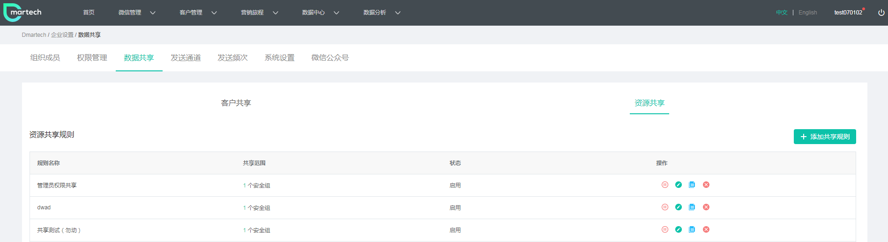

点击“添加共享规则”创建资源共享规则

a）规则名称：所创建规则的名称 

b）共享资源：通过条件筛选出所要共享的数据 

c）共享给：选择要将数据共享给哪个安全组 

d）选择给安全组共享的操作

注：规则名称后开关代表是否启用这个规则，打开则代表将数据共享给了选中的安全组。

## 发送通道\(标准版、专业版客户专享\)

发送通道是给不同的部门配置不同的发送通道权限

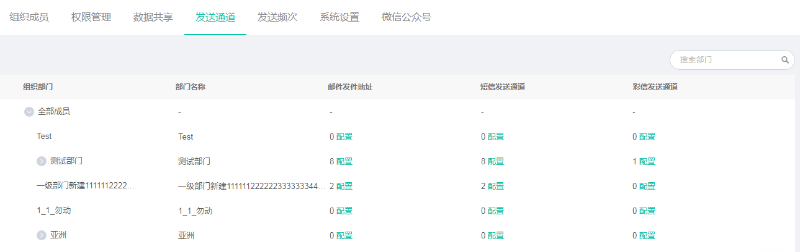

选择邮件发送地址、短信发送通道或者彩信发送通道，给对应部门配置不同的发送通道

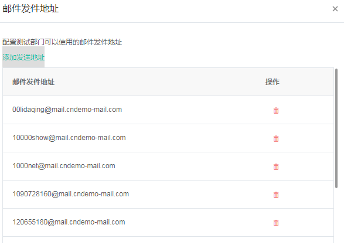

点击“添加发送地址”可给当前部门配置其他可用的发送地址

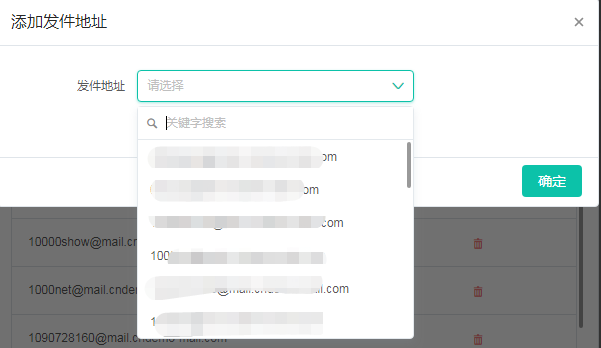

## 发送频次（专业版客户专享）

发送频次用于限制给用户发送消息的次数。

a）发送频次限制开关：“是”则代表启用频次限制，“否”则代表不限制

 b）运行周期：配置不同的发送周期，有四种方式：每天、每周、每月和自定义，表示在选择的时间段之内仅能按照限制的频次发送，当超过时间段后发送量清空并重新计算 

c）发送上限：邮件、短信、彩信、微信客服消息、微信模板消息分别限制的发送频次，按照次/人或者不限来划分 

d）当发送某一类型的消息给单个联系人的次数达到限制时，其他类型消息的发送限制设置

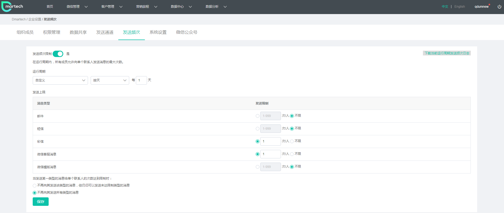

## 系统设置（专业版客户专享）

系统设置用于控制是否开始旅程审批功能，当开启该功能，所有的旅程可以申请审批，由审批人处理申请。此按钮关闭时，旅程中将看不到审批相关功能按钮。

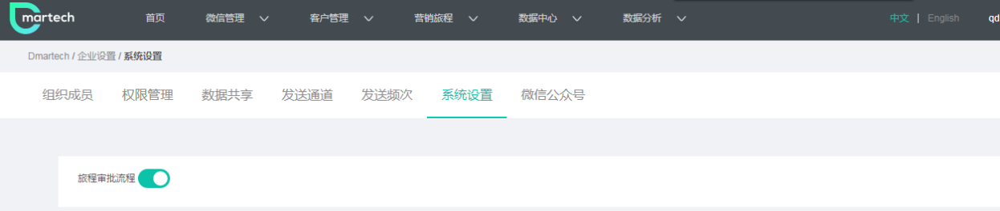

## 微信公众号

管理绑定的微信公众号，若未绑定公众号，点击右上角“绑定公众号”进行微信授权，在微信后台绑定你的微信公众号。

绑定后公众号信息显示在页面上。

如需更改已绑定的公众号，请在微信后台解绑当前公众号后重新绑定。

