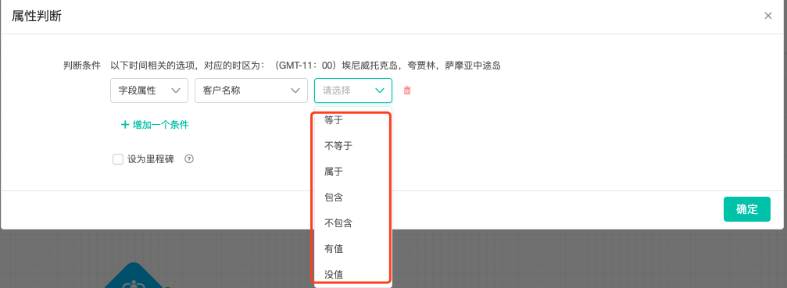
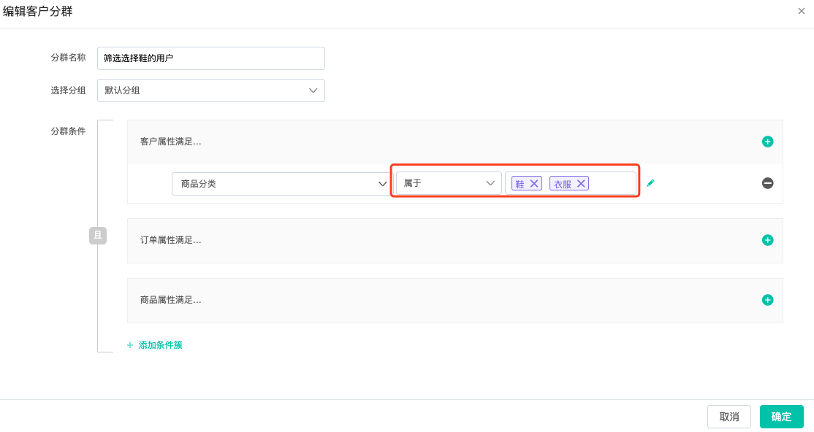

# 筛选条件说明

## 什么是筛选条件？

如果您看过“[控件说明](https://doc.dmartech.cn/ji-ben-gai-nian/kong-jian-shuo-ming)”章节的内容，那您一定对事件判断、属性判断、条件分支这类判断控件有印象，筛选条件就是判断符号，例如用户等于男，等于就代表筛选条件。

**由于筛选条件过多，本节专门做整理，方便您的查看**

### 筛选条件按照数据可分为以下几类：

#### 字符串类型

| 筛选条件 | 说明 |
| :--- | :--- |
| 等于 | 当属性或数据与判断值完全一致，才会进入到规定的流程分支 |
| 不等于 | 当属性或数据与判断值完全不一致，才会进入到规定的流程分支 |
| 包含 | 当属性或数据包含判断值，就会进入规定的流程分支 |
| 不包含 | 当属性或数据完全不包含判断值，才会进入规定的流程分支 |
| 有值 | 当属性或者数据字段中值不为空时，就会进入规定的流程分支 |
| 没值 | 当属性或者数据字段中值为空时，才会进入规定的流程分支 |
| 正则匹配 | 当属性或者数据字段中符合制定的正则条件的，才会进入规定的流程分支 |
| 正则不匹配 | 当属性或者数据字段中不符合制定的正则条件的，才会进入规定的流程分支 |
| 属于 | 当属性值等于选中的多个值内的任意值都算满足条件 |

#### “属于“详解：

案例：创建表单包含“商品分类“选项，“商品分类“包含鞋、衣服和零食，鞋包含皮鞋、运动鞋和高跟鞋，衣服包含西装、连衣裙和内衣，零食包含方便面、糖果和果冻。

当收集到用户的统计表后，我们要筛选出选择运动鞋、皮鞋、高跟鞋、西装、连衣裙和内衣内任意一个的用户，此时可使用“属于“运算符

因为“属于“运算符的含义是值等于筛选值内任意值。

在上图分群内使用“商品分类“属于“鞋、衣服“，就代表用户在“商品分类“内选中的值在“鞋“或“衣服“其中之一，即用户选择的值在运动鞋、皮鞋、高跟鞋、西装、连衣裙和内衣之内的其中之一。

#### 数值类型（整数和小数）

| 筛选条件 | 说明 |
| :--- | :--- |
| 等于 | 当属性或数据与判断值完全一致，才会进入到规定的流程分支 |
| 不等于 | 当属性或数据与判断值完全不一致，才会进入到规定的流程分支 |
| 大于 | 当属性或数据大于判断值，才会进入到规定的流程分支 |
| 小于 | 当属性或数据小于判断值，才会进入到规定的流程分支 |
| 大于等于 | 当属性或数据大于或者等于判断值，才会进入到规定的流程分支 |
| 小于等于 | 当属性或数据小于或者等于判断值，才会进入到规定的流程分支 |
| 有值 | 当属性或者数据字段中值不为空时，就会进入规定的流程分支 |
| 没值 | 当属性或者数据字段中值为空时，才会进入规定的流程分支 |
| 区间 | 当属性或者数据处于判断值的区间内，才会进入规定的流程分支 |
| 不在区间 | 当属性或者数据不在判断值的区间内，才会进入规定的流程分支 |

#### 时间类型

| 筛选条件 | 说明 |
| :--- | :--- |
| 汇总 | 属性时间与汇总时间一致的，才会进入规定的流程分支 |
| 绝对时间 | 属性时间必须与确定的时间相同，才会进入规定的流程分支 |
| 相对当前时间 | 属性时间与相对当前时间一致，则会进入规定的流程分支 |
| 相对当前时间区间 | 属性时间在相对当前时间区间内，则会进入规定的流程分支 |
| 有值 | 属性时间只要存在时间，就会进入规定的流程分支 |
| 没值 | 属性时间只要不存在时间，就会进入规定的流程分支 |

**部分解释：**

**汇总：**所有条件的总合

选中汇总后，需要选择时间单位周、月...，然后选择等于或者不等于，最后按照之前选中的时间单位选择时间点**。**

举例：我们选择创建时间-汇总-周-等于-每周一、每周五**，**就代表，筛选所有创建时间在每周一和周五的用户。

**相对当前时间：**选中此项，会出现选择天数，并且确定是在以内还是以前。

例如：相对当前时间点在1天之内，那么属性时间距离当前时间必须在1天之内；相对当前时间点在1天之前，那么属性时间距离当前时间超过1天

**相对当前时间区间**：时间在这个时间区间内

示例：选中相对当前时间区间，需要选择时间段，下图是过去1天至将来2天，就是筛选出以当前时间为参考点，在过去的24小时和未来的48小时内首次购买的用户。



