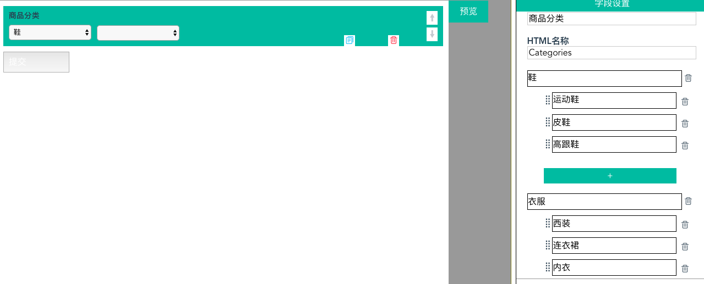
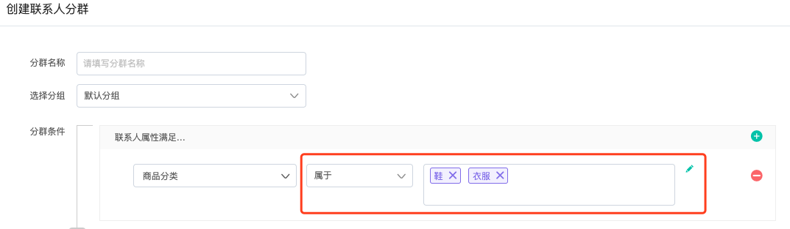
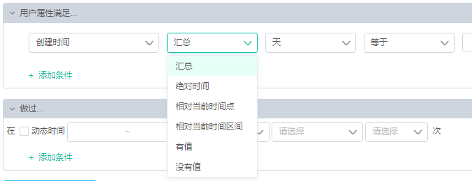

# 筛选条件说明

## 什么是筛选条件？

如果您看过“[控件说明](https://doc.dmartech.cn/ji-ben-gai-nian/kong-jian-shuo-ming)”章节的内容，那您一定对事件判断、属性判断、条件分支这类判断控件有印象，筛选条件就是判断符号，例如联系人性别等于男，“等于“就是筛选条件。

_**由于筛选条件过多，本节专门做整理，方便理解**_

### 筛选条件按照数据可分为以下几类：

#### 1）字符串类型

| 筛选条件 | 说明 |
| :--- | :--- |
| 等于 | 属性值与指定内容完全相同 |
| 不等于 | 属性值与指定内容不完全相同 |
| 包含 | 属性值内包含指定内容 |
| 不包含 | 属性值内不包含指定内容 |
| 有值 | 属性值不为空 |
| 没值 | 属性值为空 |
| 正则匹配 | 符合所设置的正则匹配条件 |
| 正则不匹配 | 不符合设置的正则匹配条件 |
| 属于 | 当属性值等于指定的多个值中的任意值都算满足条件 |
| 不属于 | 属性值不等于指定的多个值中的值 |

#### “属于“详解：

案例：创建表单包含“商品分类“选项，“商品分类“包含鞋、衣服和零食，鞋包含皮鞋、运动鞋和高跟鞋，衣服包含西装、连衣裙和内衣，零食包含方便面、糖果和果冻。

当收集到用户的统计表后，我们要筛选出选择运动鞋、皮鞋、高跟鞋、西装、连衣裙和内衣内任意一个的用户，此时可使用“属于“运算符

因为“属于“运算符的含义是值等于指定值内任意值。

在上图分群内使用“商品分类“属于“鞋、衣服“，就代表用户在“商品分类“内选中的值在“鞋“或“衣服“其中之一，即用户选择的值在运动鞋、皮鞋、高跟鞋、西装、连衣裙和内衣之内的其中之一。

#### 2）数值类型（整数和小数）

| 筛选条件 | 说明 |
| :--- | :--- |
| 等于 | 属性值等于指定数值 |
| 不等于 | 属性值不等于指定数值 |
| 大于 | 属性值大于指定数值 |
| 小于 | 属性值小于指定数值 |
| 大于等于 | 属性值大于或等于指定数值 |
| 小于等于 | 属性值小于或等于指定数值 |
| 有值 | 属性值不为空 |
| 没值 | 属性值为空 |
| 区间 | 属性值介于某数值区间内 |
| 不在区间 | 属性值在某数值区间之外 |

#### 3）时间类型

| 筛选条件 | 说明 |
| :--- | :--- |
| 汇总 | 对时间类型属性值汇总（按分钟、小时、天、周、月、季度），随后继续筛选等于或者不等于指定值 |
| 绝对时间 | 具体的指定“年月日时分“时间区间 |
| 相对当前时间点 | 与该判断条件执行时间点点多少天之外或之内，比如5天之内 |
| 相对当前时间区间 | 相对现在时间的过去或未来的两个时间区间，比如过去5天至未来5天 |
| 有值 | 时间类型属性值不为空 |
| 没值 | 属性值为空 |

**补充解释**

**汇总举例**：我们选择创建时间-汇总-周-等于-每周一、每周五**，**就代表，筛选所有创建时间在每周一和周五的用户。



