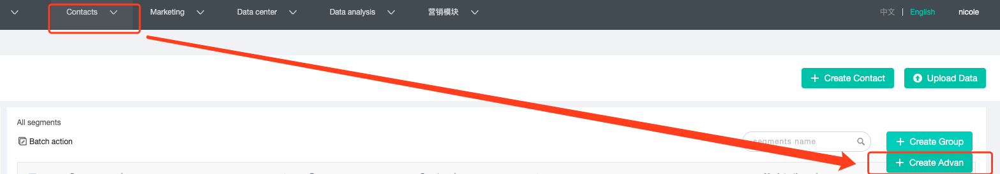
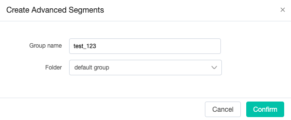
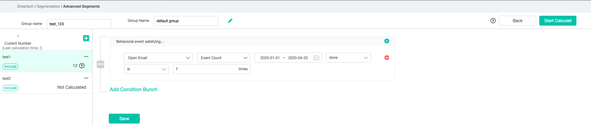
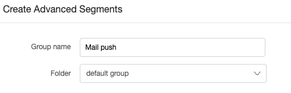
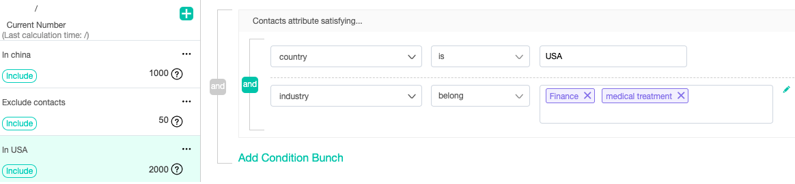

# Advanced segmentation

Advanced Segmentation is different from Standard Segmentation. It can contain multiple Standard Segmentation as sub-segment, and these sub-segments are calculated by "include" and "exclude".  Advanced grouping is suitable for more complex screening conditions. It also require additional time for data processing. So make sure that the conditions are what you need when processing advanced grouping calculations.

1. Click "Contact-Segmentation", move the mouse to "Create Group" and click "Create Advanced Group" to add a new advanced group.

2. Enter the name of the advanced group and the select a folder.

3. Move the "Add" button on the left to create a "new sub-segment" or copy an existing segmentation.

4. Define the conditions and rules of sub-segment, then click "save" to finish this step. 

5. Hover  ...  of sub-segment to view the available actions .

6. You can add up to 20 sub-segment, then click "Start calculation" to process the calculation. During data process, this advanced segmentation will remain "Calculating" status until it finish.  

Notice： 

* Up to 20 sub-segment of 1 advanced segmentation. 
* The advanced group will count 100,000 people per minute.
* The advanced group have four status:
  * Not Calculated： Calculating, 
  * Completed：Data calculation has finished.  
  * Calculating:  being calculated.
  * /:  It's a shared advanced segment, need to copy for use.

**Only the advanced group with "Completed" status can be selected for use in the journey.**

**All advanced segmentation will automatically have a mark ♔ in front of their name to make the recognition easily.** 

 

**Example：** 

Our scenario will have 3 group of people, and we want to make an advanced segmentation to find them, here are the rules of groups： 

* group 1：Country = “China”, AND Job title = “CEO”
* group 2：Country = “China", AND have open email = "test"
* group 3：Country = “USA",  AND Industry = "Finance" OR "medical treatment"

So we want the result of Group 1 + Group 3 but exclu Group 2. So here are some steps: 

 1.  Add a new advanced group: Mail push

2. Click Add sub-segment, and create our Group 1 like this: 

3.Click Add sub-segment, and create our Group 2 like this: 

4.Click Add sub-segment, and create our Group 3 like this: 

5. Switch Group 2 to "exclude" by hover on "..." .

6. Last step, click "start Calculation" button to get what we need. 

