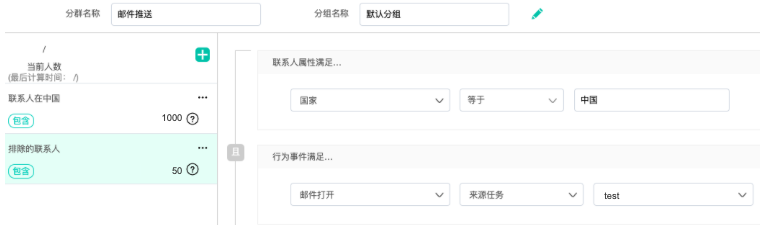
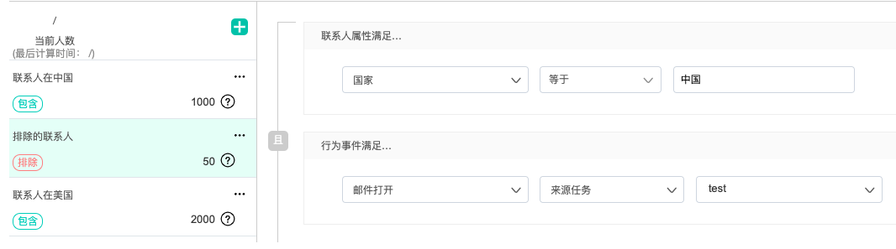
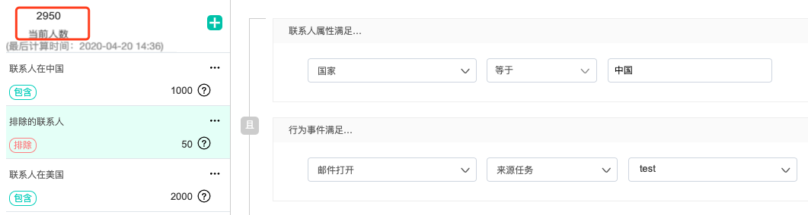

# 高级分群

## 创建高级分群

依次点击菜单“联系人管理“—联系人分群“，进入联系人分群页面，鼠标移至“创建分群”下方会出现“创建高级分群“，点击进入高级分群创建

1、首先填写分群名称，并设置分组，点击确定后进入分群设置页面

2、新创建的高级分群页面是空的，需要点击左侧栏上方的“+“号图标新建子分群；复制已有分群是当该分群中已经有子分群时，可以复制；

3、点击“新建子分群“后，设置子分群名称，点击确定，页面右侧会出现一个子分群

4、设置子分群的筛选条件，新建的子分群人数为“未计算“状态，点击“保存“会自动计算出子分群人数。

5.默认子分群关系为“包含（该高级分群包含该子分群下的联系人）“，点击子分群“…”可切换分群关系为“排除（该高级分群需排除该子分群下的联系人）“

比如：某高级分群含两个子分群，子分群1关系为包含，子分群2关系为排除，则高级分群的总人数=子分群1人数-子分群2人数；当子分群1关系为包含，子分群2关系为包含，则高级分群的总人数=子分群1+子分群2的人数；

6.可继续点击“+“创建更多子分群或复制子分群，当各子分群规则配置完成后，点击页面右上角“开始计算”按钮，可计算高级分群下的总人数。在计算过程中，点击“返回列表”可进行其他操作，该高级分群会继续计算，直到计算完成。 

注： 

1） 每个高级分群下子分群最多创建20个 

2）高级分群每分钟会计算10万人

3）高级分群有“未计算、计算中、计算完成、/”四种状态

* “未计算”：未点击“开始计算”计算过程分群
* “计算中”：正在计算的分群为“计算中” 
* “计算完成”：分群计算完成后显示计算完成 
*  “/”其他成员共享给本人的高级分群。 

4）只有“计算完成”的高级分群才能在旅程内作为受众使用

## **高级分群案例**

共三个子分群： 

* 子分群1：国家=中国，职位=CEO 
* 子分群2：国家=中国，打开邮件=test 
* 子分群3：国家=美国，行业=金融或者医疗

此次需要筛选的高级分群条件为包含子分群1、排除子分群2、包含子分群3，高级分群人数=子分群1—子分群2+子分群3

 1.进入“联系人管理”，点击“创建高级分群”，输入分群的名称和所属分组

2.创建子分群1，名称为“联系人在中国”，子分群条件是“国家=中国，职位=CEO”，即此分群被筛选到的1000个联系人都在“国家=中国，职位=CEO”内

3.创建子分群2，名称为“排除的联系人”，子分群条件是“国家=中国，且打开过邮件=test”，即此分群被筛选到的50个联系人都属于中国，且打开过邮件test。

4.创建子分群3，名称为“联系人在美国”，子分群条件是“国家=美国，行业=金融或医疗”的，即此分群被筛选到的2000个联系人属于美国，且行业属于金融或者医疗。

5.本次分群的目的是将分群2排除掉，所以在“排除的联系人”分群内将鼠标移动到右上角”…”，点击“切换为排除”，此时图标变为“排除”样式，代表将此分群的联系人排除。

6.完成上述步骤后，点击“开始计算”，计算完成后得到2950个联系人，就是本次要筛选的最终人数。

