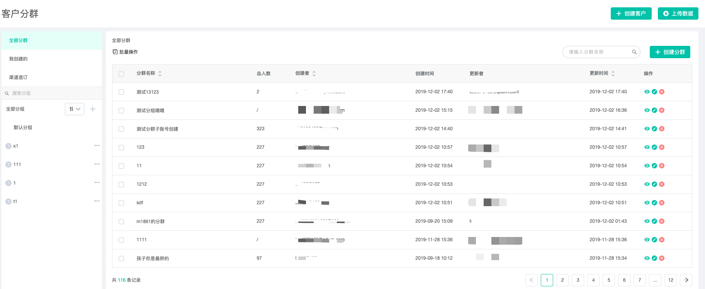

# 客户分群

**预置分群：**

* 全部分群：组内包含平台内所有的分群
* 我创建的：组内包含本人创建的分群
* 渠道退订：包含全局退订、邮件退订和手机退订
*  * 全局退订：若标准表单内订阅模块选择“否”，则对应的用户会进入组内，代表用户即退订邮件，又退订短信和彩信。
  * 邮件退订：通过邮件退订的用户会进入此组内。（退订的用户会隔天进入组内）
  * 手机退订：通过短信或彩信退订的用户会进入此组内（退订用户会在一小时后进入）

**客户分群筛选条件：**

【客户属性】

基本信息：邮箱、手机号、openid、unionid、客户id、姓名、性别、所在地

会员信息 ：会员编号、会员积分、会员等级、会员加入日期、会员状态

标签信息：标签

消费信息：订单总量、订单金额、首次订单时间、最后订单时间

高级信息：综合评级、活跃指数、消费指数、邮件互动、微信互动、短信互动

自定义信息

【订单属性】

订单编号、订单实际金额、订单原金额、订单日期、订单状态、订单产生积分（单次）、订单来源、订单客户端、门店编号、门店名称、销售员编号、销售员名称

【商品属性】

商品编号、商品名称、商品数量、商品价格、商品折扣价格、商品对应积分、商品一级分类、商品二级分类

**条件簇：**

案例：

某商家拥有线下商店（北京和上海各一家店面）和线上电商平台，现在要筛选出在北京或者上海的购买过高跟鞋的女性用户，给她们发放线下优惠券

我们可以通过分群条件簇来筛选满足条件的用户：

{（“商品分类“等于“高跟鞋“，且“性别“等于“女性“） 且   \(“所在地“等于“北京“，或“所在地“等于“上海“\)}

通过上图分群条件簇，可轻松筛选出目标用户。

