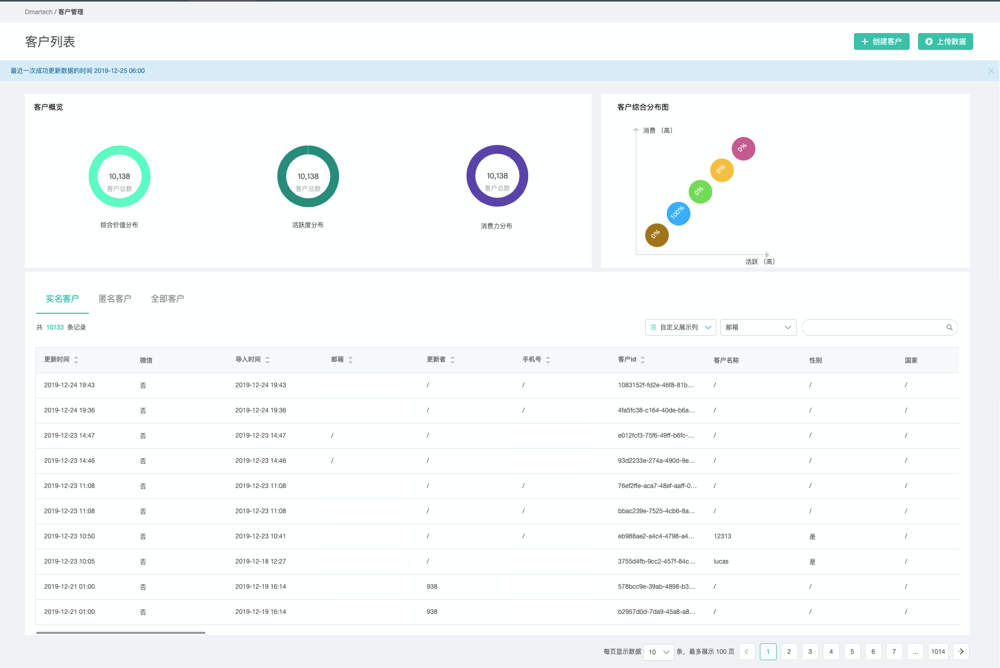
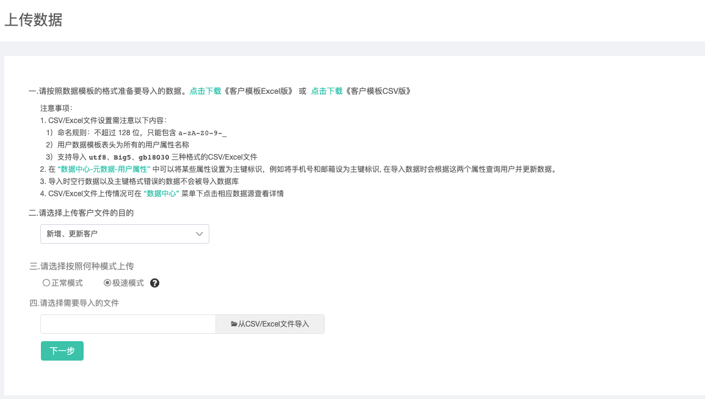
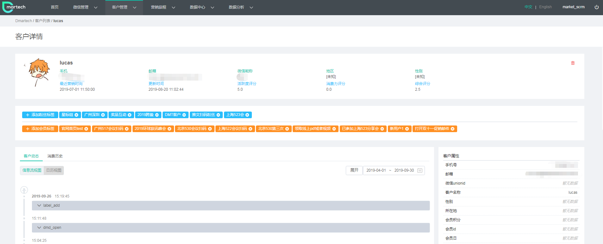

# 客户管理

依次点击进入“客户管理”-&gt;客户管理，可在本页面查看客户概览和客户综合分布图，以及客户列表。

客户概览分别包括**综合价值分布、活跃度分布、消费力分布**对应的客户总数。

1）综合价值分布：根据“消费指数”和“活跃指数”的分数多少综合评定一个客户的价值等级。

2）活跃度分布：根据每个客户在邮件、短信、微信三个渠道的正面负面反馈次数来综合评定的分数。

3）消费力分布：根据每个客户的消费金额评估出的分数。

### 创建客户操作指南：

页面右上角有【创建客户 】和【上传csv】，分别提供了创建单个客户和批量上传客户的方式。

**【创建客户】**

1）选择需要上传的字段，填写对应的值。点击“+”可增加字段，系统默认保留了手机号、邮箱和客户名称三个字段，其中手机号和邮箱为主键标识字段，创建客户至少需要选择一个主键标识字段。

2）设置好字段后，为创建的客户选择或者新建一个标签，点击“确定”即可完成创建。

**【上传数据】**

1）从本地导入客户csv/Excel文件（建议文件在30M以内，太大会超时。系统限制为100M）。

注意事项：

csv/Excel文件命名格式为user\_yyyy-MM-dd.csv；

csv/Excel文件表头大小写不敏感，数据除openid和unionid大小写敏感外，其他数据均大小写不敏感；

支持导入utf8、big5、gb18030三种格式的csv文件；

 在 [“数据中心-元数据-用户属性” ](https://app-beta.dmartech.cn/data/meta/user-attribute)中可以将某些属性设置为主键标识，例如将手机号和邮箱设为主键标识, 在导入数据时会根据这两个属性查询用户并更新数据；

 导入时空行数据以及主键格式错误的数据不会被导入数据库；

csv/Excel文件上传情况可在 [“数据中心” ](https://app-beta.dmartech.cn/data/data-center)菜单下点击相应数据源查看详情。

#### **正常模式与极速模式的区别：**

通过正常模式上传的用户数据都是会产生事件的，而极速模式下上传的用户数据是**不会产生事件**的。

**什么时候通过极速模式上传用户数据？**

当您想要将这批用户数据快速导入，然后针对这些用户仅使用旅程发送邮件或者短信时，可使用此方法，导入的速度会比正常模式快很多；但若您导入用户数据会使用导入过程中产生的事件进行旅程发送等请使用正常模式。

**什么是事件？**

事件，是追踪或记录的用户行为或业务过程。举例来说，在用户点击邮件的链接、点击邮件内的按钮等都是用户行为；导入用户数据可能包含属性变更（即国家从美国变为中国）就是业务过程。

若使用极速模式上传的用户数据，不产生事件，以下功能无法使用：

1.不会产生属性变更事件。不会在导入的客户详情时间轴内查看到属性变更的事件记录；

2.导入数据同时打上标签，不会产生新增标签事件。不会在导入的客户详情时间轴内查看到新增标签的事件记录；

3.若导入的用户数据，变更订阅状态时，订阅状态不会变更，且客户详情时间轴内无订阅订阅状态变更的事件记录；

4.实时旅程触发条件，当属性变更时内的标签事件和属性变化事件无法不能作为这部分用户的开启条件；

5.实时旅程内，事件判断控件，无法根据判断条件是属性变化事件作为判断条件；

6.实时旅程内，标签判断控件，若导入时新增某标签，无法根据包含或者不包含此标签作为判断条件。

2）上传csv文件后，点击“下一步”。为本次导入的客户选择或者新建标签，默认的数据格式为utf8，页面下方会展示最多20条数据可预览，若数据内容乱码或存在其他问题，可切换数据格式为big8或gb18030查看。

系统会提示扫描的总数据以及其中重复数据、无效数据和实际预计导入数据。

3）确认数据正确后，点击“开始导入”，即可完成csv文件导入，点击“查看数据源”可直接跳转到数据中心查看导入状态。

### 客户详情

点击客户列表中的客户数据即可进入客户详情页面。客户详情页面主要包含客户头像、客户属性、重要数据指标（积分、订单量、订单金额、首次购买时间和最后购买时间）、以及订单记录和营销记录。

