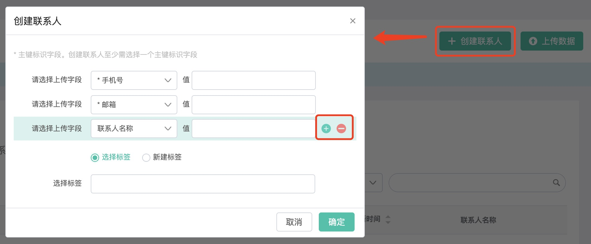
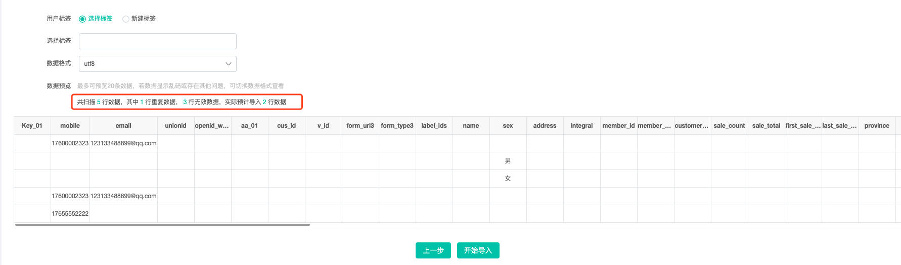
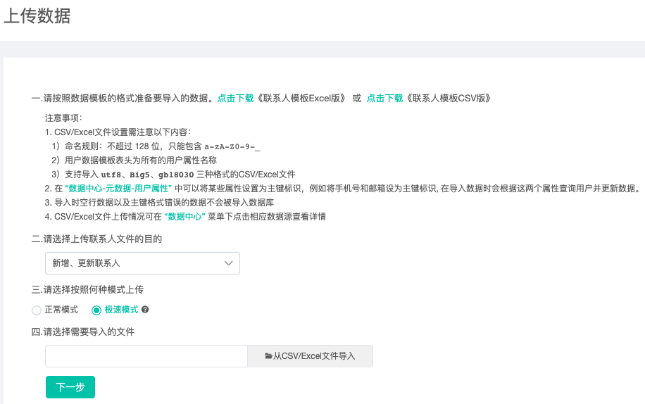
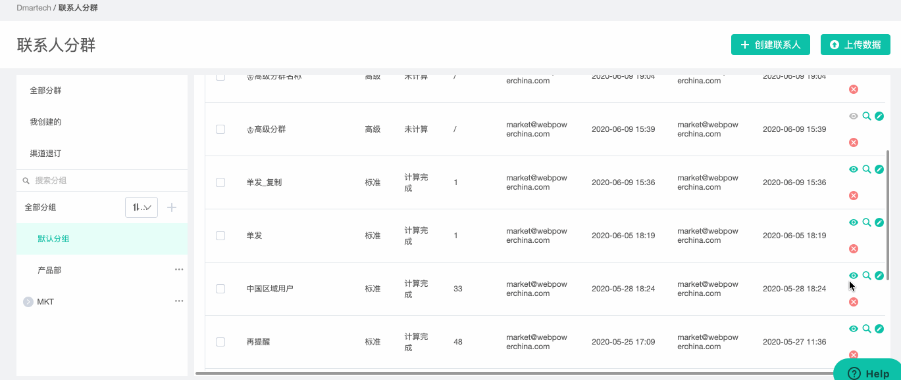

# 联系人管理

依次点击进入“联系人管理”-&gt;联系人管理，可查看全部联系人。

联系人分四类进行管理：

1）实名联系人：手机号或者邮箱等主键字段有值的联系人

2）匿名联系人：主键字段无值的联系人

3）微信粉丝联系人：微信\_openid有值的联系人，即绑定了微信公众号的联系人

4）全部联系人：平台内所有联系人

关于以上几类的更多解释见[“基本概念“](../ji-ben-gai-nian/)

## 操作指南

### 联系人列表

#### 1、联系人数量

联系人列表页显示当前账号下联系人总数，切换各类联系人也可以查看每个分类下的联系人数量。

#### 2、自定义展示列

联系人列表展示列可自定义，可将关注的字段在列中显示，不关注的字段不显示，点击“自定义展示列“，将左侧联系人属性选中到右边已选展示列即可，同理，将已选展示列的移除则不会在列中展示。

#### 3、查找联系人

联系人列表一般用于查找联系人，支持根据多个属性字段查找，选择属性，然后输入属性值进行搜索。

#### 4、同步微信粉丝

微信粉丝联系人页面的“同步微信粉丝“，用于手动同步微信后台粉丝与粉丝标签，一般来说粉丝的关注和取关在Dmartech和微信后台都是实时同步的，该功能适用于当两边不同步的特殊情况.

### 创建/导入联系人

页面右上角有【创建联系人 】和【上传数据】，分别提供了创建单个联系人和批量上传联系人两种方式。

#### **【创建联系人】**

1）选择需要上传的联系人属性，填写对应的属性值。系统默认显示“手机号“、“邮箱“和“联系人名称“三个字段，其中手机号和邮箱为系统预置的主键标识字段，创建联系人至少需要一个主键标识字段有值，当然你也可以使用其他任意主键字段创建数据。点击“+”可增加字段，下拉从全部属性字段中选择要创建的字段。点击“—“可删除。

2）设置好字段后，需要为创建的联系人选择或者新建一个标签，用于标记创建的联系人，点击“确定”即可完成创建。

_**注：新建标签时，点击“齿轮“图标，可将标签设为隐藏状态。设为隐藏的标签仅在联系人详情页内不显示，实际上隐藏标签仍然属于该联系人。**_

#### **【上传数据】**

1）在页面提示文字中点击“点击下载“可下载上传的联系人文件的模板，提供了Excel版和CSV版，按需选择。**为了避免文件格式错误导致的文件数据乱码等情况，建议使用系统提供的模板。下载的模板是一个zip包文件，解压后内包含5个模板，分别用于删除联系人、邮件退订、短彩信退订、全局退订、新增/更新联系人，根据不同的上传目的需要使用相应的模板。**

2）上传文件之前**请仔细阅读页面中的“注意事项“**，以免无法导入或导入错误数据。

3）选择上传联系人文件的目的

* 新增/更新联系人：上传的联系人数据若在平台中不存在则新增，若平台中已存在，则更新数据
* 删除联系人：上传的联系人若在平台中存在则会被删除，若不存在，则不做任何处理
* 邮件退订联系人：上传的联系人将会被标记为邮件退订，在“联系人详情“的订阅状态栏的邮件订阅状态为“否“
* 短彩信退订联系人：上传的联系人将会被标记为手机退订，在“联系人详情“的订阅状态栏的手机订阅状态为“否“
* 全局退订联系人：上传的联系人将会同时被标记为全局退订，在“联系人详情“的订阅状态栏的全局订阅状态为“否“

4）从本地导入客户CSV/Excel文件（建议文件在30M以内，过大会超时。系统限制为100M）。

_**注：上传的数据必须有任意主键字段有值，退订类型的上传，文件中“event\_id“与“create\_time“字段值不能为空，可以任意填写值，create\_time为时间值即可。**_

5）从本地上传文件后，点击“下一步“进入数据预览界面，当新增/更新数据时，需要设置标签，其他类型的更新不需要。预览数据若出现文字乱码等异常情况，可以切换“数据格式“查看，选择正确的格式即可。仅可导入CSV/Excel的sheet第一页数据，且仅支持预览前20条数据，数据导入之前，可以看到系统提示的数据数量，以便核对过更改数据。

图中数据为：共扫描 5 行数据，其中 1 行重复数据， 3 行无效数据，实际预计导入 2 行数据

* 共5行数据：代表导入的文件内数据总行数（除表头）。
* 1行重复数据：代表用户主键列，存在一个或多个值相同，则判断为重复数据。
* 3行无效数据：以下情况均被记为无效数据

1. 空行
2. 与表头不对齐（仅对CSV有效），如：多列、少列、错行等
3. 缺少用户主键
4. 重复行数

* 实际预计导入2行数据：代表最终导入的行数。

6）确认数据正确后，点击“开始导入”，即可完成文件导入，点击“查看数据源”可直接跳转到数据中心查看导入状态。

----------------------------------------------------------------------------------------------------------------------------------------------------

### **极速上传**

#### **个别账户上传时可选择上传模式，“正常模式“与“极速模式“的区别：**

通过正常模式上传的联系人数据都是会产生事件的，而极速模式下上传的联系人数据是**不会产生事件、在数据中心不产生导入记录、且无法下载导入的联系人数据**。

**什么时候通过极速模式上传联系人数据？**

当您想要将这批联系人数据快速导入，对于这批数据的使用仅是向联系人发送邮件或者短信时，可使用此方法，导入的速度会比正常模式快很多；但若您导入联系人数据会使用导入过程中产生的事件进行旅程发送等请使用正常模式上传。

**什么是事件？**

事件，是追踪或记录的联系人行为或业务过程。举例来说，在联系人点击邮件的链接、点击邮件内的按钮等都是用户行为；导入联系人数据可能包含属性变更（即国家从美国变为中国）就是业务过程。

若使用极速模式上传的联系人数据，不产生事件，以下功能无法使用：

1.不会产生属性变更事件。不会在导入的联系人详情时间轴内查看到属性变更的事件记录；

2.导入数据同时打上标签，不会产生新增标签事件。不会在导入的联系人详情时间轴内查看到新增标签的事件记录；

3.若导入的联系人数据，变更订阅状态时，订阅状态不会变更，且联系人详情时间轴内无订阅订阅状态变更的事件记录；

4.实时旅程触发条件，当属性变更时内的标签事件和属性变化事件无法不能作为这部分联系人的开启条件；

5.实时旅程内，事件判断控件，无法根据判断条件是属性变化事件作为判断条件；

6.实时旅程内，标签判断控件，若导入时新增某标签，无法根据包含或者不包含此标签作为判断条件。

### 导出联系人

 可在联系人分群中批量导出联系人，在联系人细分列表中点击“查看“进入联系人列表，点击分群名称旁的“...“继续点击“导出联系人“，可进行导出。

1）选择属性，可以一键选择全部属性也可以选择指定属性，选中的属性将被导出

2）导出格式支持csv和excel

3）导出到指定邮箱，在邮件中下载数据文件

更多关于联系分群的内容请查看“[联系人分群](ke-hu-fen-qun.md)“

### 删除联系人

**联系人被删除后不可恢复，请谨慎删除。**删除联系人的方式有以下几种：

1）删除单个联系人，则进入联系人详情页面，点击删除图标即可删除该联系人

2）在联系人分群的联系人列表页面，选中多个联系人，可批量删除某分群下的联系人

3）上传联系人时，选择上传目的为“删除联系人“，则上传文件中的联系人在平台中存在时会被删除，在平台中不存在时，不做任何处理

**【同步DMD联系人】**

**部分DMD平台客户若需要迁移数据到DMT，所有的用户属性字段也都需要在元数据创建。**

**注：任何方式介入的联系人数据，相关属性都需要在元数据中创建。**

----------------------------------------------------------------------------------------------------------------------------------------------------

### 联系人详情

点击联系人列表中的联系人行即可进入该联系人详情页面，展示了联系人360度全景视图，主要包含以下内容：

1）红框1区域展示联系人的重要个人信息：手机、邮箱、微信昵称等

2）红框2区域展示联系人的各渠道订阅状态，包括全局订阅、邮件订阅、手机订阅状态。其中手机订阅代表短彩信订阅，全局退订代表手机和邮件都退订。

3）红框3区域展示联系人当前的粉丝标签和联系人标签，可直接增加和删除标签。

4）红框4区域展示联系人行为动态和消费记录。“联系人动态“的信息流视图按照时间顺序记录联系人所有的行为事件，比如邮件打开、微信点击菜单、微信扫码等支持下载事件；日历视图可以查看联系人的活动时间，可以一目了然的观察到联系人的活跃时间段。关于更多事件详情请查看“[元数据](../shu-ju-zhong-xin/shu-ju-guan-li/yuan-shu-ju.md)“

5）红框5区域展示联系人的全部属性，均为当前最新值，不可直接编辑修改，若要修改联系人属性，可以重新创建或上传该联系人（保持主键字段为原值，其他字段为修改值即可）。

