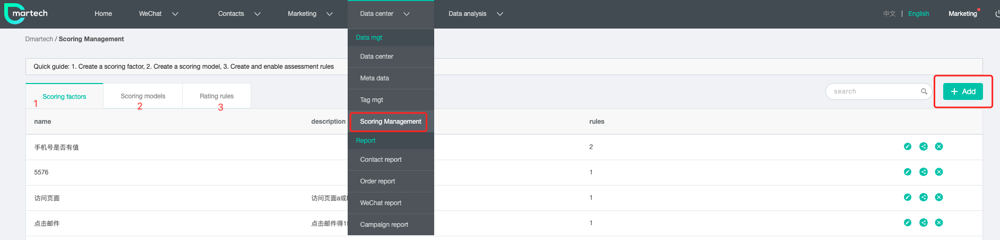
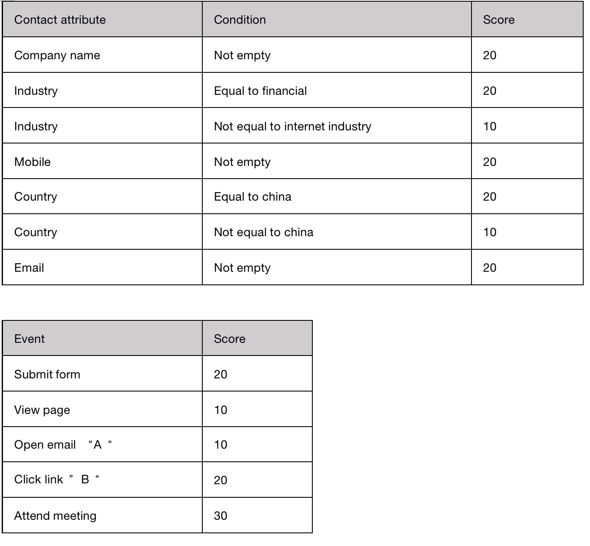
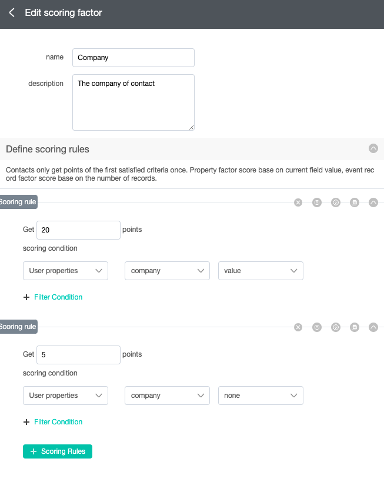
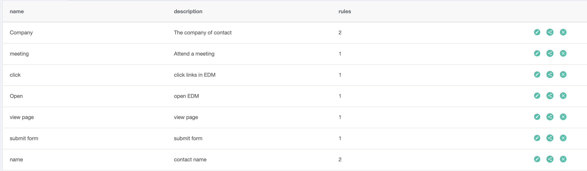
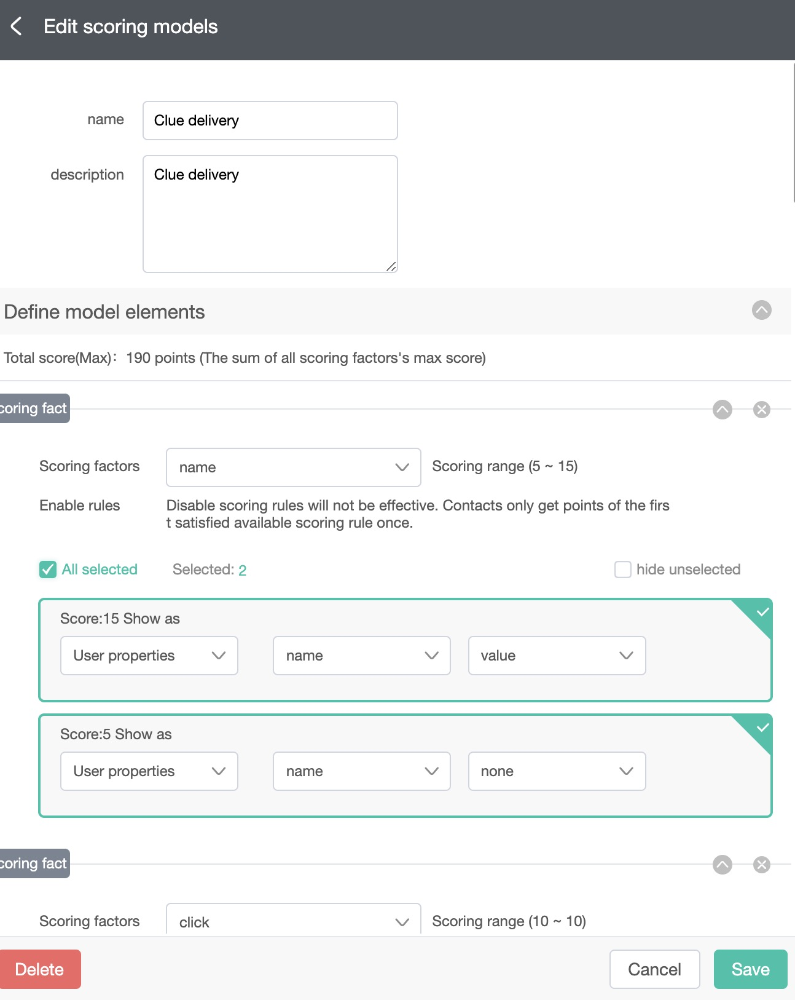
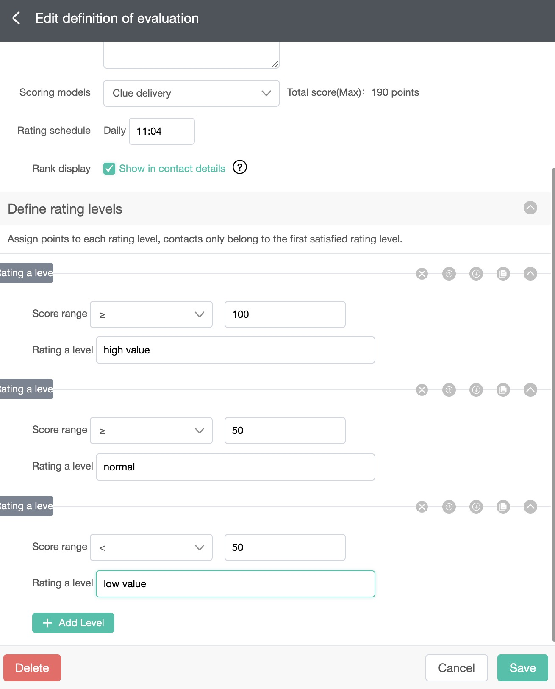
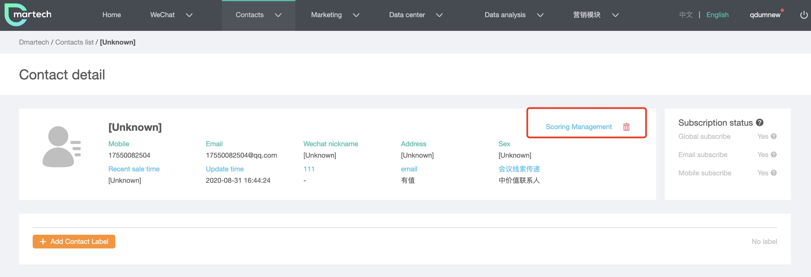

# Meta Data

User attributes, events, and event attributes can be defined in the Meta data module. User attributes refer to various aspects information of contacts, such as name, gender, age, etc. These information can be entered when uploading or creating a contact, or obtained and imported by Dmartech when the contact submitting the form. The behavior of the contacts is recorded by events, and all behaviors and actions can be viewed in the Contact dynamic info in the Contact detail page. There are some common preset events in Dmartech. The platform will capture some contacts behavior events by default. It also supports custom events for event tracking or other event records of background transmission. There is no limit to the number of created custom events.

### Customize Contact Attributes

Dmartech presets some common contact attributes and supports to customize attributes. The customizable field types include string, integer, date, and decimal. It is necessary to set correct data type when importing contacts data by files or API, otherwise it could cause data import errors. 

All contact data fields need to be defined in the User properties page first before importing to the platform, otherwise the data will not be imported to the platform \(the form fields also need to be created in the Meta data\). 

Step 1Choose Data center&gt; Meta data from the main menu. Select the User properties tab on the top navigation bar. Check whether the required contact attribute is currently exist in the user properties list. If not, click to add a new user attribute. The parameters that need to be filled when adding a new user attribute record: 

* Property name: The name of the property that stored in the database, which cannot be repeated with the existed property names. 
* Field meaning: The name displayed in Dmartech, which cannot be repeated with the existed field meanings. 
* Type: Choose one of the four types: string, integer, date and decimal. 
* Length: Set the field length according to the Type. 
* Key identify: The platform will merge data record according to the primary key attributes. If Key identify is enabled, the different records with the same primary key values will be considered as the same contact. Therefore, it is necessary to set the attribute that can represent the contacts’ identity as the primary key, such as mobile, email, etc. The primary key is unique. Attributes with repeated values cannot be defined as primary keys. 

**Step 2** Click 'Save" to complete the creation.

### Customize Events

Custom events are generally used for event tracking or event records by API transmission. 

**Step 1**It is required to add the attributes of the event first in order to customize an event. Choose Data center&gt; Meta data from the main menu. Select the Event properties tab on the top navigation bar. Click "Add" to create the attributes of the newly defined event by setting below parameters: 

* Property name: The english name of the property that stored in the database. 
* Field meaning: The Chinese name displayed in Dmartech. 
* Type: Choose one of the four types: string, integer, date and decimal. 
* Length: Different attributes types have different lengths.

**Step  2**  the event after creating the event properties. Select the Event management tab on the top navigation bar. Click "Add" to create an custom event by setting below parameters: 

* Event name: The name of the event that stored in the database. 
* Display name: The Chinese name displayed in Dmartech. 
* Preset property: Select the event attributes used by the event, which is used to describe the event \(The event attributes has created in Step 1\).

**Step 3** The created event will be stored in the default group, or you can select Event group tab to create a new group by setting below parameters: 

* Group name: Set a group name of the event. 
* Display name: Set the displayed group name. 
* Defined event: Check the custom event just created.

### Example

The group named email includes Open Email and Click Email events. The attributes of the Open Email event include journey\_template\_id, task\_instantiation\_id, event\_date, dmd\_mailing\_name, create\_date\_email, email and etc. 

The default preset events do not need to be edited. The above events will be automatically recorded when the contact has related behaviors. You can view the event record by clicking Contact dynamic in the Contact detail page.

### Evaluate Score

Dmartech added the scoring mangment function to create a scoring model to score contacts. You can set specific scores for contact attributes or contact events, and the scores of contacts that meet the conditions can finally evaluate the expressiveness of the contact in some scenarios, so as to determine the stage of the lead. Click to enter "Data center"-"Scoring management":

A complete scoring system includes three parts：Scoring factors"、“Scoring models" and "Rating rules". Scoring factors： 

* Scoring factor: A scoring condition is a scoring factor, such as the email field with a value, 10 point 
* Scoring models: Multiple scoring factors are combined through a logical relationship to build a scoring model 
* Rating rules: According to the total score of the scoring model, the score is divided into several intervals, and the contact score will be in different stages according to the score interval

 In order to understand how to use the contact score, the following will introduce you an example case.

 **Example**: A company held an online conference recently，they hope to find high-quality sales leads from users who have participated in the meeting, transfer them to their own CRM system, and follow up by sales.

The following table is the scoring conditions built for enterprises, and contacts with a score greater than 100 will eventually be transferred out.

**Step1**: Create all the conditions in the table on the scoring factor. Enter the "Scoring factor" page, click “add" to configure the corresponding scores for different fields and conditions according to the above table.

* Edit factor name and descriprion 
* Define score rules ,set scoring condition and points, you can add mutiple scoring rules. 
* There can be multiple conditions under each scoring rule 

_Note：If multiple scoring rules are added to a scoring factor, the contact will not continue to judge subsequent rules after meeting the first rule_ 

Add all the scoring factors in turn, and you can see the list as follows after completion.

**Step2:** After all the basic conditions are created in the scoring factor, the scoring model can be created.Enter "Scoring model“ page and click "add" to create a new model.

* Edit model name and descriprion 
* Select the scoring factor that has been created, and combine multiple scoring factors into a model according to the rules 
* You can see the total score at "Define model elements"

**Step3**: The last step is to create rating rules，enter “Rating rules“ page and click "add" to create.

* Edit name and description and select a model, the scoring rules are for a scoring model
*  You can set a time, and the score of the contact under the model will be updated at this time every day 
* If you check the level display, the level of the contact under the scoring rule will be calculated and displayed on the contact details page 
* According to the highest score of the selected scoring model, divide the score into several levels，for example, if the score is greater than one hundred, it is defined as a high-value leads. 
* After clicking the switch to enable the rule, the scoring model will start to run.

#### Score in contact details

 In the contact details page, you can see the score and grade of the contact in this rule model, as well as the events generated by the rating change. Click the "Scoring management" button to see the change records of all leads for this contact.

#### Score in segmentation and marketing journey

After the scoring rule runs, it will be automatically generated as a user attribute, which can be used as a conditional judgment in segmentation and journey.

