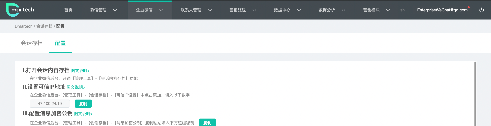
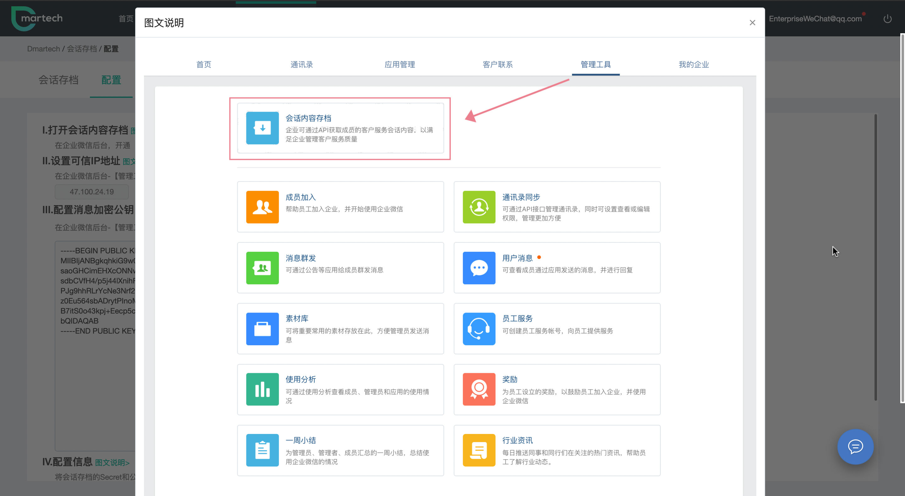

# 会话存档

当您在企业微信官网开通了会话存档功能，意味着您可以通过Dmartech平台对员工间、员工与客户间及内外部群聊等聊天记录的回查与保存，实现查找有限时间范围内员工与客户整合员工的对外形象、统一企业沟通话术等效果。

### **Dmartech中会话存档操作说明**

* **配置会话存档**

开通企业微信会话存档功能并完成在Dmartech的配置共需要四步，具体配置方法：

点击【企业微信】-会话存档-配置，根据说明按步骤操作，图文说明弹框有参考图片指导

Dmartech会话存档仅支持查看员工与员工间、员工与客户间及内外部群之间的消息。

* **搜索会话存档**

右侧支持员工与联系人共同搜索；即员工和联系人是“且”的关系，选择某员工列表不会立即筛选，只有在联系人框输入回车或点击放大镜按钮才会对所选员工中的联系人进行筛选；

_**需要注意的是**_，_点击查找员工时，显示的员工列表仅为【企业设置-企业微信-组织员工】与自建应用【Dmartech通知】可见范围选中的员工的交集_。

企业群的筛选，支持群名筛选；

* **查看会话存档**

会话存档默认页面为全部会话列表，默认按会话时间倒序排列，每页显示25条数据，剩余的分页展示；

点击某一会话数据，侧边栏出现会话详情；

支持筛选消息类型，若选中的全部为文本类型，则支持关键字搜索；

