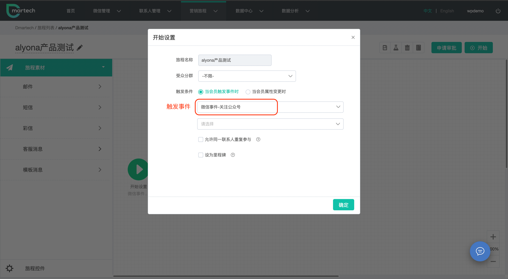
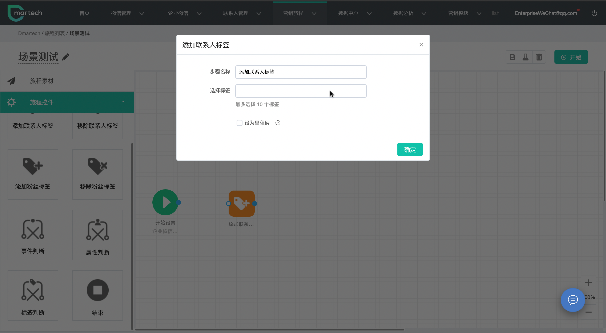
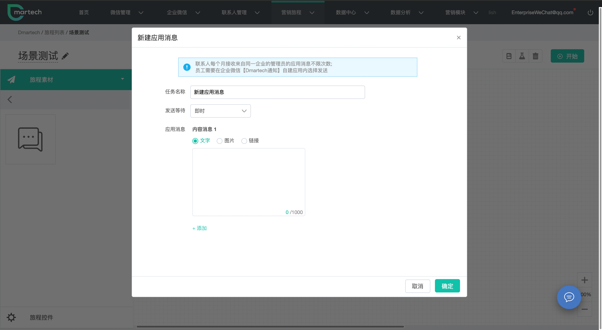

# 营销场景演示

很多场景下，向联系人/企业群推送消息都不是一个单一的场景与行为，经常伴随着关注公众号或提交个人信息等一系列触发事件，如何将企业微信的消息群发功能与营销活动结合到一起，才是Dmartech的真正价值。

除了您可以通过【企业微信】-企业群发，创建您想要给客户发送的消息外，也可以利用Dmartech【营销旅程】完成全生命周期的自动化营销。

#### 下面将为您介绍企业微信相关功能如何在【营销旅程】自动化营销中的实现方法

_场景描述——客户关注了某公众号，公众号推送带有员工渠道活码的模版消息，客户继续扫码添加该员工后，Dmartech为联系人打标签并向其所属员工推送应用消息，员工在手机端跟进客户，完成对客户的消息推送，根据客户的反馈为该客户修改标签。_

#### 【实时旅程搭建步骤】

**Step 1** 点击营销旅程-营销旅程-新建旅程，默认进入实时旅程界面

填写旅程基本信息：选择时区、填写旅程名称、选择分组、受众分群

选择触发条件“当会员触发事件时”选择微信事件-关注公众号，点击确定；

**Step 2** 添加客服消息控件，向客户推送带有员工企业名片的“渠道活码”

**Step 3** 增加“添加联系人标签”控件，当客户扫码添加员工后，Dmartech自动为客户打标签，用于区分不同渠道客户来源

**Step 4** 添加“应用消息”控件，编辑消息内容；此条消息将在旅程开始后推送至员工的企业微信客户端

**Step 5** 员工跟进客户，将收到的消息推送至相应客户，点击复制即可复制该消息，点击跟进打开对应客户的聊天窗口粘贴消息后发送，再次进入应用通知界面点击完成即可结束任务；

#### 以上，即企业微信与Dmartech营销旅程的结合演示。

所有旅程开始前建议您预先进行测试或审批，测试正常或审批通过后方可开启旅程。

更多行业使用企业微信的营销场景灵感，请参考[【营销场景行业案例】](../ying-xiao-chang-jing/)

