# 企业微信客户端

在企业微信绑定完成Dmartech自建应用后，Dmartech将在企业微信的PC端/手机端

* 推送应用消息，员工通过【Dmartech通知】完成跟进；
* 同步Dmartech联系人画像/标签/属性与事件等详情；
* 对联系人的标签进行编辑（添加/删除）；
* 对联系人的属性和事件进行选择性展示；

### 具体操作如下：

* **添加联系人后，随时查看联系人用户画像**

员工点击某一外部联系人（通常为联系人微信）的对话窗口，页面右下角可以点击侧边栏按钮展开右侧侧边栏，Dmartech的用户画像将在此侧边栏展示。

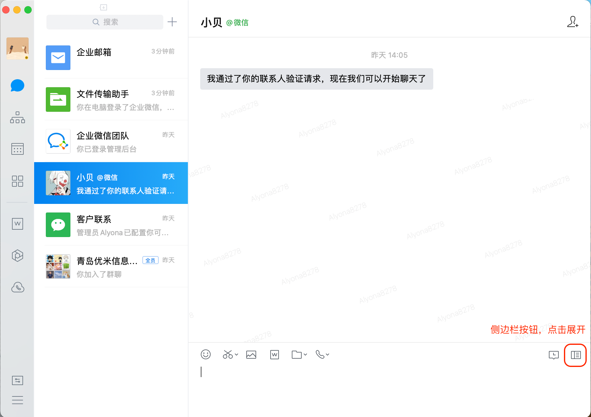

企业微信的侧边栏为操作者提供了多种便捷工具，可以在管理端对客户端展示功能进行添加删除，Dmartech将平台的联系人标签、属性、事件完整同步至用户画像这一模块

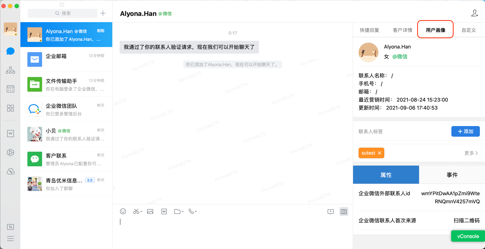

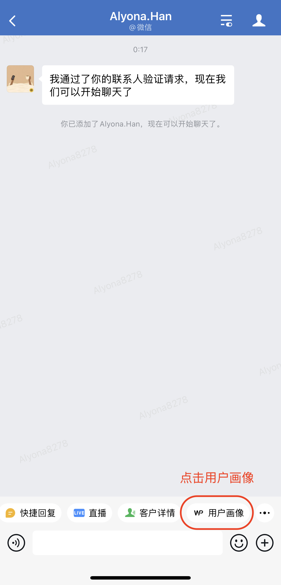

_**请注意，只有在自建应用内可见范围的员工，才可见联系人画像内容；**具体添加方法请见_[【使用前需要做】](shi-yong-qian-xu-yao-zuo.md)自建应用可见员工设置

* **收到应用通知，随时跟进联系人**

当员工收到需要推送至联系人的消息推送时，客户端会显示Dmartech通知更新的消息详情

员工点击复制按钮，即可复制该推送消息；点击需要联络的客户“跟进”按钮，即可进入该联系人的聊天页面，粘贴已复制的消息，点击发送。

发送完成后，回到Dmartech通知，点击完成。视为此次发送任务已结束。

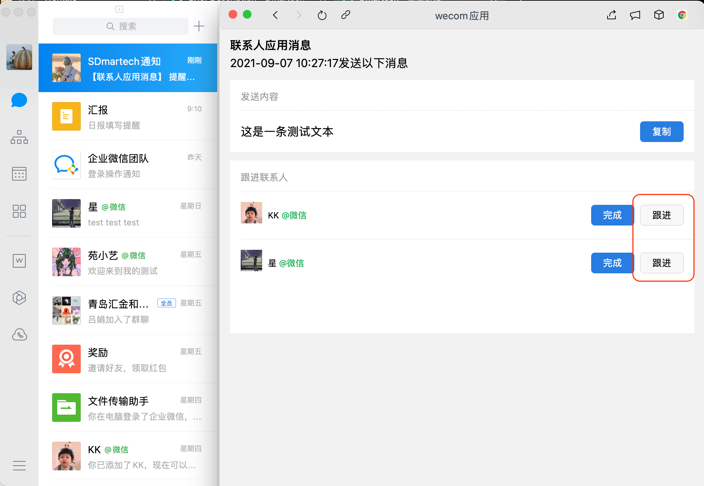

* **客户端添加/删除联系人标签**

联系人用户画像显示的联系人标签与Dmartech平台联系人标签保持同步，支持员工在PC/Mobile端添加和移除标签，点击“添加”为联系人添加标签，添加标签时支持搜索Dmartech已有标签；

客户端随时根据跟进详情进行联系人管理，同时也可以和Dmartech保持同步；

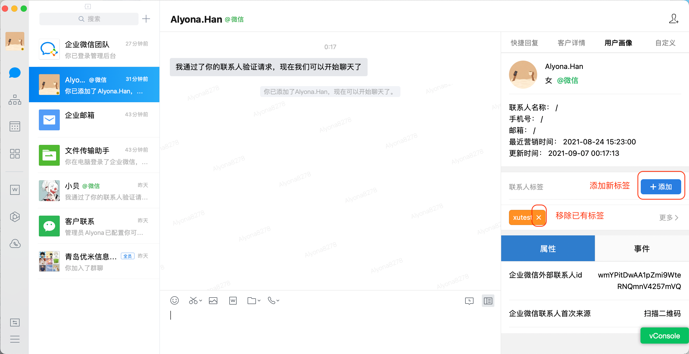

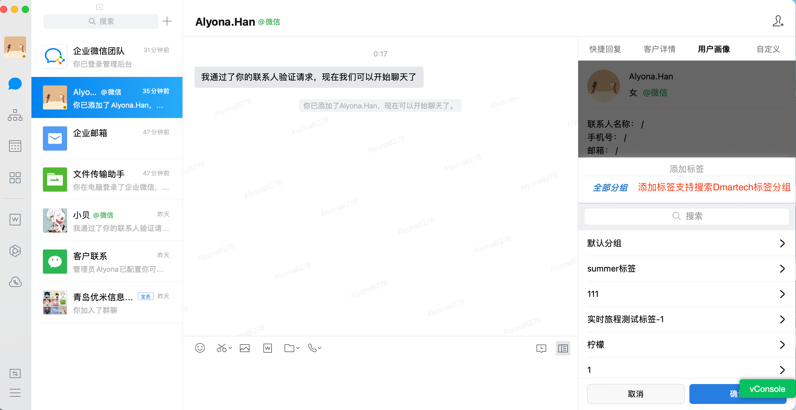

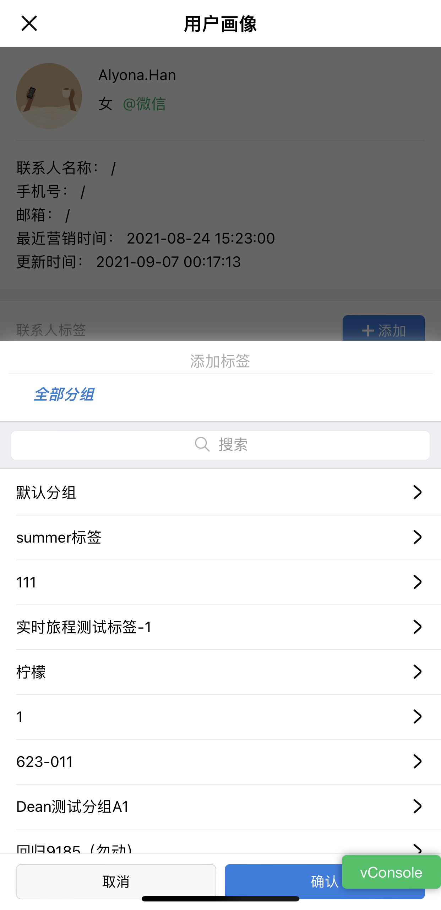

* **查看联系人属性与发生事件**

联系人的属性与事件与Dmartech平台保持同步，优先会显示已具备的属性与事件，点击全部事件，展开所有事件列表，可根据需要点选展示的事件；

如查看外部联系人的渠道来源、何时扫码、何时收到某条消息推送等信息；

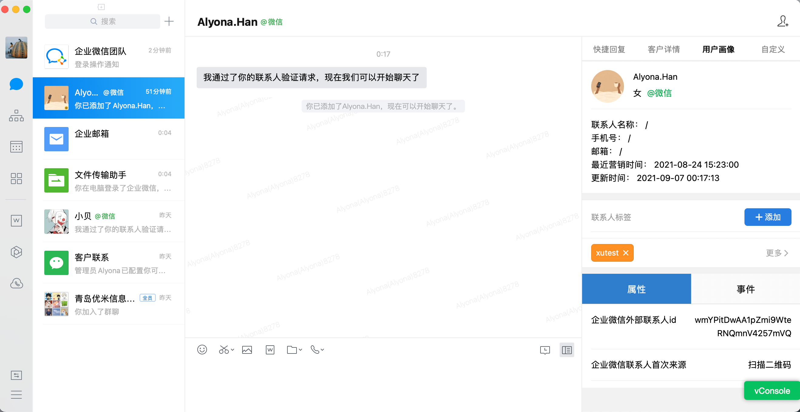

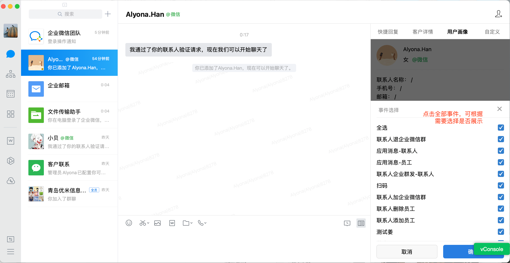

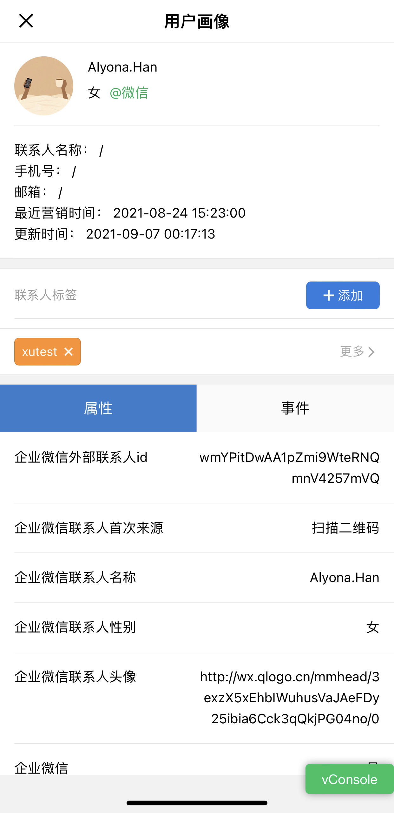

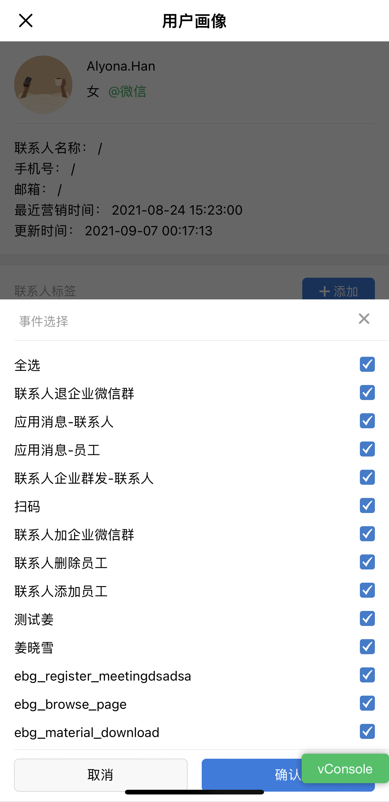

