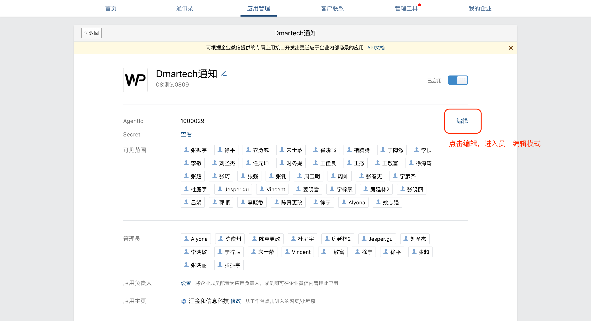
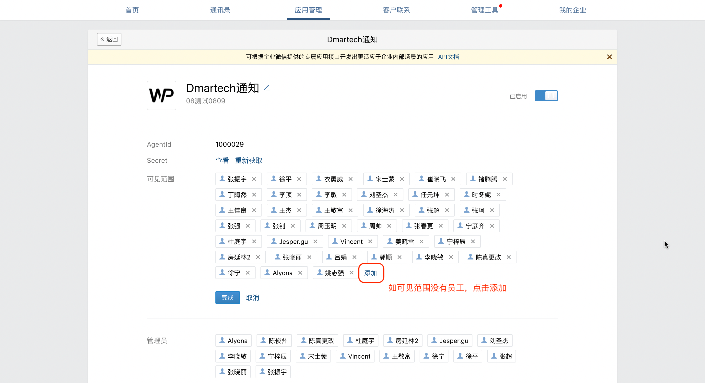
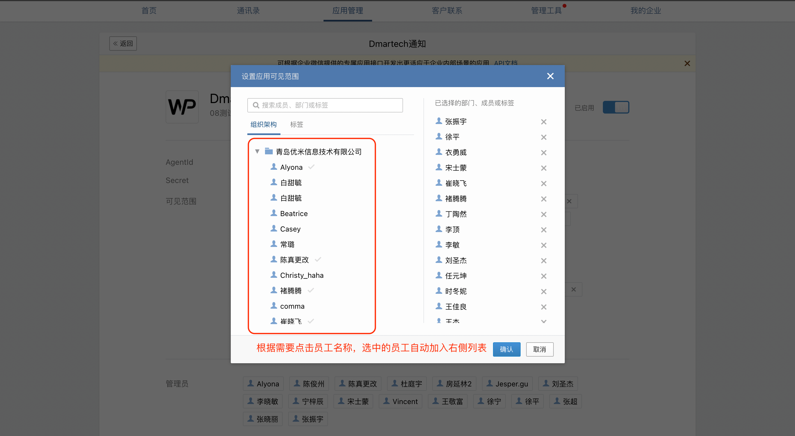
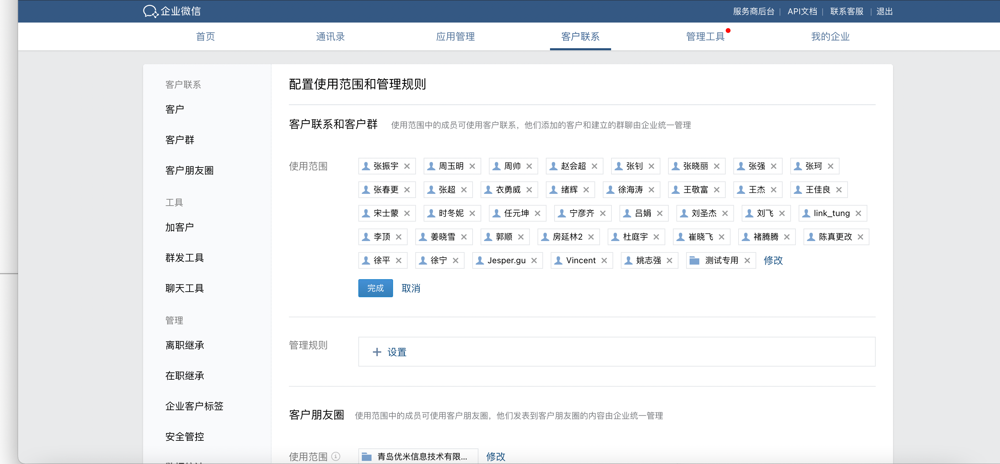
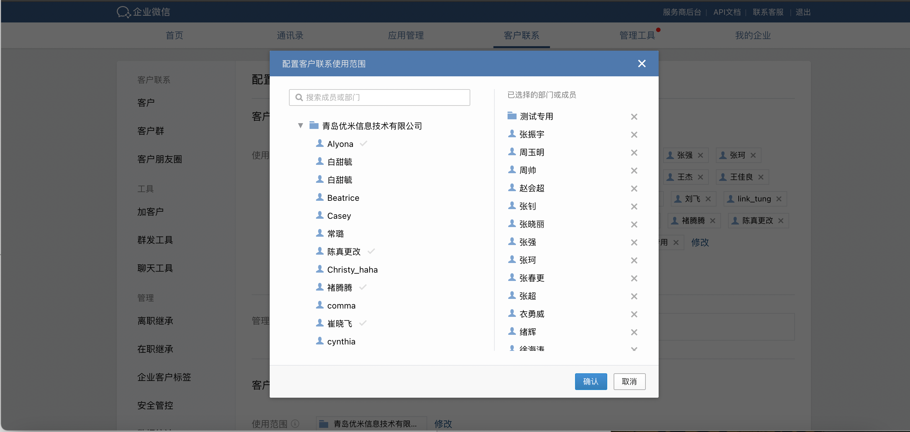

# 使用前需要做

请先确认以下操作都已完成：

* **企业微信官网注册**

Dmartech绑定使用前，请前往企业微信官网[https://work.weixin.qq.com](https://work.weixin.qq.com)进行注册

* **绑定自建应用**

注册完成企业微信后，就可以进行在Dmartech平台绑定自建应用啦。

未绑定自建应用或未成功绑定的话，企业微信的相关功能都无法使用哦。

**Dmartech绑定企业微信的入口有两个：**  

入口1.进入Dmartech主页后，点击【企业微信模块】

这时点击企业微信任意模块页面显示如下，点击【去配置】即可**。**

入口2：进入Dmartech主页，进入右上角账户信息-企业设置-企业微信，点击“新建自建应用”即可。

**Dmartech仅支持新增一个企业微信自建应用**

**绑定自建应用**

绑定自建应用共需要八步，每一步操作都有相应的图文说明，点击即可通过弹窗查看。

每步操作都有相应的图文说明窗口可供参考；请确保每步所填写的信息都准确无误并按说明完成8步操作，数据错误或步骤缺失都会影响企业微信的使用哦。

**修改自建应用**

已创建的自建应用，点击“应用配置”可对内部数据进行修改。修改后点击“配置完成”即可。

* **同步组织员工**

授权企业微信后，在自建应用可见范围内选中的员工信息，会自动同步至组织员工架构内；

* **自建应用内添加可见员工**

管理员登录企业微信管理端，选择【应用管理】-【Dmartech通知】，主页面即为自建应用可见的员工列表

**关于Dmartech中企业微信相关的权限配置**

所有员工对于Dmartech企业微信模块内全部的数据，即渠道活码、企业群发、会话存档（已购买）可见全组织数据；

但联系人数据，仍然遵循数据权限-联系人记录内规则。

**员工添加联系人的权限，此权限需要企业在企业微信后台-客户联系模块进行添加**。

了解以上操作步骤后，就完成了企业微信的相关配置，接下来向您介绍Dmartech企业微信中的三大模块功能介绍及场景应用，便于您更好地使用Dmartech企业微信实现精准化管理与营销。

