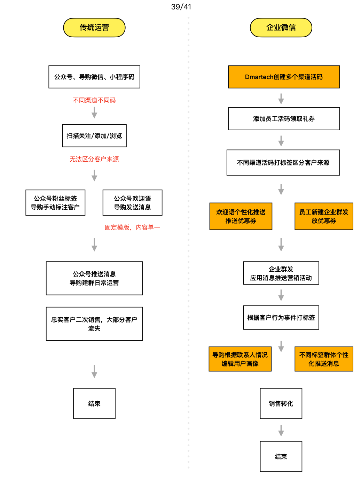

# 零售行业

## 行业痛点

### 线上线下客户数据不打通

### 客户标签不统一

### 无法实现私域流量运营

_**传统零售行业，导购/销售与客户沟通依托于个人微信，一旦员工离职会造成客户数据流失。营销活动时，客户较为分散，无法统一地进行运营。**_

_**零售行业在进行旅程搭建时，通常的营销方式为会员注册后收集到客户信息，通过短信/邮件形式下发优惠券，针对是否使用优惠券的客户进行二次营销，并打上相应的标签，后续针对不同标签下的客户进行针对性营销。**_

