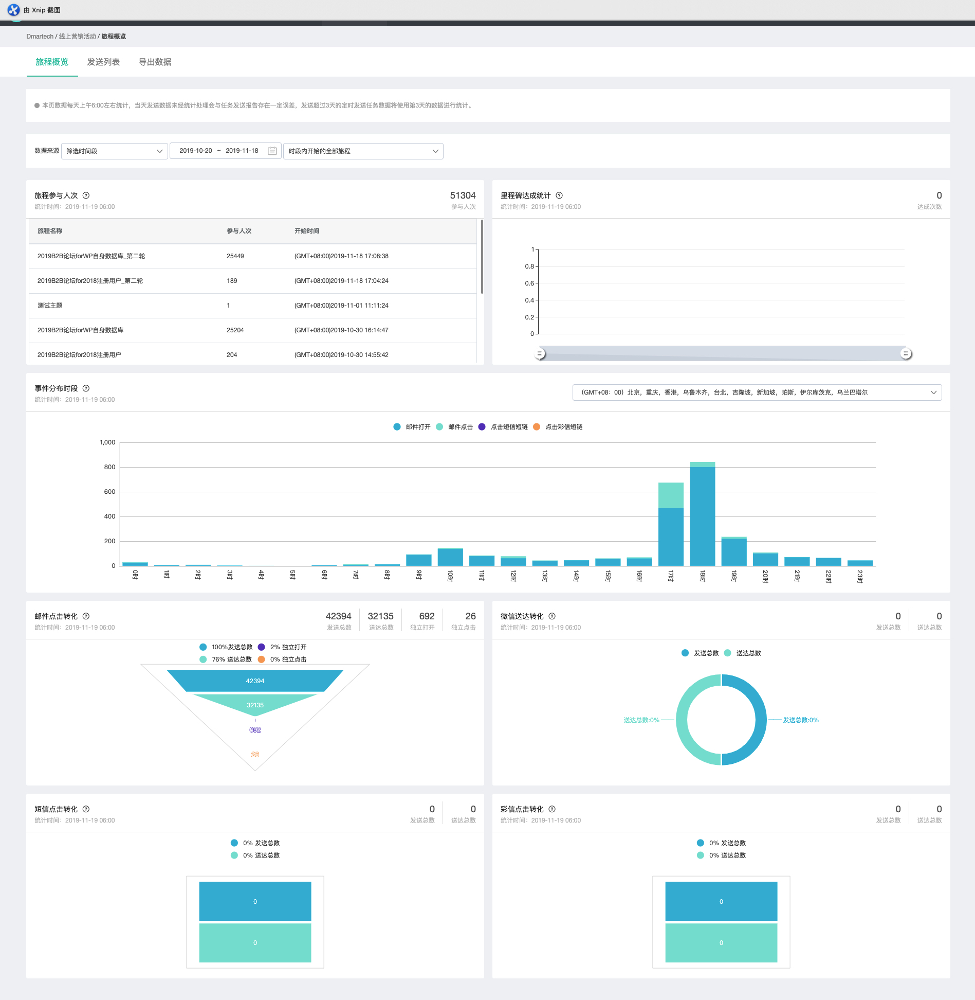
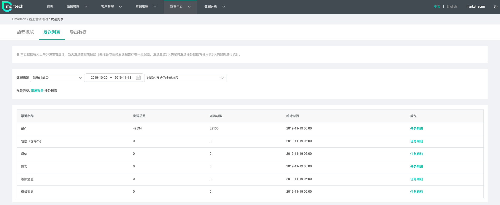
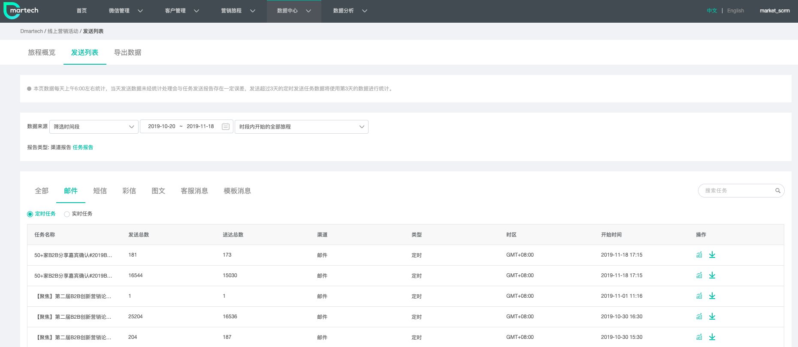
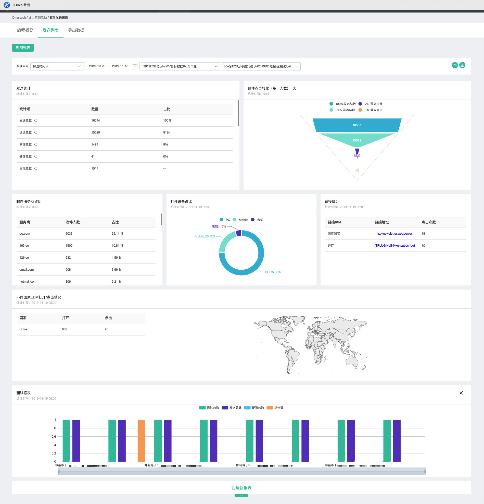
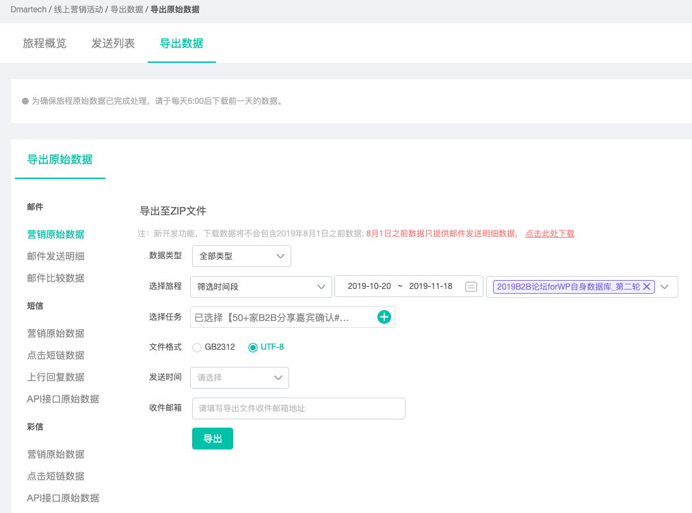

# 线上营销活动

线上营销活动模块是针对旅程查看-导出的模块。

线上营销活动模块分为：**旅程概览、发送列表和导出数据**三部分。

### 旅程概览：

旅程概览页面可查看所有旅程或者某个旅程的发送情况，包括：

* 旅程参与人次：客户参与旅程的行为记为一次触达。 一个客户可以在完成旅程后再次参与旅程， 此时触达人数将会累加统计，不去重。
* 里程碑达成统计：客户到达旅程里程碑步骤的行为记为一次里程碑达成。 一个旅程可能包含多个里程碑步骤， 此时将会累加统计，不去重。
* 事件分布时段：收件人渠道响应事件分时段分布
* 邮件点击转化：显示邮件营销过程中各环节的收件人数量
* 微信送达转化：显示微信营销过程中各环节的收件人数量
* 短信点击转化：显示短信（含海外）营销过程中各环节的收件人数量
* 彩信点击转化：显示彩信营销过程中各环节的收件人数量

**注意：以上数据均是隔天统计**

**里程碑通常是指一个旅程中的核心步骤或核心节点，可以自由将相关的控件标记为里程碑。**

### **发送列表：**

此页面内可查看不同旅程内不同渠道素材发送的情况。

渠道报告页面：可查看当前时间段或者某个旅程包含的邮件、短信、彩信、微信图文消息、微信客服消息和微信模板消息各自的发送总数和实际推送数。

任务报告页面：可查看当前时间段或者某个旅程不同素材的部分数据（发送总数、实际推送、渠道、类型、时区和开始时间）

此页面可查看某个旅程内，某个素材的实际发送情况

使用底部创建新报表可根据不同的指标和维度搭建不同的图表。

**注意：仅单次和周期旅程有报告，实时旅程当前无发送报告。**

邮件发送统计字段含义：

| 字段名 | 含义 |
| :--- | :--- |
| 发送统计 | 已经发送的所有邮件数量 |
| 送达总数 | 去除软硬弹后成功送达的邮件数量， 分母：邮件发送总数。 |
| 软弹总数 | 软性弹回数量. 邮件已送达对方邮件服务器， 但无法送达至对方邮箱。一般造成的原因可能是， 用户邮箱已满。软性弹回的邮箱可能会在下次重新发送。 分母:邮件发送总数。 |
| 硬弹总数 | 硬性弹回数量. 邮件发送至对方邮件服务器， 被对方邮件服务器退回。一般造成的原因可能是， 邮箱地址无效。分母:邮件发送总数。 |
| 呈现总数 | 邮件呈现次数的总和，该参数是以收件人点击下载图片的动作为依据， 如果收件人多次打开邮件那么该记录会被多次记录。 |
| 独立呈现总数 | 邮件呈现的独立次数总和和，该参数是以收件人点击下载图片的动作为依据。 如果收件人重复打开邮件那么该参数仍然只会被记录一次。分母: 已送达邮件总数。 |
| 独立打开总数 | 邮件被独立打开的次数，该参数是基于邮件中图片的下载行为或者邮件中的超链接被点击行为作为依据的。 分母: 已送达邮件总数. |
| 点击总数 | "收件人点击了多少次邮件中的一个或者多个链接?" 收件人在一封邮件中点击了3个不同的链接，则数值为3 点击总数。 |
| 独立点击总数 | "多少独立的收件人点击了一个或者多个链接?" 如果收件人点击了一封邮件内的3个链接，则数值为1 独立点击总数。分母: 已送达邮件总数. |
| 独立点击打开率CTO | "浏览邮件的收件人中，有多少人产生了点击行为?" 独立点击总数 除以 邮件独立呈现总数。 |
| 垃圾邮件投诉人数 | "多少收件人将邮件举报为垃圾邮件?" 分母: 已送达邮件总数。 |
| 退订人数 | 收件人点击退订的邮件数量。 分母：已送达邮件总数。 |

短信、彩信发送统计字段含义：

| 字段 | 含义 |
| :--- | :--- |
| 发送总数（条） | 已经发送的发送人数与发送短信条数 |
| 送达总数（条） | 已经送达的发送人数与发送短信条数，分母：发送人数。 |
| 失败总数 | 未送达的发送人数与发送短信条数，分母：发送人数。 |
| 点击总数 | 收件人点击短信短链链接的次数总和，仅统计dmt专用短链。 |
| ip去重 | 收件人点击短链时的ip去重数。 |
| 独立点击 | 收件人多次点击短链只被计为1次，分母：送达人数。 |

### 导出数据：

此页面用来导出某旅程或通过API进行的邮件、短信和彩信的报告。

选择要导出的不同类型的数据，选中数据类型、选中旅程、选中任务、文件格式和收件邮箱即可将数据CSV文件发送到收件邮箱内。

