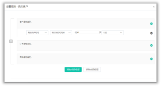

# 标签管理

在“微信管理”-&gt;“粉丝管理”中我们介绍了粉丝标签，粉丝标签只是针对微信粉丝所设置的标签，Dmartech的标签体系包括粉丝标签和会员标签两种类型，“数据中心”-&gt;“数据管理”-&gt;“标签管理”指的便是会员标签，适用于所有的用户。 

1）新建标签，输入标签名称即可。 

2）标签可分组管理，未分组标签会在“默认分组”中；

 3）“是否查看子分组下标签”：标签分组为多级分组，若某分组内包含若干标签，其子分组下也包含若干标签，则用“是否查看子分组下标签”来区分。

4）每个标签均可设置标签规则，系统自动为满足规则的用户打上相应的标签，也可移除相应标签。系统自动更新时间为每晚凌晨零点。

可随时点击“重新计算”手动更新标签中用户数量。

另外，除了通过标签规则为用户打标签的方式之外，还可以在营销旅程中通过添加“增加标签”、“移除标签”等相关控件来设置标签，也可以在创建带参二维码时，设置扫码后可携带的标签。

在标签列表中可开启【显示标签ID】的功能，标签ID可直接引用于在上传联系人时的CSV/EXCEL文件中。

