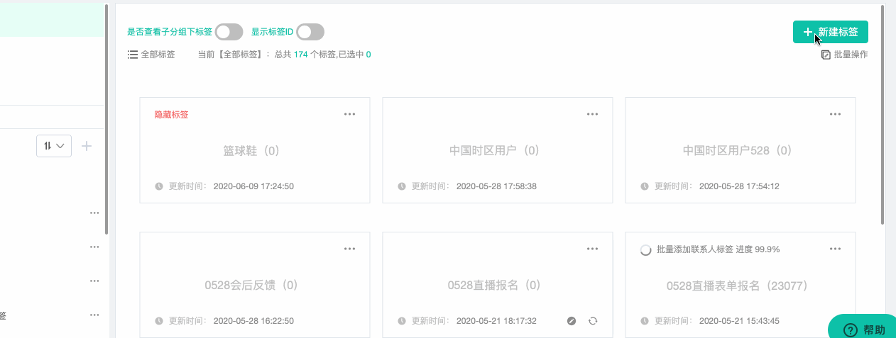

# 标签管理

给联系人贴标签时营销中常用的做法，合理的使用标签能够描述出360全景用户画像，标签时直接标记在联系人身上的， 能够更加深入和全面的了解联系人特征。

在“微信管理”-&gt;“粉丝管理”中我们介绍了粉丝标签，粉丝标签只是针对微信粉丝所设置的标签，Dmartech的标签体系包括粉丝标签和联系人标签两种类型，“数据中心”-&gt;“数据管理”-&gt;“标签管理”指的便是联系人标签，适用于所有的联系人。 

## 操作指南

### 多层级标签分组

标签支持分组管理，可创建多级分层，最多4层，如“基本属性“—“性别“—“男、女、未知“

页面左侧为分组，右侧为标签。默认分组有：全部标签、我创建的、隐藏标签

【全部标签】：当前账号下所有的标签

【我创建的】：使用当前账号创建的标签

【隐藏标签】：标签可以设置为隐藏，设为隐藏的标签在联系人详情页面的标签栏不显示，将一些并不用于描述用户画像的标签隐藏，可以让联系人标签更加清晰

点击分组中的“+“按钮，可创建分组，用于管理标签。创建分组时，选择上级分组，创建下级分组。最底层且其中不包含标签的分组，可以删除，否则不能删除。

### 创建标签

点击页面右上方“新建标签“进行创建

1）新建标签，输入标签名称即可。 

2）标签可分组管理，未分组标签会在“默认分组”中；

3）创建标签后，可以给标签添加规则也可以不添加规则

**不添加规则（相当于静态标签）**

标签创建后，不添加规则，可以在联系人详情页面手动添加标签或导入/创建联系人时，选择标签，还可以在旅程中使用“添加标签“、“移除标签“为联系人增删标签

**添加规则（相当于智能标签）**

点击标签内的“设置“图标设置标签规则，系统会自动给满足规则的联系人可以添加或移除该标签，每天凌晨标签会自动重新计算更新，符合规则的联系人打上标签，不符合规则的联系人会移除标签。

4）添加规则后，标签内会显示打标签的进度，也可手动点击刷新按钮查看标签下人数。

**注：系统自动更新时间为每晚凌晨零点**

#### 另外，除了通过标签规则为联系人打标签的方式之外，还可以在营销旅程中通过添加“增加标签”、“移除标签”等相关控件来设置标签，也可以在创建带参二维码时，设置扫码后可携带的标签。

### **标签其他操作**

 **【是否查看子分组下标签】**标签分组为多级分组，若某分组内包含若干标签，其子分组下也包含若干标签，则用“是否查看子分组下标签”来区分。

**【显示标签ID】**用于查看标签ID，标签ID可直接引用于在上传联系人时的CSV/EXCEL文件中。

【**设为隐藏**】标签设置隐藏后，标签上会有红色标记“隐藏标签“，联系人打上该标签后在详情页面查看不到隐藏标签。

**【日志】**当数据量较大时，打标签需要花费一些时间，点击日志可以查看历史打标签记录和进度

**【删除标签】**删除标签需谨慎，删除前先确认：

1）删除标签后，联系人身上的相应标签会被移除

2）删除标签后，联系人细分条件中有关于该标签的条件将会失效，细分需要重新设置和保存，否则会导致发送出错。

