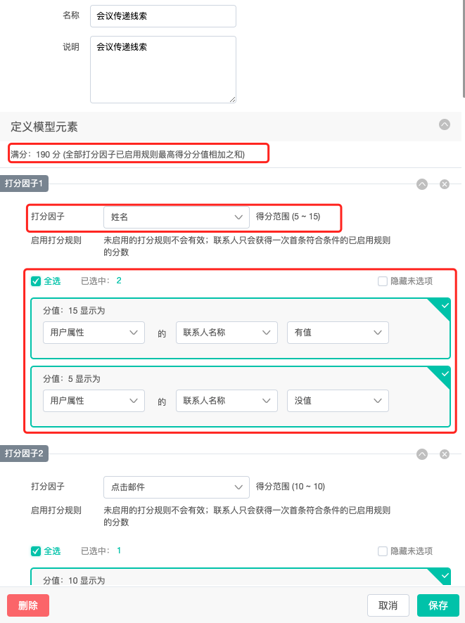
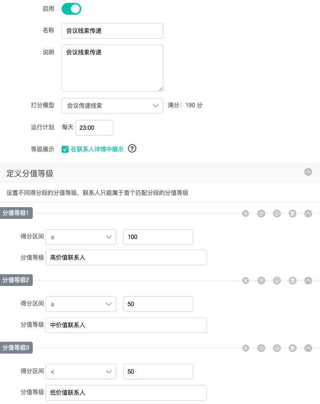
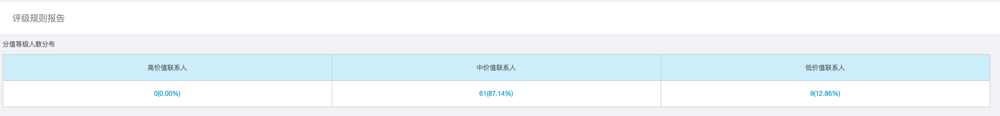
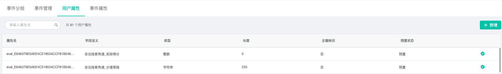

# 打分评级

从联系人的属性和行为事件两个纬度进行打分，对符合分值或者阶段的联系人进行二次营销或者培育。

从“数据中心“-“打分评级“进入评分模型配置页面：

打分评级页面分为：“打分因子“、“打分模型“、“评级规则“三大模块。

多个“打分因子“组成一个“打分模型“，一个“打分模型“组成一个“评级规则“，“评级规则“最终形成的可以使用的规则。

为了更好的让您了解打分模型的使用方法，请按照示例和我们一起深入了解。

**示例：**公司A是一家团队协作saas互联网公司，近期举办完一场线上会议，市场部同事使用Dmartech打分评级功能从会议留资的用户中获取高质量的销售线索，然后传递到自家的CRM系统内，帮助销售获取商机。

以下是市场部同事搭建的评分规则，要求最终评分为100的联系人，推送到自家的CRM系统内。

**表1：**

| 字段 | 条件 | 分值 |
| :--- | :--- | :--- |
| 公司名称 | 有值 | 20分 |
| 行业 | =金融业 | 20分 |
| 行业 | =互联网 | 20分 |
| 手机号 | 有值 | 20分 |
| 国家 | =中国 | 20分 |
| 国家 | 不等于中国 | 10分 |
| 职称 | 有值 | 20分 |
| 姓名 | 有值 | 15分 |

**表2：**

| 字段 | 条件 | 分值 |
| :--- | :--- | :--- |
| 提交表单 | 提交A表单  | 20分 |
| 访问页面 | 访问B页面 | 10分 |
| 打开电子邮件 | 打开邮件C | 10分 |
| 点击电子邮件 | 点击邮件C | 15分 |
| 参加会议 | 参加D会议 | 30分 |

## 创建评分规则

1.首先进入“打分因子“页面，按照上表对不同的字段和条件配置相应的分值。

* 点击“新增“，配置名称和说明；
* 选中“用户属性“，“公司名称“，有值，得“20“分。代表联系人公司名称有值就会得20分；
* 点击“打分规则“，配置联系人公司名称没值得5分；
* 若想配置其他条件，可点击“筛选条件“配置多余的条件；
* 红框内的从左到右依次代表：删除、下移、上移、复制和收起。删除是删除选中的打分规则，上移和下移代表移动对应的打分规则，复制代表复制对应的规则，收起代表收起规则条件；
* **注意：**当联系人满足打分规则1时就会得到对应的分值，不会在向下进行分值获取；
* 此时点击“保存“，就会生成一条因子；
* 依次建立其他字段和条件，表1即可配置完成；
* 表2是行为事件的条件打分规则，与表1配置基本相同，唯一不用是，表1是“用户属性“，而表2是选中事件进行打分；
* 当所有条件配置完成后，会生成下表。

2.点击“打分模型“，将多个打分因子聚合到一个模型内，为最终的规则做准备。

* 点击“新增“，配置名称和说明；
* 选择“打分因子“，会出现当前因子对应的所有打分规则，选中本次需要的因子，或者全部选中。注意每个打分因子选中多个规则时，当联系人满足规则1时就不会向下获取其他分值；
* 点击“添加打分因子“，同理可添加其他的打分因子；
* 选中本次需要的所有因子和规则后，可在“定义模型元素“内看到此模型的最高得分。

3.点击“评级规则“，将“打分模型“配置到评级规则内，完成最终的规则模型。

* 点击“新增“，可配置此规则开启或关闭，若开启则当规则配置完成后，此规则模型将固定时间内更新联系人的分值和等级；
* 配置规则的名称说明；
* 选择“打分模型“，此处选中最终需要的模型，且能看到该模型的最高分值；
* 选中运行计划，该规则模型将在每天选中的时间进行联系人分值和等级的更新。注意：已开启的规则该时间仍可手动修改；
* 选中等级展示，则此规则等级将在联系人详情页内展示；
* 根据选中“打分模型“最高值，可配置多个分值等级的规则，如图当分值大于等于100时，对应等级名称为“高级值联系人“，其他同理；
* 点击“保存“则此规则模型创建创建成功，在规定时间内将会运行。

如上图，是最终创建的规则，红框内操作从左到右依次为：编辑、报告、日志和删除。

上图是报告内详情，代表对应等级的联系人数量，以及在平台总人数的占比。**注意**：主、子账号看到的都是相同值，即报告内数据都是针对全平台联系人数量。

**注意**：每次创建的评级规则，都会在“元数据“-“用户属性“内创建对应的分值等级和实际得分属性。

## 联系人详情

当配置好评级规则，且规则运行后，到联系人详情页内可以看到该联系人在此规则模型内的分值和等级，以及评级变更所产生的事件。

点击“打分评级“按钮，可看到此联系人所有线索的变更记录。

**注意**：在“评级规则“内勾选中等级展示的规则将会在该页面展示，其他的都需要到“打分评级“内查看。

## 联系人分群

新建联系人分群，在联系人属性满足内选中“自定义信息“-“选中对应评级规则的分值或者等级“，填写分值或等级名称即可筛选出符合条件的联系人。

## 营销旅程

在营销旅程内，选中某分群，配置分值条件与线索传递即可将满足条件的联系人传递给线索系统内。

