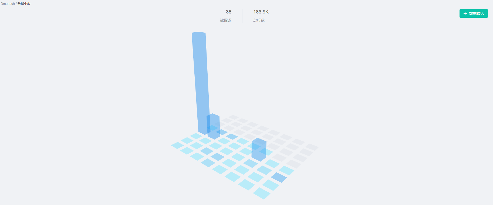
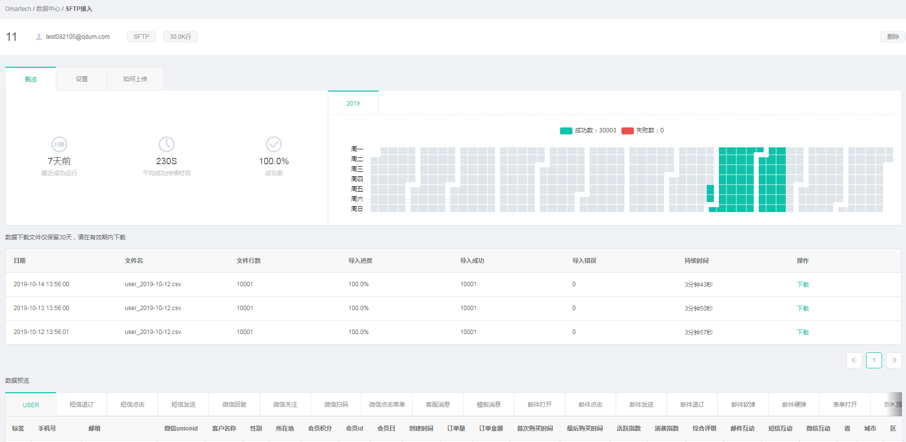

# 数据中心

Dmartech提供了多样化的数据接入方式，目前支持服务端SDK接口、服务端API接口、SFTP这三种接入方式来获取源数据。 

1）服务端API接口：采用Rest原则设计，使用秘钥授权和身份认证。请求和返回均采用规范的JSON格式，且编码为utf8。 

2）服务端SDK：目前支持JAVA JDK， 通过在项目中引入JAR包的方式， 将数据通过SDK传输给服务器。 

3）SFTP数据文件传输：通过秘钥安全访问FTP服务器，按日期分事件上传并更新数据。

在数据中心均可按照步骤进行数据接入。

