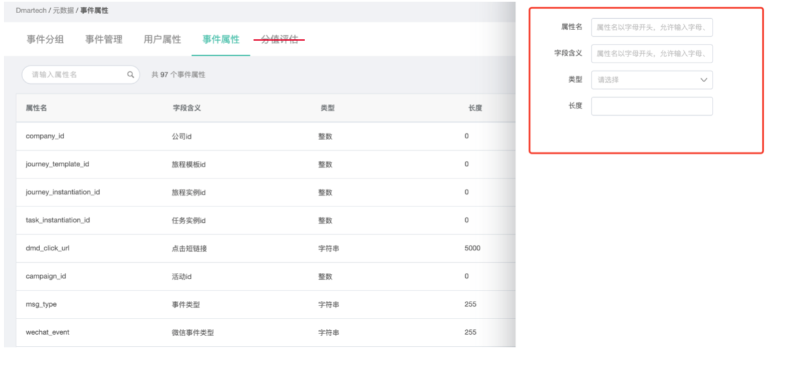
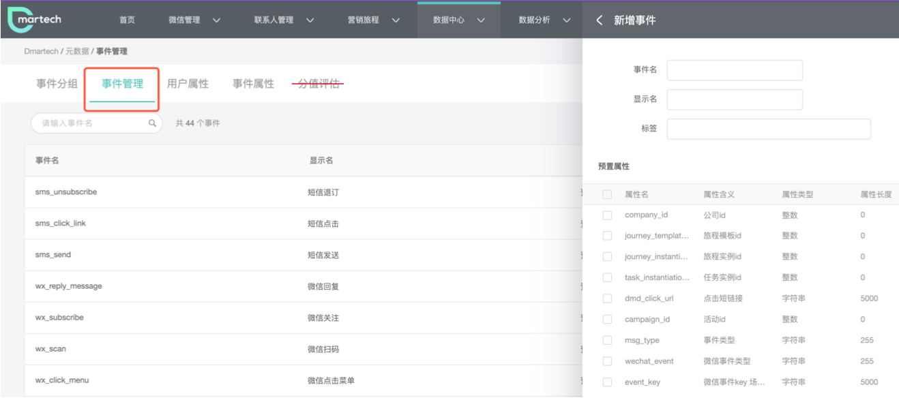
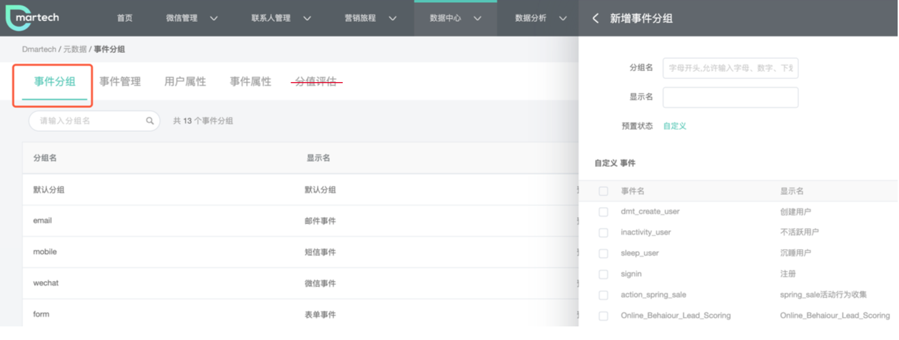
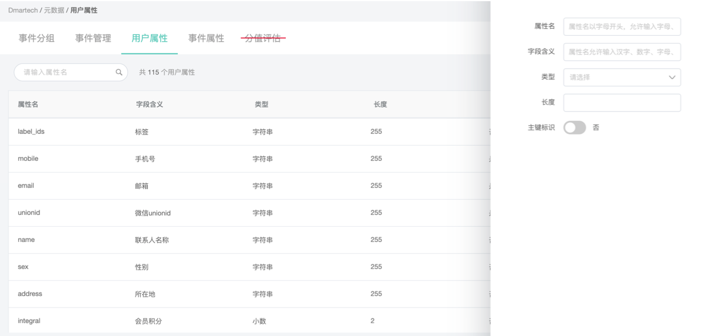

# 元数据

依次点击进入“数据中心“—“元数据“，可以看到5类内容，分别是：事件分组、事件管理、用户属性、事件属性以及~~分值评估~~**（分值评估模块已删除，请使用**[**打分评级功能**](https://doc.dmartech.cn/shu-ju-zhong-xin/shu-ju-guan-li/da-fen-ping-ji)**）**。我们可以理解为三个部分：

1）事件定义：包括事件分组、事件管理、事件属性

2）用户定义：包括用户属性

~~3）（删除）分值评估：根据评分模型给联系人打分~~**（分值评估模块已删除，请使用**[**打分评级功能**](https://doc.dmartech.cn/shu-ju-zhong-xin/shu-ju-guan-li/da-fen-ping-ji)**）**

## 事件定义

 联系人的行为用事件来记录，在联系人详情中动态时间轴可查看所有行为动作。在Dmartech中系统预置了一些常用的事件，系统会默认捕捉一些联系人行为事件，也支持自定义事件用于网站买点或者其他后端传输的事件记录，自定义事件创建不限制数量。

#### 事件分组：用于将多个事件整合为组进行管理，一个事件分组中可包含多个事件。当事件非常多时，就可以将事件进行分组，便于管理和查找。设置分组后，在筛选条件中用到事件时，也是先选择分组，再选择事件

**事件管理：指的是具体的某个事件**

**事件属性：用于描述事件，是组成事件的基本元素，采集事件信息的时候，通过事件属性来记录事件发生的详情以及上下文信息，比如邮件打开事件，那么邮件名称、打开时间就是事件属性** 

### **系统预置的事件**

| 事件分组 | 事件 |
| :--- | :--- |
| 邮件事件 | 邮件打开、邮件点击、邮件送达、邮件退订、邮件软弹、邮件硬弹 |
| 短信事件 | 短信退订、短信点击、短信发送 |
| 彩信事件 | 彩信点击、彩信发送 |
| 微信事件 | 微信回复、微信关注、微信扫码、微信点击菜单、客服消息、模板消息、微信取消关注、群发消息 |
| 表单事件 | 表单打开、表单提交 |
| 标签事件 | 标签新增、标签移除、粉丝标签新增、粉丝标签移除 |
| 属性变更 | 属性变更、全局退订 |
| 订单事件 | 订单、订单详情 |
| 用户事件 | 创建用户、合并用户 |

**【示例】**

事件分组为“邮件事件“，其中包含“邮件打开“和“邮件点击“事件，“邮件打开“事件的属性包括旅程实例id、任务实例id、事件触发事件、邮件名称、邮件创建时间、联系人邮箱等。

系统预置的事件无需编辑，当联系人产生相关行为以上事件会自动被记录，可在“联系人详情—联系人动态“处查看事件记录。

### 如何自定义事件？

1）一般创建自定义事件用于网站埋点或API传输的事件记录，一般可以先新增事件属性。在“事件属性“页面点击页面右上角“新增“按钮，右侧会展开新增属性内容，需要填写：

* 属性名：即后台存储的名称，英文名称
* 字段含义：可以理解为系统显示中文名称
* 类型：字符串、整数、时间、小数
* 长度：不同类型的属性长度不同

2）创建完成事件会涉及的属性后，就可以创建事件，同样的，在“事件管理“页面点击右上角“新增“按钮，右侧展开新增事件内容，需要填写：

* 事件名：即后台存储的事件名称
* 显示名：使用时显示的中文名称
* 选择属性：选择该事件用到的事件属性，用于描述事件

3）若需要将事件分组，则在事件分组页面新增分组，操作方式同上，若新增分组加入新增的事件，会在默认分组中

## 用户属性

用户属性是指联系人各方面对信息，比如姓名、性别、年龄等，这些信息可以来自于上传或创建联系人时的录入，也可以时联系人提交表单后系统自动获取信息到平台中。

### **那么用户属性对营销工作有什么帮助？**

#### 1）形成完整的联系人资料，更加清晰的了解联系人，促进沟通

用户属性越完善，我们获取的联系人信息越多，能够帮助我们全方位了解联系人，一份完整的客户资料对销售来说是至关重要对，能够帮助销售于客户更加顺畅的沟通。

#### 2）通过联系人属性和行为事件，可以建立联系人细分，对客户进行分类，实现个性化精准营销

通过记录联系人的属性和行为（在联系人详情的动态时间轴上记录所有行为），可以非常精准的筛选出特定客户群体，针对性的进行营销，比如针对20岁～30岁的女性，推送美妆资讯，针对爱好运动的男性推送体育资讯。

#### 3）进行用户属性分析，找到目标联系人的特征 

企业一般需要对客户特征有整体的分析和了解，这就可以通过用户属性分析来实现，比如分析客户的年龄段分布、性别比例、地区分布、行业分布等，可以找到客户群体的共性，也可以用于支持营销方案。

### 如何创建和使用用户属性？

在“元数据“—“用户属性中“，系统预置了一些常用的用户属性，支持用户自定义，可自定义的字段类型有字符串、整数、时间、小数，**在文件导入或api导入客户数据时，需填写正确的数据类型进行导入，否则，会出现数据导入错误。**所有进入平台的联系人数据字段都需要在用户属性中定义，否则数据不会进入平台（表单字段也需要在元数据中都创建）。

点击“新增用户属性“可自定义用户属性，新增用户属性需要填写的内容：

* 属性名：后台存储的属性名称
* 字段含义：系统显示的名称
* 类型：字符串、整数、时间、小数
* 长度：根据类型设置长度
* 主键标识：**系统会根据主键属性合并数据，主键相同的数据被认为是同一个联系人，因此需要把能代表用户身份的属性设置为主键，比如手机号、邮箱等，主键具有唯一性，有重复值的属性不可以作为主键**。

**自定义用户属性最多可创建300个**

## ~~分值评估~~

**分值评估模块已删除，请使用**[**打分评级功能**](https://doc.dmartech.cn/shu-ju-zhong-xin/shu-ju-guan-li/da-fen-ping-ji)

