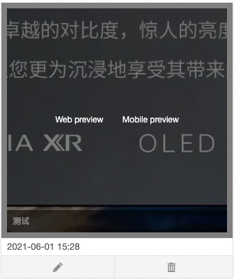

# Content

Material management manages all kinds of materials used in the operation of WeChat official account, including text and text message materials, picture materials, voice materials and video materials, supports operations such as adding, deleting, modifying and checking, and creates a material library for sending and using.

Click "WeChat management" -&gt; material management, you can enter the material management page. There is an upper limit on the amount of material stored in the library: text and text message material and picture material are online at 5000, and other types are 1000.

Synchronize DMARTECH WeChat material with WeChat public background. Select a time period in the upper right of the page and click "Synchronize WeChat material" to synchronize the WeChat background material to the local.

【Text message page】

1\) The text message page displays all the text messages, including single text and multiple text, which can be retrieved according to the title / author / abstract. Each text supports preview, edit, delete and other operations

2\) Click "create text message" in the upper right corner to create a new text message. Dmartech provides a convenient text message editor to insert pictures, videos and small programs

3\) Text message preview supports web page preview and mobile phone preview 

* Web page preview is to jump to a new web page to preview the text message 
* Mobile preview provides two-dimensional code of text message, scanning two-dimensional code can preview text message on mobile terminal

【Picture】

1\) The creation of image material can be completed by uploading a local image with a size of less than 10m. Support PNG / jpeg / JPG / GIF format. 

2\) Each image material supports preview and delete operation.

【Audio】

Upload audio material from local, the size of material is not more than 2m, playback length is not more than 60s, support AMR / MP3 format.

【Video】

The video does not support local upload, and the existing video in wechat background can be synchronized

