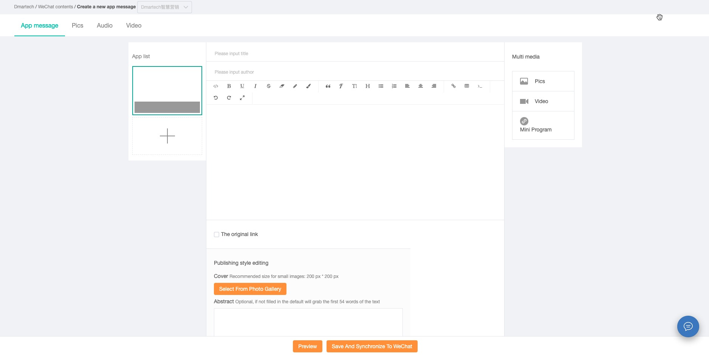
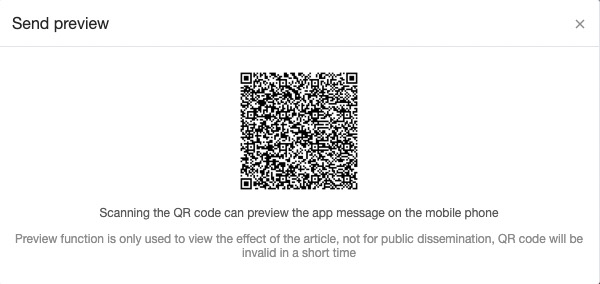
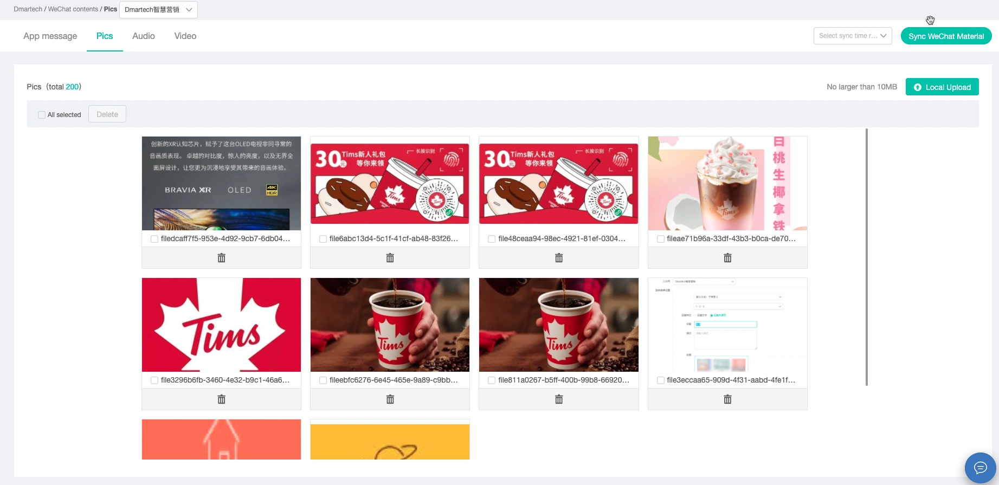
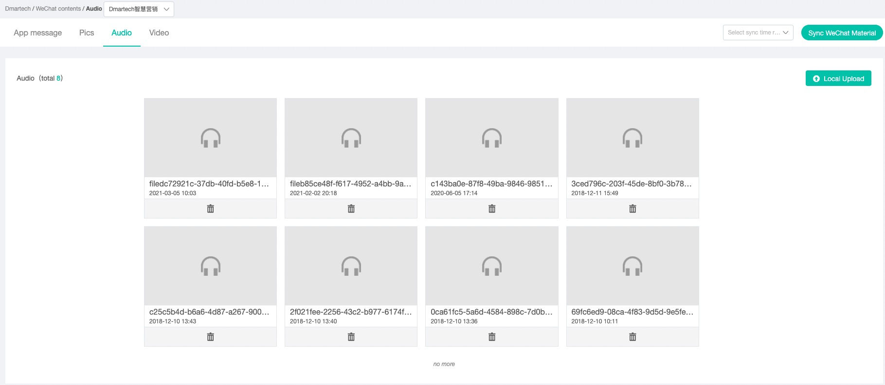
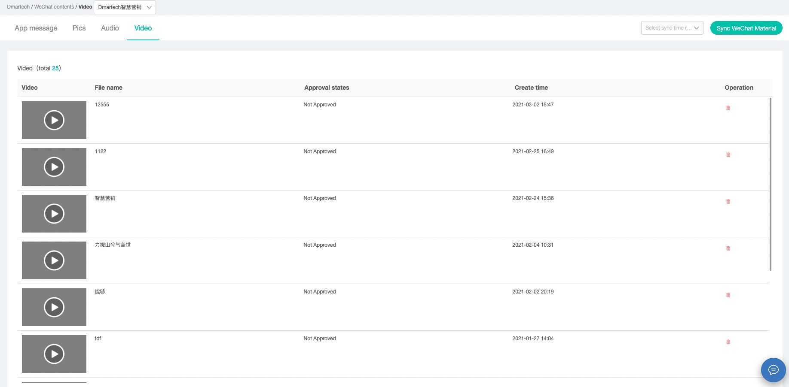

# Content

Material management manages all kinds of materials used in the operation of WeChat official account, including text and text message materials, picture materials, voice materials and video materials, supports operations such as adding, deleting, modifying and checking, and creates a material library for sending and using.

Click "WeChat management" -> material management, you can enter the material management page. There is an upper limit on the amount of material stored in the library: text and text message material and picture material are online at 5000, and other types are 1000.

_**In December 2021, WeChat public backend adjusted the draft box interface, added a new publishing interface, and gradually completed grayscale testing for all public numbers.**_

Synchronize DMARTECH WeChat material with WeChat public background. Select a time period in the upper right of the page and click "Synchronize WeChat material" to synchronize the WeChat background material to the local.

【Draft Box】

1\) The draft box page shows all the graphic messages, including single and multiple graphic messages, which can be searched by title/author/summary, and each graphic supports publish, preview, edit and delete operations

2\) Click "create text message" in the upper right corner to create a new text message. Dmartech provides a convenient text message editor to insert pictures, videos and small programs

3\) Text message preview supports web page preview and mobile phone preview&#x20;

* Web page preview is to jump to a new web page to preview the text message&#x20;
* Mobile preview provides two-dimensional code of text message, scanning two-dimensional code can preview text message on mobile terminal

 (1) (1).png>)

4）Click the Publish button to publish the edited graphic message. The successfully published graphic message will enter the published page from the draft box, and the unsuccessful graphic message will be kept in the draft box.

【Picture】

1\) The creation of image material can be completed by uploading a local image with a size of less than 10m. Support PNG / jpeg / JPG / GIF format.&#x20;

2\) Each image material supports preview and delete operation.

【Audio】

Upload audio material from local, the size of material is not more than 2m, playback length is not more than 60s, support AMR / MP3 format.

【Video】

The video does not support local upload, and the existing video in wechat background can be synchronized

【Publish】

Graphic messages that are successfully published in the draft box will appear in the published list.

 (1).png>)

1）The successfully published graphic message supports saving as new draft and deleting, after clicking save as new draft, the graphic message will appear in the draft box, as a new graphic that has not been synced to WeChat, you need to manually click sync to WeChat.

&#x20;2\) The published graphic messages can be used as the source of graphic materials for customer service messages, auto-reply and custom menu.

