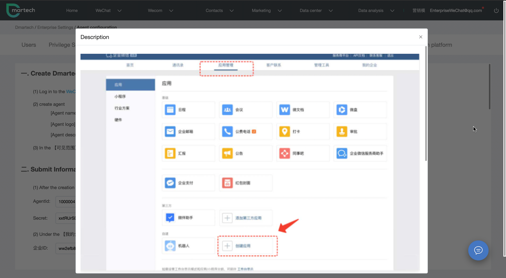

# Need to do

The Wecom of Dmartech platform includes three modules: channel QR code, enterprise Broadcast and Message archiving. The following will introduce you in detail how to use Wecom to achieve accurate marketing in Dmartech platform.

Before you get familiar with the specific functions and operations of Wecom, we provide you with a quick guide to configure Wecom to Dmartech, so that you can understand and get started using Wecom faster afterwards. Please make sure the following operations have been completed first:

* **Register on the Wecom official website**

Before using Dmartech , please go to the official website of Wecom at [https://work.weixin.qq.com](https://work.weixin.qq.com)

.png>)

* **Agent configuration**

After registering Wecom, you can add agent on the Dmartech. If you don't add agent or add successfully, you won't be able to use the related functions of Wecom.

There are two methods of binding.

1\. After entering Dmartech homepage, click \[Wecom]Module

.png>)

At this time, click on the Wecom trust module page is displayed as follows, click \[To configure]

2.Enter Dmartech homepage, go to the upper right corner of Account Information-Enterprise Settings-Wecom, click "Add agent", Dmartech only supports adding an agent for Wecom.

.png>)

.png>)

It takes 8 steps to add agent, and each step of the operation has corresponding graphic instructions, which can be viewed through the pop-up window by clicking on it.

.png>)

Please ensure that the information filled in each step is accurate and follow the instructions to complete the 8 steps, incorrect data or missing steps will affect the use of Wecom.

### **Modify agent**

Click "Agent Configuration" to modify the internal data of the created agent. Click "Configure Complete" after making changes.

* _Simultaneous organization staff_

After authorizing Wecom, the information of employees selected within the visible scope of the agent will be automatically synchronized to the organization's staff structure; the organization staff needs to be configured in Wecom，choose \[Contacts].

About the permission configuration related to Wecom in Dmartech.

All employees have organization-wide data visible for all data within the Dmartech Enterprise WeChat module, channel QR codes, enterprise broadcast, and message archives.

Contact data, however, still follows the rules within Data Permissions - Contact Records.

The permission for employees to add contacts, this permission needs to be modified and added by the enterprise in the Wecom backend - Customer Contact module**.**

After understanding the above operation steps, you have completed the configuration of Wecom. Next, we will introduce you the three modules and scenarios in Dmartech Wecom, so that you can better use Dmartech  to achieve accurate management and marketing.
