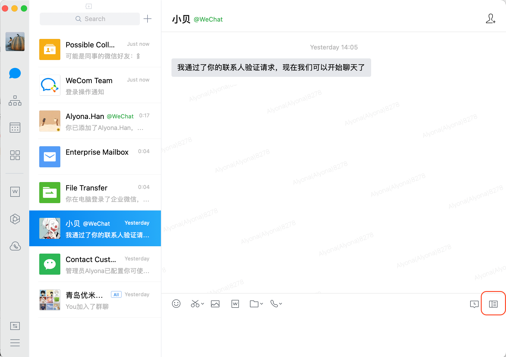
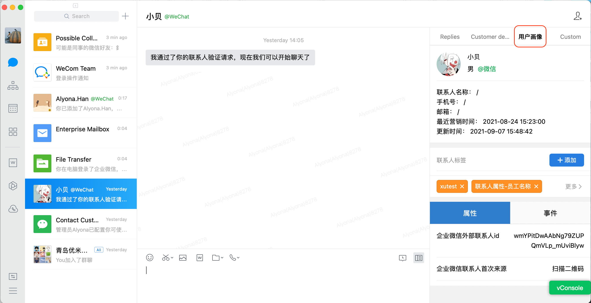
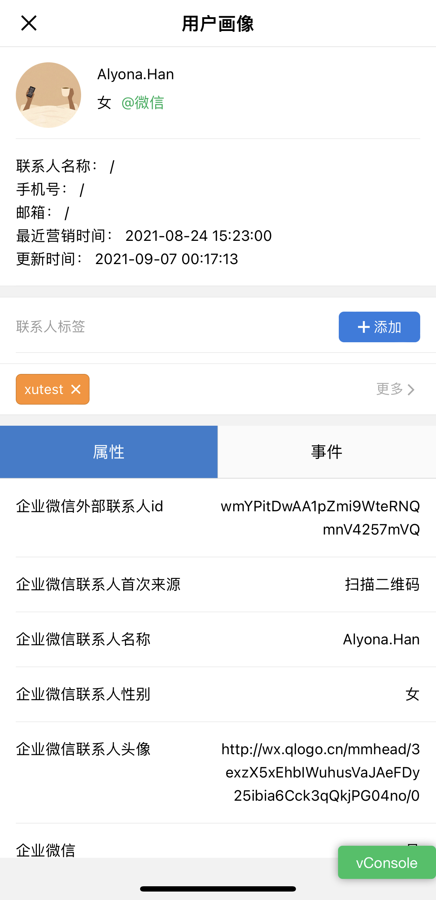

# Wecom App

After Dmartech's self-built application is completed in Wecom binding, Dmartech will

* **Pushing application messages, and employees complete the follow-up through \[Dmartech Notification].**
* **Synchronizing details of Dmartech contact **
* **Portraits/tags/attributes and events.**
* **Edit (add/remove) the tags of contacts**
* **Selective display of attributes and events of contacts.**

The specific operations are as follows:

* View a contact's user profile at any time after adding them.

When an employee clicks on the conversation window of an external contact (usually the contact WeChat), the right sidebar can be expanded by clicking the sidebar button at the bottom right corner of the page, and Dmartech's user profile will be displayed in this sidebar.

Please note that the content of the contact portrait is only visible to employees with a visible scope within the self-built application.

* **Receive app notifications to keep up with contacts**

When an employee receives a message push that needs to be pushed to a contact, the client will display the message details of the Dmartech notification update.

Employees click the Copy button to copy the push message; click the Follow Up button for the customer they need to contact to access the chat page for that contact, paste the copied message, and click Send.When the send is complete, go back to the Dmartech notification and click Finish. The sending task is considered to be completed.

* **Client Add/Remove Contact Tags**

The contact tags displayed in the contact user profile are synchronized with the Dmartech platform contact tags, and employees are supported to add and remove tags on the PC/Mobile side, click "Add" to add tags to contacts, and search for existing Dmartech tags when adding tags.

The client can manage the contacts according to the follow-up details at any time, and also keep in sync with Dmartech.
