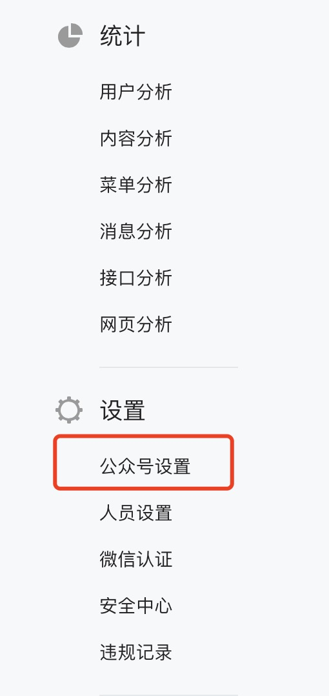

# 微信管理

Dmartech微信管理模块依托于微信公众后台，需绑定微信服务号或订阅号方可使用。绑定微信服务号时，无功能限制；当绑定订阅号时，二维码和模板消息功能不可用。

**支持绑定多个公众号**

## 微信公众号的绑定与解绑

### 绑定公众号

未绑定公众号时，点击微信管理模块任意页面显示如下：

按页面显示“点击进行微信授权“进入授权页面，管理员扫描二维码即可授权

或依次进入“企业设置”—“微信公众号”可以查看公众号列表，点击“绑定公众号”进入微信授权页面进行绑定

**绑定微信公众号后，当前关注公众号的粉丝都会自动成为Dmartech中的联系人以及粉丝，以后新关注的粉丝也会自动创建为客户。如果未来有粉丝取关公众号，系统不会自动删除该联系人，但该联系人便不再是绑定公众号的粉丝，也会记录取关的动作。**

### **解绑公众号**

点击公众号列表的“解绑”操作，可以看到弹窗显示的解绑提示，如果确认要解绑某个公众号，需要先在微信官方后台中解绑，然后再回到dmartech确认解绑，这样才能彻底解绑，如果没有在微信公众后台解绑，仅在dmartech操作无法解绑。

在微信公众后台请按照以下步骤操作解绑：

1）首先登录[微信公众平台](https://mp.weixin.qq.com)，输入账号密码登录：

2）登录后，将左侧列表的菜单项下拉至地步，找到“设置“菜单栏下的“公众号设置“项，点击进入（如图）

3）进入公众号设置后，可以看到该页面共有三个子标签页，点击进入“授权管理“，可以看到第三方授权列表，找到“dmcloud“，点击“查看平台详情“，进入详情页

4）在详情页下拉就可以看到“取消授权“按钮，点击按钮即可解绑

5）完成微信官方解绑流程后，需要在Dmartech在线客服上告知客服，你已在微信后台解绑dmartech，客服会将你的解绑需求以工单形式派工，最快1小时最迟24小时即可完成解绑。 

**注：取消公众号授权后，已存在于系统中的粉丝（联系人）不会自动删除，但粉丝信息将不再更新。如果取消授权后再次授权，可能会导致粉丝关注信息无法同步的问题，可点击联系人管理的“微信粉丝联系人“页面的“同步微信粉丝“进行手动同步**

**绑定和解绑只有管理员可操作，解绑需谨慎**

## 多公众号的使用

### 在微信模块的使用

微信模块的所有功能页面导航栏都增加了公众号选择框，下拉可选择当前内容所属的公众号，切换公众号后微信模块所有页面的公众号都会切换

1）微信二维码，在页面上方导航栏选择“Dmartech智慧营销公众号，表单当前所展示的二维码都属于该公众号，新建也同理，如果需要创建其他公众号下的二维码，直接下拉切换公众号即可

2）发送微信消息，同样微信消息的发送 ，也是针对页面上方所选择公众号的群发对象和素材

3）其他内容如自动回复、自定义菜单、消息管理、粉丝管理、素材管理、模板管理都是相同方式切换公众号查看和设置内容。

### **在联系人列表中的微信粉丝展示**

在联系人列表中，微信粉丝联系人列表展示的联系人为所选公众号的全部联系人，支持多选。当选择多个公众号时，列表中包含所选公众号的全部联系人

注意：当同一联系人同时关注了多个公众号时，如果该联系人没有通过手机号、邮箱等主键打通，则在平台中会存储多条联系人数据，如果已经在公众号上使用相同的手机号或邮件数据，被系统收集，则会合并为一条数据，在联系人属性中，会记录不同公众号的openid和订阅属性

### **在联系人分群中使用**

1）属性判断：可以根据每个公众号的subscribe、unsubscribe、openid 等属性设置判断条件

2）事件判断：如果在联系人分群中，使用微信事件时，一般需要先添加“微信公众号”事件属性，选定公众号范围，比如，筛选出给公众号“Dmartech智慧营销“回复内容为”Dmartech“的联系人，则条件设置如下：

注意：旅程中的微信相关属性和事件判断同理

### **在营销旅程的使用**

1）实时旅程的触发条件为微信事件时，先选择事件，再下拉选择一个公众号，表示触发该公众号指定事件的联系人呢进入旅程

2）旅程素材中的微信类素材，可以切换公众号，选择对应公众号的素材

3）单次旅程目标受众可以选择任意一个或多个公众号

### 在多账号协同

1）可以给指定组织部门分配不同的公众号使用权限，在“企业设置”—“渠道分配”下增加了微信公众号渠道，点击“配置”可以给部门设置公众号权限，添加或删除公众号

**注意：根据目前的多公众号设置，如果企业有设置过部门，那么默认部门是未配置公众号的，因此访问微信管理页面时会提示没有权限。如遇此类问题，请在【企业设置-渠道分配】处为部门进行公众号配置。父部门配置≠子部门配置，因此按需决定是否都要配置。**

2）联系人共享，可以共享不同公众号下的联系人。在“企业设置”—“数据共享”—联系人共享下设置共享规则时，可以根据不同公众号来设置共享数据

