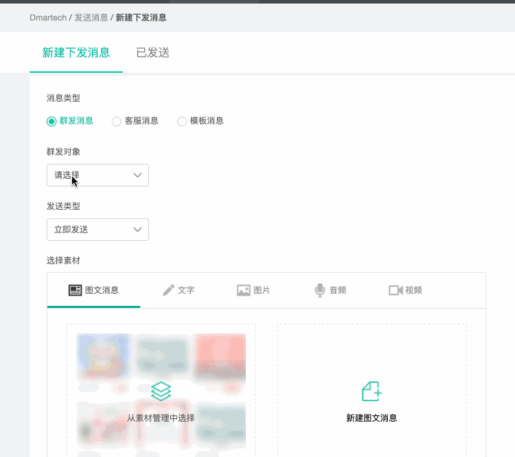

# 发送消息

支持发送三类微信消息：群发消息、客服消息和模板消息。

有关发送消息的最新规则，请见微信官方说明：[https://developers.weixin.qq.com/doc/offiaccount/Message\_Management/Batch\_Sends\_and\_Originality\_Checks.html](https://developers.weixin.qq.com/doc/offiaccount/Message_Management/Batch_Sends_and_Originality_Checks.html)

## 三类消息介绍

### **1、群发消息**

对于认证服务号虽然开发者使用高级群发接口的每日调用限制为100次，但是用户每月只能接收4条，无论在公众平台网站上，还是使用接口群发，用户每月只能接收4条群发消息，多于4条的群发将对该用户发送失败；

对于认证订阅号，群发接口每天可成功调用1次，此次群发可选择发送给全部用户或某个标签；

### **2、客服消息**

仅限发送给48小时内有过如下**互动**行为的粉丝，互动是指：

* 用户发送信息
* 点击自定义菜单（仅有点击推事件、扫码推事件、扫码推事件且弹出“消息接收中”提示框这3种菜单类型是会触发客服接口的）
* 关注公众号
* 扫描二维码
* 支付成功
* 用户维权

### **3、模板消息**

1）所有服务号都可以在微信公众后台“功能-&gt;添加功能“插件处看到申请模板消息功能的入口，但只有认证后的服务号才可以申请模板消息的使用权限并获得该权限；

2）需要选择公众账号服务所处的2个行业，每月可更改1次所选行业；

3）在所选择行业的模板库中选用已有的模板进行调用；

4）每个账号可以同时使用25个模板。

5）当前每个账号的模板消息的日调用上限为10万次，单个模板没有特殊限制。【2014年11月18日将接口调用频率从默认的日1万次提升为日10万次，可在MP登录后的开发者中心查看】。当账号粉丝数超过10W/100W/1000W时，模板消息的日调用上限会相应提升，以公众号MP后台开发者中心页面中标明的数字为准。

**Dmartech开放主动下发模板消息给粉丝的功能，目的是为了更好的帮助客户维护粉丝。但切勿滥用此功能，大量群发模板消息会导致粉丝投诉，你的公众号会被警告或封闭。Dmartech不承担相关责任，亦不能承诺或保证相关到达率及投诉率。**

## **三类消息发送操作**

### **1、群发消息发送操作**

1）群发对象：可选择所有粉丝或某个标签下的粉丝，关于粉丝和粉丝标签的详细内容见“[粉丝管理](fen-si-guan-li.md)“；

2）发送类型：可立即发送或定时发送；

3）选择素材：支持发送图文消息、文字、图片、音频、视频，发送的素材可以从已经创建好的“[素材管理](su-cai-guan-li.md)“中选择相应的素材，可以新建；

4）点击“发送“按钮执行消息下发命令；

5）点击“已发送“进入历史发送记录查看页面，可以查看历史发送情况；

### **2、客服消息发送操作**

客服消息发送的操作与群发消息相同，唯一不同的是客服消息仅在48小时之内有过用户互动行为的情况下才可发送给用户。

### **3、模板消息发送操作**

模板消息的发送操作与其他两类消息也相同，这里选择的素材是[模板管理](mo-ban-guan-li.md)中的模板素材

## 已发送

可以查看各类消息的发送记录，可以看到实际发送状态。

