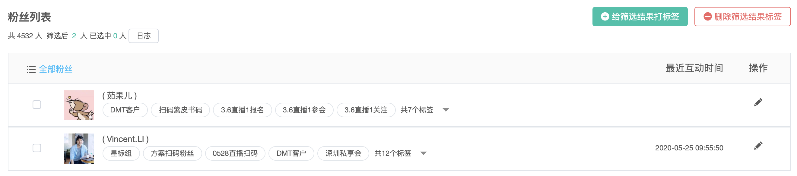

# 粉丝管理

粉丝管理是指对授权Dmartech平台的微信公众号的粉丝进行管理，可查看粉丝关注和取关列表，查找粉丝，给粉丝打标签等

## 操作指南

依次点击“微信管理”-&gt;粉丝管理，可进入粉丝管理页面。分两个页面分别管理“已关注“和“已取关“粉丝。

### 已关注

#### 1）筛选器

根据性别、地区、语言、标签、互动等纬度筛选粉丝。也可直接搜索粉丝昵称/备注

其中，标签即为平台中的粉丝标签，用于标记和分类微信粉丝，可通过点击页面右上角“新建标签“按钮进行新建，一个粉丝最多可添加20个标签，可对某标签下用户群发消息。

_**注：粉丝标签创建后仅能在微信公众平台内删除，且不会在Dmartech内删除。若要在Dmartech内删除可重新授权公众号。**_

#### 2）已关注粉丝列表

粉丝列表展示全部粉丝或根据筛选器筛选出的粉丝列表，列表中可查看粉丝头像、昵称、标签、最近互动时间，可修改备注；

#### 日志

点击“日志“按钮可以查看粉丝标签的打标签记录，以及进度和处理情况。

**“给筛选结果打标签“与“删除筛选结果标签“：**

此功能用于将筛选出的粉丝应用于指定联系人分群，筛选出这些粉丝中同时存在于该分群的联系人，添加或删除某些标签。

### **已取关**

已取关粉丝列表仅展示了取关粉丝的头像和昵称。

