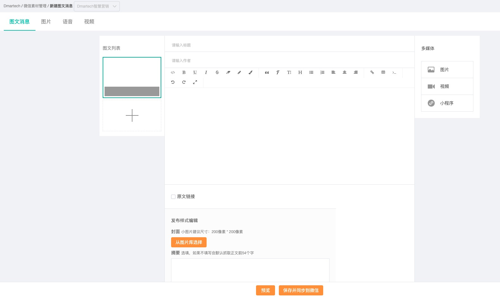
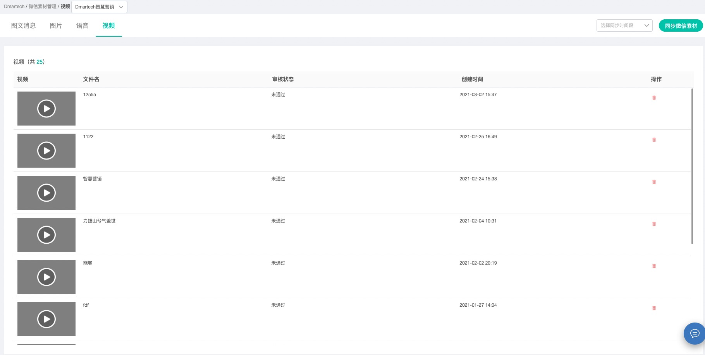

# 素材管理

## 操作指南

依次点击“微信管理”-&gt;素材管理，可进入素材管理页面。素材库保存数量有上限：图文消息素材、图片素材上线为5000，其他类型为1000。

Dmartech微信素材与微信公众后台的同步，在页面右上方选择一个时间段，点击“同步微信素材“可将微信后台的素材同步至本地。

### **【图文消息】**

1）图文消息页面中展示了所有的图文消息，包括单图文和多图文，可根据标题/作者/摘要进行检索，每个图文支持预览、编辑、删除等操作

2）点击右上角的“创建图文消息“可新建图文消息，Dmartech提供了便捷的图文消息编辑器，可插入图片、视频及小程序

3）图文消息预览支持网页预览和手机预览两种方式

* 网页预览即跳转至新的网页页面预览图文消息
* 手机预览提供了图文消息的二维码，扫描二维码可在手机端预览图文消息

### **【图片】**

1）从本地上传大小不超过10M的图片即可完成图片素材的创建。支持PNG/JPEG/JPG/GIF格式。

2）每个图片素材支持预览和删除操作。

### **【语音】**

从本地上传语音素材，素材大小不超过2M，播放长度不超过60s，支持AMR/MP3格式。

### **【视频】**

视频不支持本地上传，仅支持同步微信后台已有视频。

