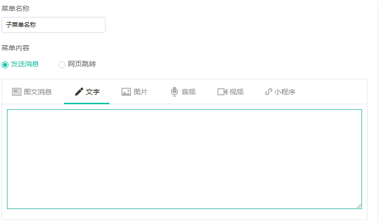

# 自定义菜单

### 操作指南：

依次点击“微信管理”-&gt;自定义菜单，可进入此功能页面。

1）自定菜单最多包括3个一级菜单，每个一级菜单最多包含5个二级菜单。一级菜单最多4个汉字，二级菜单最多7个汉字，多出来的部分将会以“...”代替。

2）编辑子菜单可设置点击子菜单时的菜单内容，支持发送消息（图文消息、文字、图片、音频、视频）和网页跳转

3）支持拖拽调整菜单排序

4）菜单设置完成后，点击“保存并同步到微信”按钮即可。

