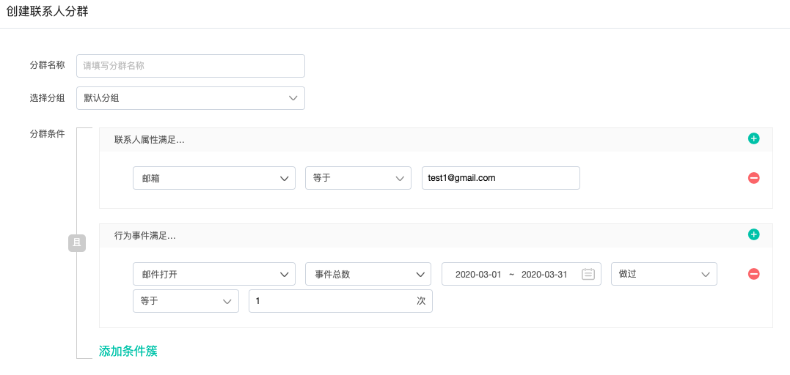

# 快速入门

使用地址  [https://app.dmartech.cn](https://app-beta.dmartech.cn)  进入Dmartech平台，输入你的账号密码登录Dmartech（右上角可切换中英文版本）： 

登录成功即进入Dmartech首页，如果是初次使用，首页的数据都为0：

## 1、导入客户数据

Dmartech智慧营销是基于平台内客户数据的，那么首先我们需要导入客户数据。客户数据分为微信粉丝和系统联系人数据。根据你的使用需求，导入相应的客户数据。

**1）微信粉丝**

使用微信管理模块需先绑定微信公众号，未绑定微信时，点击微信模块显示如下：

绑定具体操作方见“[微信管理](wei-xin-guan-li/#wei-xin-gong-zhong-hao-de-bang-ding-yu-jie-bang)"

绑定后微信粉丝会自动同步到Dmartech。可在“微信管理-&gt;粉丝管理”中查看粉丝详情。

**2）联系人数据**

Dmartech提供了多种接入联系人数据的方式。具体操作方式见“数据中心”，每一种接入方式会按步骤指引操作。

* 【服务器端接入】SDK/API接入：具体接入方式见“[数据中心](shu-ju-zhong-xin/shu-ju-guan-li/shu-ju-zhong-xin.md)“
* 【联系人端接入】JS-SDK接入：具体接入方式见“[数据中心](shu-ju-zhong-xin/shu-ju-guan-li/shu-ju-zhong-xin.md)“
* 【数据文件接入】SFTP接入：具体接入方式见“[数据中心](shu-ju-zhong-xin/shu-ju-guan-li/shu-ju-zhong-xin.md)“

另外，在联系人管理可以看到“创建联系人"和“上传数据“按钮，“创建联系人“即可手动创建单个联系人。“上传数据“即SFTP的方式上传数据文件。更多详情见“[联系人管理](ke-hu-guan-li/ke-hu-guan-li-1.md)“

## 2、创建联系人分群

Dmartech营销旅程的目标受众是“联系人分群”和“公众号粉丝”，联系人数据接入平台后，接下来很重要的是，创建联系人分群，即联系人分群是根据“联系人属性“和“行为事件“筛选出符合条件的联系人群体，将其保存为一个组。一般来说，我们导入联系人的时候，会为联系人打上标签，可以设置分群条件为“标签”等于“导入时打上的标签”，保存后即可筛选出某标签下的联系人，用于对这些联系人进行后续的营销。

## 3、营销旅程

### 3.1 邮件渠道使用场景及方式

如果你需要使用Dmartech进行邮件群发，那么在准备好要发送的人群受众之后之后，接下来就可以创建邮件素材。

依次进入“营销旅程”-&gt;素材—【邮件素材】创建邮件素材，可以看到Dmartech提供了三种创建邮件素材的方式：拖拽式设计、粘贴代码、导入zip。你可以选择合适的方式来进行创建，具体操作方式见“[素材](ying-xiao-lv-cheng/su-cai.md#you-jian-su-cai)“

当邮件创建完毕后，我们通过营销旅程来进行邮件的批量发送。

**场景一：只是单次批量发送邮件**

如果你只是想单次批量发送邮件，进入营销旅程，【新建旅程】中创建单次活动即可。

第一步：选择目标受众，拖拽至旅程画布中。

第二步：选择要发送的邮件素材，拖入画布中。

第三步：连接目标受众与邮件素材。

第四步：点击邮件素材控件，点击编辑按钮，进入邮件设置。

填写相关邮件设置内容，点击确定：

邮件设置完成后，即可开始旅程，检测通过点击“开始旅程”。邮件就会按照设置的发送时间进行投送。

一般来说，在大批量发送前，可先利用内部小的联系人分群进行测试，一方面可以检测旅程是否正确执行，另一方面可以查看收到的邮件内容是否达到预期效果。

**场景二：增加判断条件的邮件发送**

基于场景一的单次发送，可以增加判断条件，比如向邮箱有值的联系人发送邮件，只需在邮件素材之前加入条件分支控件即可。

设置条件：

**场景三：需要周期性执行活动**

当需要周期性执行活动时，就需要新建“周期活动”旅程，在新建旅程时，设置重复周期，然后旅程中的路径将会重复执行。

更多还有复杂的旅程使用方式，见“[营销旅程](ying-xiao-lv-cheng/)“

### 3.2 微信渠道使用场景及方式

当需要给粉丝发送微信消息，有两种方式：微信原生功能、营销旅程。

方式一：通过微信原生功能发送微信消息

依次点击进入【微信管理】-&gt;“发送消息”页面，可以发送三种不同类型的消息：群发消息、客服消息、模板消息。

方式二：通过营销旅程发送微信消息

选择受众为相应公众号

选择素材为相应消息类型

### 短彩信渠道使用场景及方式

通过旅程群发短信，在【营销旅程】-“素材”中创建好短信素材，就可以通过旅程群发短信。

### 多渠道营销以及实时旅程

Dmartech最核心和强大的功能在于整合多渠道，通过实时条件触发旅程，形成基于不同场景的自动化营销路径。

**场景一：展会资料下载**

 ****1）场景流程

2）场景描述

通过二维码、表单、实时旅程，在用户下载资料的同时实现leads自动转化为member。

整个过程均是根据用户互动行为事件自动触发的，节省人力的同时给予用户更好地体验。

3）场景实现

步骤一：准备表单素材

可联系你的客户经理，由wp将表单部署于服务器，部署完成后即可在“营销旅程—&gt;表单”下浏览并使用该表单。

步骤二：准备用于表单投放的模板消息

你需要在微信后台创建模板消息并通过审核，在“微信管理—&gt;模板管理”中同步模板消息至Dmartech，编辑该模板消息，设置为跳转至已准备好的表单。

步骤三：准备会签提醒短信与会后资料下载短信，在“营销旅程—&gt;素材”中创建。

步骤四：创建资料下载二维码

在“微信管理—&gt;二维码列表”中创建用于展会的二维码。

步骤五：构建展会场景实时旅程

创建一个以用户扫码时间为触发条件的实时旅程，每当有用户使用微信扫描“展会资料下载”二维码即会进入旅程。

步骤五：实施旅程

点击开始旅程，正式开始前，可先进行测试，确保旅程能够顺利运行。

**场景二：打通粉丝与线下会员数据**

1）场景流程

2）场景描述

解决粉丝与线下粉丝数据各自分离的问题。 

打通粉丝与线下会员数据，完善会员数据与画像，实现多渠道营销。

3）场景实现

步骤一：准备表单素材，同场景一，不赘述啦

步骤二：准备模板消息与短信素材，同场景一。

步骤三：构建旅程

步骤五：实施旅程

点击开始旅程，正式开始前，可先进行测试，确保旅程能够顺利运行。

以上就是新手指引的全部内容了，希望可以帮到你哦~如果使用过程中有任何疑问，可以通过在线客服咨询或者联系客户经理反馈问题。

