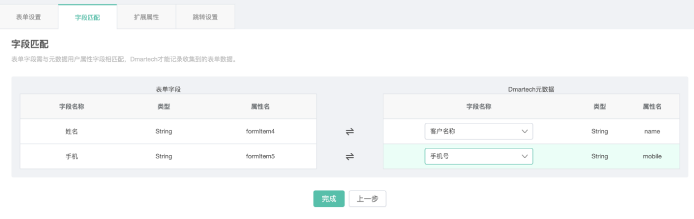

# 表单

通常我们下发表单来收集用户信息。Dmartech表单由开发人员在服务器上直接部署，并在部署完成后和客户账号下的对应表单相互关联，表单可通过模板消息和二维码下发。

点击“营销旅程”-&gt;“表单“即可进入Dmartech表单管理界面。左侧为表单分组栏，可对表单进行分组管理。点击右上角“创建表单”，可以看到Dmartech提供了两种表单创建方式：标准表单和接入金数据表单。在表单列表的“表单来源“显示了表单的类型。

点击“创建表单“，可选择创建标准表单或接入金数据表单。

## 标准表单

首先，创建表单之前，需要在元数据的用户属性中自定义表单所需的字段，以便于收集的表单数据能够进入Dmartech数据库。依次点击“数据中心”-“元数据”-“用户属性”-“新增”，添加元数据中没有的表单字段。 

元数据中创建好字段之后就可以创建标准表单了。表单编辑器为左中右布局，左侧为字段选择区，中间为表单展示区，右侧为字段设置区。

【操作步骤】

1）在表单上方编辑表单名称和HTML名称（指导出的HTML文件的名称）

 2）在左侧字段选择区选择所需的字段或字段类型，点击即可添加至表单；

 3）点击表单中字段，在右侧设置相关字段属性，包括字段名称、HTML名称（指在HTML代码中显示的名称）、默认值、提示以及校验等，不同字段可设置校验内容不同，一般包括设置必填项、不能与已有字段重复、字符限制等。

 4）表单创建完成后，点击保存，页面跳转至“字段匹配”页面，在表单右上角会出现表单链接（可复制）、表单二维码（扫描可预览表单），以及导出HTML按钮，点击可导出当前表单HTML源代码，可用于表单二次加工。

5）保存后页面将跳转至“字段匹配”阶段，将表单中创建的字段与元数据中创建的与之对应的字段进行关联。

6）点击“完成”则创建好一个表单。

 7）表单创建完成，还可以进行表单相关其他设置。

A：扩展属性

扩展属性一般用于区分表单数据来源，通过为表达链接添加一个扩展属性字段，由该字段判断表单数据的来源渠道。最多可设置三层扩展属性。

B：跳转设置

用于设置用户提交表单后页面的指向。支持三种跳转方式：默认跳转、规则设置、隐藏字段跳转。

 a\)默认跳转是指，所有的用户提交表单后都跳转至默认跳转中设置的内容页面。支持设置默认提交成功、文本、富文本、链接。

b）规则设置是指，根据用户表单中填写的某字段值跳转至不同的页面，操作为选择字段、字段值，设置对应的跳转链接。以及字段未匹配时的跳转链接。

c）隐藏字段跳转是指，表单代码中新增了一个隐藏字段【GOTOURL】，由前端开发人员在html代码中写入跳转链接，适用于需二次开发的表单。

8）以上设置完毕后，表单就可以投放使用了。表单投放后，在操作栏点击“表单统计”图标，可以查看表单收集到的全部数据。

点击右上角“报告发送设置”可按照规则将报告发送到指定的邮箱内

a\)规则名称：可设置多个报告发送规则，因此每个规则需设置一个名称 

b\)字段筛选：设置字段筛选条件，报告将包含符合筛选条件的字段数据 

c\)添加筛选条件：仅符合筛选条件的数据才会导出到CSV报告内 

d\)发送时间：可设置立即发送、定时发送和周期发送 

e\)接收邮箱：添加接收报告的邮箱

