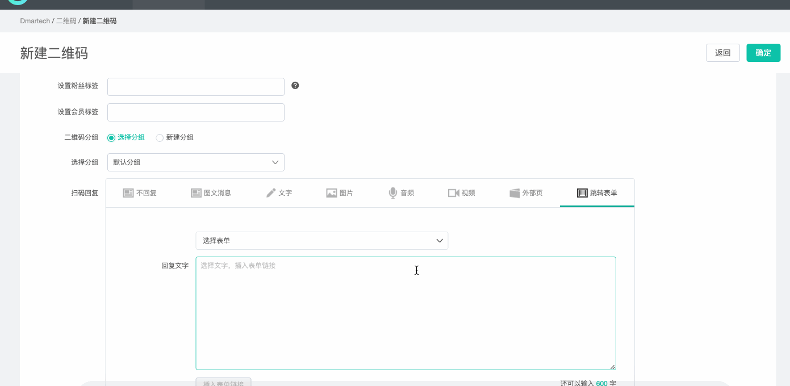
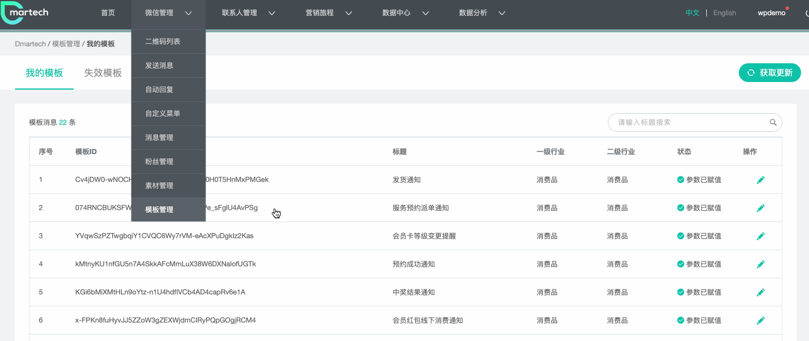

# 金数据表单

**金数据表单接入步骤**

* 第一步：创建表单
* 第二步：接入金数据API
* 第三步：接入金数据表单
* 第四步：字段匹配
* 第五步：测试
* 第六步：正式发布
* 第七步：通过二维码或模板消息下发表单
* 第八步：统计 

#### 第一步：**创建表单**

登录[金数据](https://jinshuju.net/)，在金数据注册账号，创建你需要的表单；

创建好表单之后，在**“设置”—“数据推送”**中填写数据回传的HTTP POST地址[https://gate.dmartech.cn/questionnaire/inner-api/questionnaire/v1/jishujuForm](https://gate.dmartech.cn/questionnaire/inner-api/questionnaire/v1/jishujuForm)，一定不要忘了哦，不然数据是没办法回传的。

#### 第二步：**接入金数据API**

**首次接入**金数据表单需要先绑定金数据账号，输入key/secret进行认证。

注意哦：请勿随意绑定不同金数据账号的 API Key，此举会导致已发布的表表单无法再回收数据。

#### 第三步：**接入金数据表单**

命名金数据表单，并将金数据表单的地址填写至Dmartech，获取表单。

#### 第四步：**字段匹配**

获取表单后，因为金数据表单字段类型可能与Dmartech存在差异，所以需要进行表单字段匹配。

字段匹配完成后点击保存，就完成了金数据表单的接入。

在表单列表中就新增了我们刚才创建的表单，可对表单进行查看、编辑、测试、统计删除等操作。

#### 第五步：**测试并发布**。

可以在表单接入和编辑界面进行快速测试，也可以在列表操作中进入测试，测试填写的表单信息会在表单测试记录中显示，确保表单可正常回收数据。测试后，表单状态就会由“未测试”变为“已测试”。

#### 第六步：**正式发布**。

测试后便可正式发布表单。

#### 第七步：**通过二维码或模板消息下发表单**

金数据表单的使用与下发与标准表单相同。

【二维码下发】

创建二维码时设置扫码回复表单，当用户扫描二维码就会收到表单或回复文字（点击文字链接进入表单），用户填写表单提交后，数据会自动进入Dmartech。

_**注：二维码绑定表单下发后，不能转发，因为表单链接携带参数，转发无效。**_

【模板消息下发】

在模板消息中设置跳转表单，当用户收到模板消息后，点击模板消息就可以跳转

#### 第八步：**统计**。

表单下发后，可在列表操作中点击【表单统计】查看数据收集结果。**支持下载详情**

_**注：表单状态有未测试、已测试、已发布，只有完成测试的表单才可以正式发布**_

\*\*\*\*

