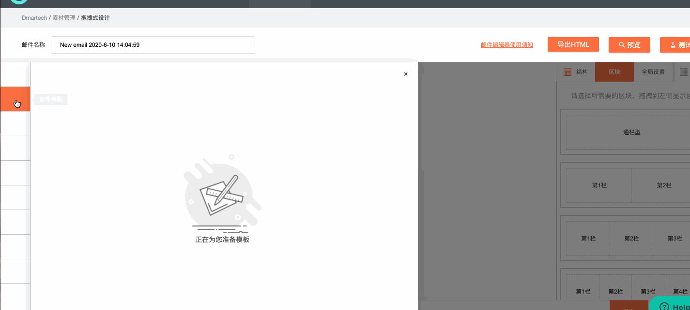
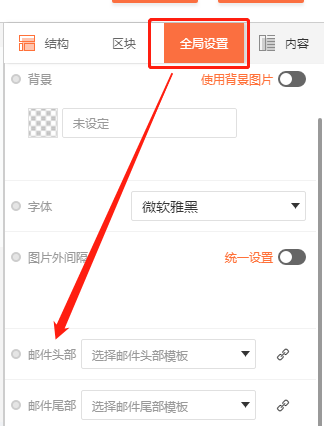
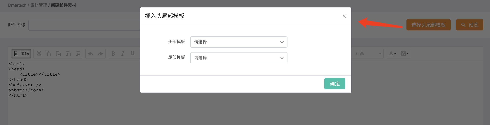
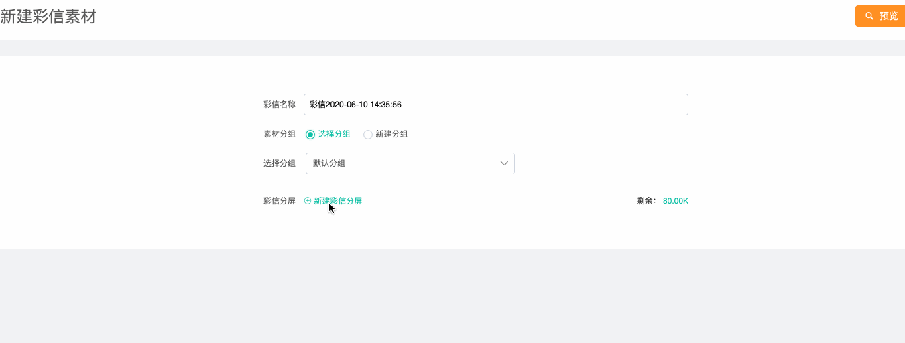

# 素材

## 素材管理

依次点击进入“营销旅程“—素材，进入素材管理页面。

支持对素材分组管理，左侧是分组栏，右侧是素材列表，系统内置了三个分组：全部素材、我创建的、共享给我的

* 全部素材：当前所有的素材，包括邮件、短信、彩信
* 我创建的：使用账号下创建的素材
* 共享给我的：素材是可以共享的，后续会详细介绍，其他账号共享过来的素材都在该分组中

除了系统内置的分组之外，用户可以按需自行创建分组，方便素材过多时的管理。右侧素材列表分别按照全部素材、邮件素材、短信素材、彩信素材分类，下面详细介绍每一种素材。

## 邮件素材

在“全部素材“页面下，点击页面右上角“添加素材“按钮，弹窗出现三种素材的创建入口，选择邮件创建，若是在“邮件素材“页面下，点击“添加素材“则直接进入邮件创建。

可以看到，邮件素材的创建有三种方式：拖拽式设计、粘贴代码、导入zip。

### 1、拖拽式设计

Dmartech提供了便捷强大的拖拽式邮件编辑器，选择好素材分组后，点击选择拖拽式设计即可进入拖拽式邮件编辑器。

首先在页面顶部编辑邮件名称，左侧为显示区，右侧为编辑区。

创建一封邮件，主要包括两部分内容：结构和内容。结构是用区块设计邮件的布局以及背景、宽度等全局设置，内容包括文字、图片、图文、按钮、分割线、目录、表格等，邮件制作就是将内容放入区块并填入信息、设置属性。

1）首先在“全局设置“中设置邮件整体样式，包括宽度、背景、字体、图片外间隔（开启后可统一设置所有图片外间隔）、选择邮件头尾模板

2）在“全局设置“设置好整体样式时，就可以根据布局从右侧选择合适的区块拖拽至左侧显示区，Dmartech提供了四种区块类型，分别划分为1、2、3、4个区块。区块拖拽至左侧显示区后点击区块即可在右侧编辑区编辑相关设置，区块比例、宽度、背景、边框、内外间隔等。

3）设置好区块后，选择内容放置在区块中。点击在右侧编辑内容，所有的内容都是相同的操作。内容元素不同设置的项目不同。

4）邮件编辑完成后，支持预览和测试，测试是将邮件发送到指定邮箱查看效果。

5）支持“导出HTML“，可将邮件二次开发使用。

_**注：不同的邮件服务商和客户端呈现的邮件细节可能不同，这是因为邮件编码至今没有统一的标准，各邮件服务商以及开发者都可以指定自己的邮件编码渲染标准，建议查看“**_[_**邮件编辑器使用须知**_](https://doc.dmartech.cn/qi-ta-shuo-ming/guan-yu-tuo-bian-ji-qi-jian-rong-xing-shuo-ming)_**“了解拖拽式编辑器兼容性说明。**_

#### 邮件模板

平台内还预置了大量邮件模板，可直接套用或参考使用。点击页面最左侧可查看模板列表，拖拽栏左侧选中模块，点击后展示所有邮件模板，选中直接使用即可。

### 2、粘贴代码

当你有现成当邮件代码时，Dmartech可以快速将你的代码创建成一封邮件素材。创建邮件时，点击选择“粘贴代码“的方式，进入编辑器，填写邮件名称，将邮件html代码粘贴至编辑框，点击“完成”即可。

### 3、导入zip

从其他地方下载的邮件也可在dmartech生成，只需准备zip文件包，上传生成邮件即可。压缩包应遵守以下规则：

1）压缩包内需包含一个html文件以及一个图片文件夹，图片文件夹名称必须为images

2）图片文件的名称必须为英文，不包含汉字或特殊符号

3）images文件夹内文件名称不能包含中文，且不能以数字或者特殊符号开头。

_**注：如果成功上传zip文件后邮件中部分图片未显示，请检查图片后缀与html图片后缀大小写是否一致，若不一致，可能会导致图片无法显示。**_

### 邮件头尾模板

为了减少重复工作，加快邮件创建效率，Dmartech支持创建邮件头尾，在模板库中保存，无论是通过哪种方式创建邮件，都可以直接插入邮件头尾。在素材列表页面，点击“邮件头尾部模板库“进入模板库，可创建头尾模板，当前仅支持“粘贴代码“和“导入zip“两种方式。

**在拖拽式邮件编辑器中插入头尾的方式：**

1）拖拽式编辑器邮件中，通过全局设置“邮件头部”和“邮件尾部”插入：

2）粘贴代码和导入zip插入方式： 

## 短信素材

如果你是第一次开通短信发送通道，请先联系你的客户经理，进行短信签名报备。报备完成后就可以使用短信通道发送短信。

#### 创建短信素材

依次点击“营销旅程”-&gt;素材-&gt;添加素材-&gt;短信，即可进入短信素材编辑界面。短信内容编辑时可插入自定义字段和跟踪短链。

**注：短信字数计数含退订TD，不含签名。插入自定义字段后，字数可能与实际发送的字数存在差异。**

## 彩信素材

依次点击“营销旅程”-&gt;素材-&gt;添加素材-&gt;彩信，即可进入彩信素材编辑界面。点击“新建彩信分屏”进行创建。

彩信内容分为图片和文字：

* 图片仅支持JPG、JPEG、GIF和PNG四种格式
* 文字：彩信内容编辑时可插入自定义字段和跟踪短链。

_**注：文字+图片总大小不能超过80KB。**_

## 素材操作

邮件素材的操作：查看、编辑、移动、测试、复制、共享、删除

其中，共享是指可以将邮件素材共享给其他账户或安全组（关于安全组的详细内容请查看“[企业设置](../ge-ren-zhong-xin/qi-ye-she-zhi.md)“），并可限制对共享素材的操作权限。

短彩信的操作：查看、编辑、移动、测试、复制、删除

