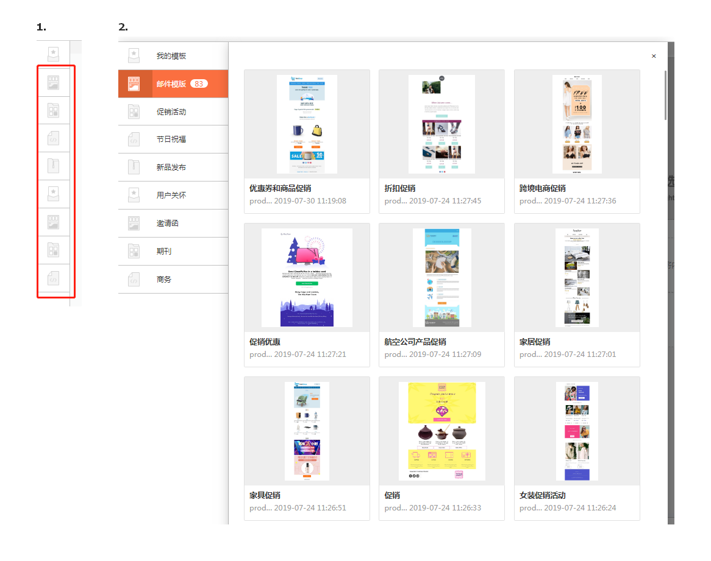
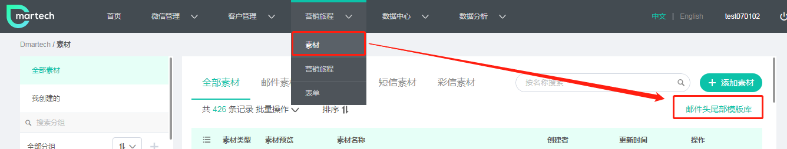
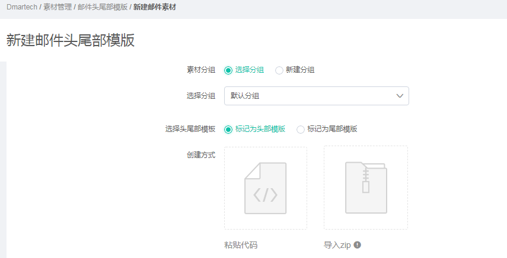
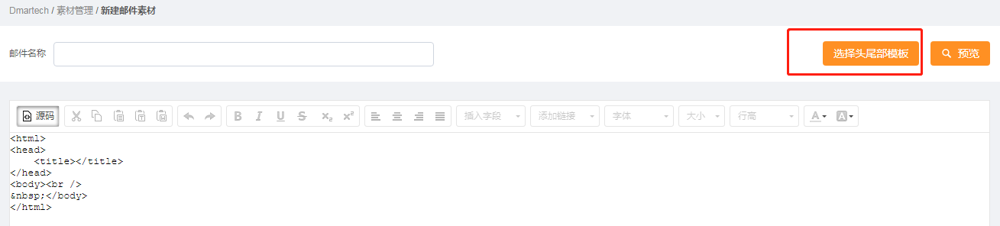
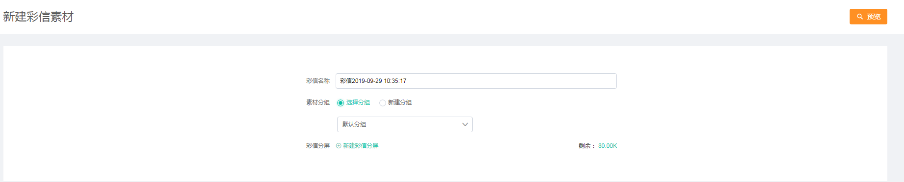
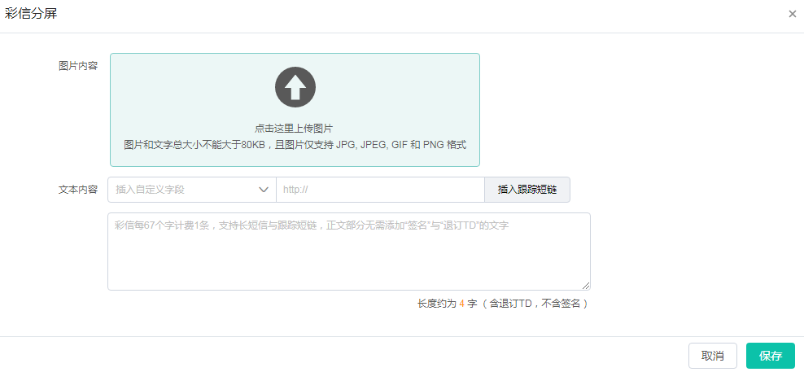

# 素材

### 邮件素材

邮件素材的创建有三种方式：拖拽式设计、粘贴代码、导入zip。

【拖拽式设计】

Dmartech提供了便捷强大的拖拽式邮件编辑器，依次点击“营销旅程”-&gt;素材-&gt;添加素材-&gt;邮件-&gt;拖拽式设计，即可开始一封邮件素材的编辑。

页面顶部可编辑邮件名称，左侧为显示区，右侧为编辑区。

1）在编辑一封邮件素材时，首先根据整体的布局设计选择所需要的区块，从右侧的编辑区拖拽至左侧显示区，Dmartech提供了四种区块类型，分别划分为1、2、3、4个区块。区块拖拽至左侧显示区时，点击即可在右侧编辑区编辑区块相关设置，区块比例、宽度、背景、边框、内外间隔等。

2）区块设置完毕，可点击“全局设置”设置进行全局宽度、背景、字体、图片外间隔等设置，特别说明，开启图片外间隔“统一设置”后，邮件素材中所有图片外间隔都默认为这里设置的数值，也可单独设置每个图片的外间隔。

3）接下来就可以向区块中编辑内容了，Dmartech邮件编辑器提供了6中内容元素：文本、图片、图文、按钮、分隔线、目录。按照实际需求，将需要的元素拖拽至显示区，同样的，点击进行内容编辑和风格设置。其中，文本支持插入自定义字段，实现个性化显示。

4）邮件编辑完成后，可进行持预览和测试。

邮件模板：

除了使用拖拽式外，平台内还预置了大量邮件模板，可直接使用且二次加工。

在拖拽栏左侧选中模块，点击后展示所有邮件模板，选中直接使用即可。

【粘贴代码】

依次点击“营销旅程”-&gt;素材-&gt;添加素材-&gt;邮件-&gt;粘贴代码，将代码粘贴至编辑框，填写邮件名称，点击“完成”即可。

【导入zip】

依次点击“营销旅程”-&gt;素材-&gt;添加素材-&gt;邮件-&gt;导入zip，上传本地邮件素材压缩包即可。压缩包应遵守以下规则：

1）压缩包内需包含一个html文件以及一个图片文件夹，图片文件夹名称必须为images

2）图片文件的名称必须为英文，不包含汉字或特殊符号

**注：如果成功上传zip文件后邮件中部分图片未显示，请检查图片后缀与html图片后缀大小写是否一致，若不一致，可能会导致图片无法显示。**

### 邮件头尾模板

通过“素材”模块找到“邮件头尾模板库”进入

通过“添加模板”进入邮件头尾模板创建入口：

目前仅可通过“粘贴代码”和“导入zip”两种方式上传头尾模板

**在邮件正文中插入头尾的方式：**

拖拽式编辑器邮件中，通过全局设置“邮件头部”和“邮件尾部”插入：

粘贴代码和导入zip插入方式：

### 短信素材

依次点击“营销旅程”-&gt;素材-&gt;添加素材-&gt;短信，即可进入短信素材编辑界面。输入短信名称，短信内容编辑时可插入自定义字段和跟踪锻炼。

**注：短信字数计数含退订TD，不含签名。插入自定义字段后，字数可能与实际发送的字数存在差异。**

### 彩信素材

依次点击“营销旅程”-&gt;素材-&gt;添加素材-&gt;彩信，即可进入彩信素材编辑界面。输入彩信名称，点击“新建彩信分屏”来创建。

内容分为俩大类：图片和文字。

图片：图片仅支持JPG、JPEG、GIF和PNG四种格式

文字内容：彩信内容编辑时可插入自定义字段和跟踪锻炼。

注意：文字+图片总大小不能超过80KB。

