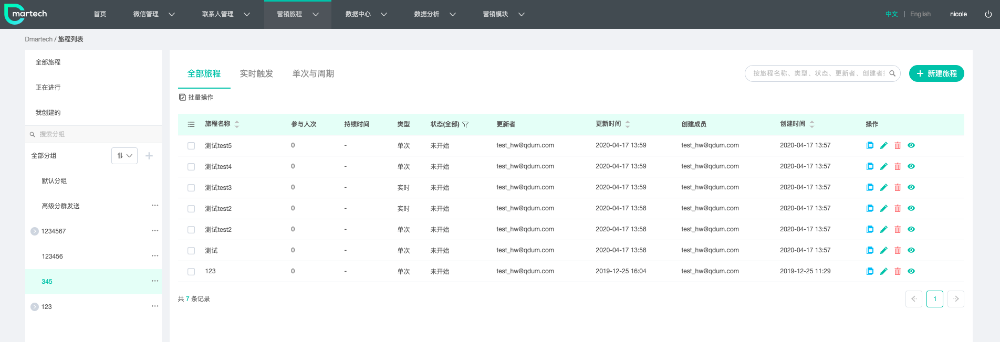
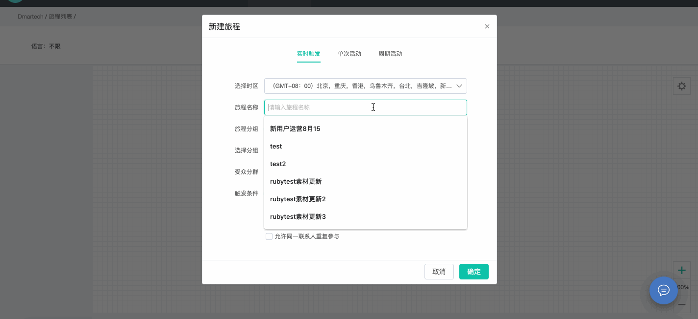
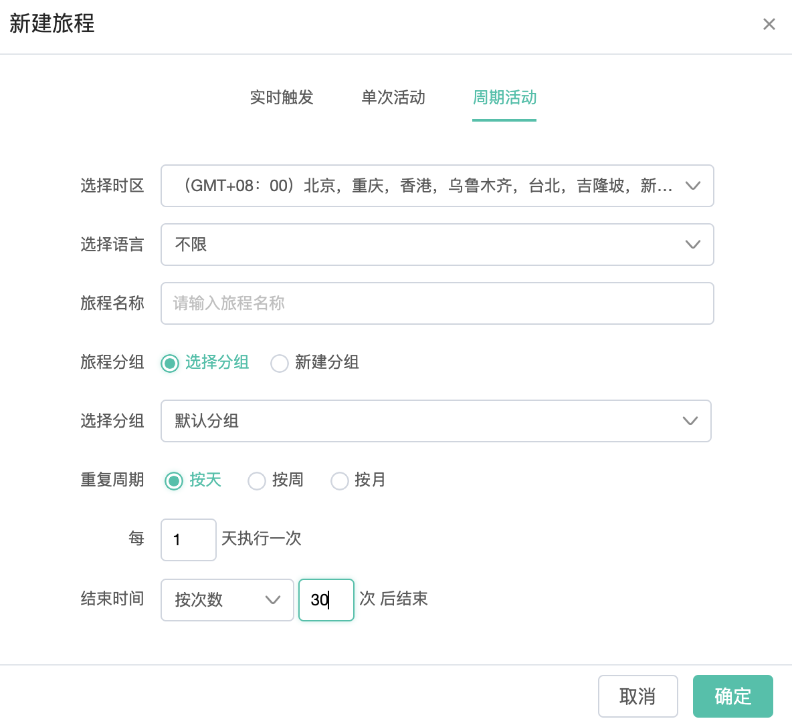
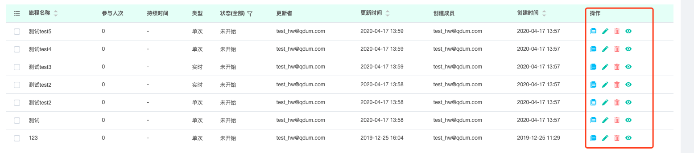
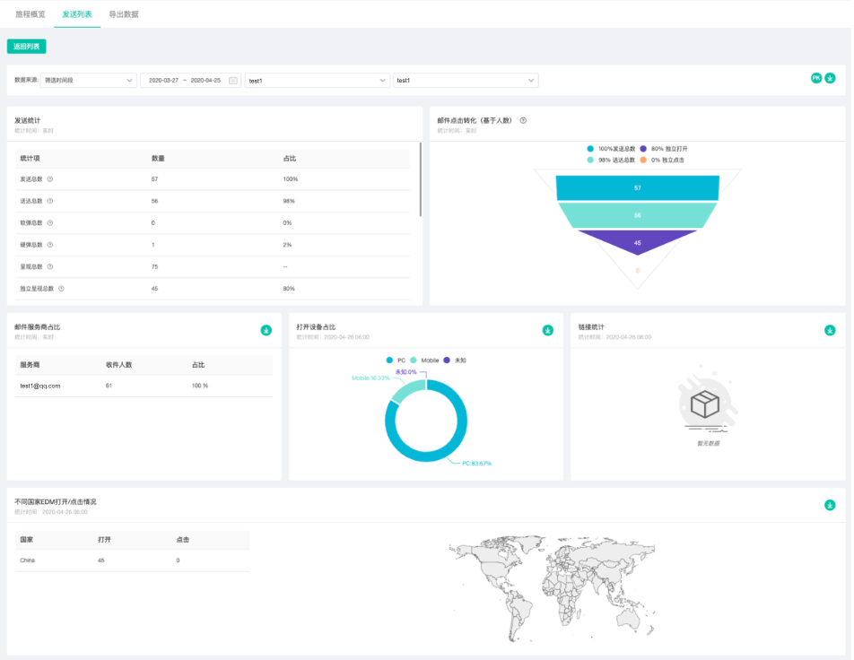
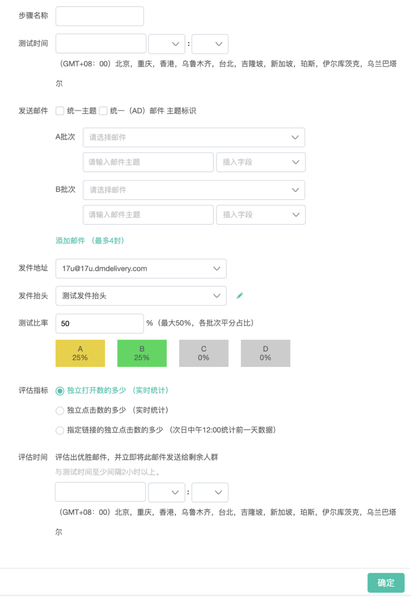

# 营销旅程

## **系统兼容性要求**

使用营销旅程拖拽旅程编辑器一般需要满足以下条件： 

* Windows7或更高版本，Chrome、QQ浏览器及高版本IE浏览器
* MacOS10.13.1或更高版本，Chrome与Safari浏览器

## **创建旅程**

是时候创建你的第一个营销旅程了！通过顶部导航栏中的【营销旅程】，进入营销旅程列表页，点击右上角【新建旅程】，可以看到有三种营销旅程类型：实时触发、单次活动、周期活动。

### 实时旅程

实时旅程的特殊性在于其开始条件，是受众分群中触发指定条件的联系人方可进入旅程，未触发指定条件的，即使是受众分群中的联系人也不会进入旅程。由于每个人触指条件的时间不同，每个进入旅程的联系人在旅程中的进度也是不同的。**即实时旅程是由用户行为触发的，实时驱动的自动流程。**

#### **第一步：旅程触发设置**

需要填写与设置以下内容：

1）选择时区：国内用户默认北京时间，若需更改，可在“个人设置”页面更改默认时区

2）旅程名称：用于管理和识别旅程

3）旅程分组：旅程可分组管理，当创建的旅程较多时，方便清晰的管理，在旅程列表可看到旅程分组

4）受众分群：设置旅程适用的人群，选择某个联系人分群

5）触发条件：“当会员触发事件时”，表示在旅程开始后，受众分群中的联系人有完成指定行为的将进入旅程；“当会员属性变更时”，表示在旅程开始后，受众分群中的联系人在平台中的标签或用户属性发生指定的变更后将进入旅程

会员触发事件

* 微信事件：关注公众号、取消关注公众号、点击公众号菜单、向公众号发消息、扫描带参二维码；
* 表单事件：打开表单、提交表单
* 自定义事件：下单、发货等

会员属性变更

* 标签变更
* 属性变更

6）允许同一联系人重复参与：若勾选，则同一个联系人只要触发指定事件，就可多次进入旅程，反之，则只会进入一次

#### **第二步：绘制旅程**

旅程开始设置完成后进入拖拽式绘制界面，将左侧控件按活动顺序拖拽至右侧画布区，依照流程连接各控件。

#### **第三步：设置各控件详情**

设置各控件的具体信息，比如素材控件需要设发送事件、主题等内容，需要注意的是，各素材发送的时间需要自洽，如果有事件判断控件，还因考虑事件判断所需要的时间。事件判断控件需要设置所要判断的事件条件，具体见下方“控件详情”

#### **第四步：测试和开始**

旅程绘制完成后，即可开始旅程。一般来说，建议先选择一个测试分群对旅程进行测试，确保能够顺利运行后，再正式开始，避免旅程执行出现问题对正式客户造成骚扰或无法触达。

#### **第五步：查看报告**

实时旅程开始后，进入旅程可查看正在进行的实时旅程每个阶段进入的联系人和发送情况等。也可以直接在旅程列表中点击报告图标查看任务发送详情。

以上便是创建一个完整的实时旅程的步骤，下面介绍一下关于实时旅程的“操作控件”与“状态“相关内容。

**实时旅程操作控件**

实时旅程的操作控件有：添加标签、移除标签、事件判断、属性判断、标签判断、结束

【添加标签】进入该控件的联系人会被打上控件所设置的标签

【移除标签】进入该控件的联系人会被移除控件所设置的标签

【事件判断】可根据以下事件设置判断条件：

* 邮件事件：送达邮件、打开邮件
* 微信事件：关注公众号、取消关注、点击公众号菜单、向公众号发消息、扫描带参二维码
* 邮件事件 ：送达邮件、打开邮件、点击链接
* 短/彩信事件：发送短信、点击短链
* 表单事件：打开表单、提交表单
* 标签事件：新增标签、移除标签
* 属性变化事件：任意属性值产生变更

【属性判断】可按照联系人属性和行为事件结合设置判断条件

【标签判断】判断联系人包含或者不包含某标签

【结束】该控无需手动添加，其他条件设置完毕，旅程开始后会自动给每个分支添加结束控件

**实时旅程的几种状态**

【草稿】旅程可以进行编辑，旅程内所设置的事件驱动机制不会生效启用，客户无法进入草稿旅程；

【测试中】测试中的旅程，在旅程画布中的相关控件上显示的概要数据，不会生成报告，同时测试统计的临时数据会在正式开始前或下一次测试前清空；

【测试结束】结束测试，允许查看测试概要数据；

【进行中】旅程无法进行编辑，启用旅程内所设置的事件驱动机制，允许客户进入流程；

【暂停】临时暂停目前旅程所有节点，暂停后旅程不可编辑，已进入旅程的客户停留在当前步骤；

注：实时旅程可通过旅程列表中的复制按钮进行复制，生成以“旅程名称\_复制”命名的新旅程。

#### 实时旅程的特点

**1）1对1：以单个用户为核心**

* 旅程由用户互动事件或会员属性实时触发，根据营销路径与条件判断自动完成一对一的推送沟通，绝不会对非目标用户造成任何骚扰，用户体验良好
* 每个用户的旅程进度都是相互独立的
* 实时旅程包含更加丰富的判断与操作控件，应用场景更加丰富

**2）多触点：连接每个互动**

* 将表单及二维码集成在线上线下营销场景的不同接触点中，监控用户的互动行为，并据此推送特定内容

**3）实时：事件实时回收**

* 实时回收事件，根据事件判断、触发后续旅程，让用户行为得到及时的反馈

**4）整合：渠道数据整合**

* 打通线上粉丝与线下会员         
* 构建标签体系完善用户画像

### 单次旅程

了解了实时旅程之后，单次旅程就比较简单了，单次旅程主要的使用场景一般是一次性的营销活动，只针对既定的目标受众进行多渠道推送，当然也可设置条件分支与判断。单次活动中所有受众联系人同时进入旅程，这点与实时旅程不同，创建步骤与实时旅程相似。

新建单次旅程时，无需设置触发条件，仅设置基本旅程信息即可进入旅程绘制，首先需要在左侧“目标受众”选择联系人分群或公众号拖拽至右侧画布中作为旅程路径的第一步。后续绘制及开启过程与实时旅程相似，不赘述。

#### **【单次旅程操作控件】**

单次旅程的操作控件有：条件分支、随即分支、A/B测试

【条件分支】根据“联系人属性“、”行为事件“、”互动“设置条件关系

【随即分支】随机按比例发推送给联系人

【A/B test】可设置4组测试邮件进行A/B测试，评估指标可灵活设置，根据独立打开数、独立点击数、指定链接独立点击数等，评估出最优邮件后，将其发给剩余人数。后文将详细介绍。

### 周期旅程

周期活动相当于单次活动的周期性运行，重复周期可按天、按周、按月。一般适用于会员日营销、定期newsletter发送等营销场景，创建步骤与单次旅程相似，不同之处在于需设置旅程重复周期，可使用控件也与单次旅程相同，不赘述。

## 旅程可用控件

### 实时旅程可用控件

| **控件类型** | **控件名称** | **控件说明** |
| :--- | :--- | :--- |
| 素材控件 | 邮件 | 创建邮件推送任务 |
| 素材控件 | 短信 | 创建短信推送任务 |
| 素材控件 | 彩信 | 创建彩信推送任务 |
| 素材控件      | 客服消息      | 创建微信客服消息推送任务（推送目标仅限48小时内与公众号有过互动的粉丝） |
| 素材控件     | 模板消息 | 创建微信模板消息推送任务 |
| 操作控件 | 添加标签 | 给联系人添加标签 |
| 操作控件 | 移除标签 | 移除联系人标签 |
| 流程控制 | 事件判断 | 根据不同事件将用户细分 |
| 流程控制 | 属性判断 | 根据不同属性将用户细分 |
| 流程控制 | 标签判断 | 判断是否包含或不包含某标签 |
| 操作控件 | 结束 | 代表旅程绘制结束 |

### 单次旅程与周期旅程可用控件

| **控件类型** | **控件名称** | **控件说明** |
| :--- | :--- | :--- |
| 目标受众                 | 目标受众 | 选择用户分群中的群组作为目标受众群体加入本次旅程 |
| 素材控件 | 邮件 | 创建邮件推送任务 |
| 素材控件 | 短信 | 创建短信推送任务 |
| 素材控件 | 彩信 | 创建彩信推送任务 |
| 素材控件 | 图文群发 | 创建微信图文消息推送任务 |
| 素材控件 | 客服消息 | 创建微信客服消息推送任务（推送目标仅限48小时内与公众号有过互动的粉丝） |
| 素材控件 | 模板消息 | 创建微信模板消息推送任务 |
| 流程控制 | 条件分支       | 根据联系人属性和行为事件将受众人群细分 |
| 流程控制 | 随机分支 | 将受众人群随机划分为两个不同的群体进行发送 |
| 流程控制 | A/B测试 | 评估多封邮件的发送效果 |

## 错误提示

| **错误提示** | **错误说明** |
| :--- | :--- |
| 没有选择任何控件 | 旅程内容为空 |
| 受众来源没有输出源 | 受众来源在流程中缺少下一步 |
| AB测试没有输入源或输出源 | AB测试控件在流程中缺少上一步或下一步 |
| 条件分支没有输入源或输出源 | 条件控件在流程中缺少上一步或下一步 |
| 任务控件没有输入源 | 发送任务在流程中缺少上一步 |
| 旅程不能有两条线 | 旅程只能包含1个流程，不能包含复数个相互独立的流程 |
| 旅程构建失败 | 服务器未响应，需要联系技术服务人员 |
| 请选择任务时间 | 任务发送时间未设置 |
| 任务时间距离当前时间必须间隔3分钟 | 第一个任务的发送时间需要与当前时间间隔3分钟以上 |
| 请选择素材 | 任务未添加发送素材 |
| 请输入发件人 | 邮件任务没有输入发件人 |
| 请选择发送地址 | 邮件任务没有选择发送地址 |
| 请输入邮件主题 | 邮件任务没有输入邮件主题 |
| 请选择发送配置 | 短信任务没有选择签名 |
| 微信任务受众来源必须有微信公众号 | 没有选择公众号 |
| 条件分支选中任务已被删除 | 条件中所选择的任务已经被删除 |
| 当前任务时间必须在前置任务时间之后 | 下一步任务的发送时间不能早于上一步任务的发送时间 |
| 条件分支中有互动类型，任务时间需间隔一天 | 根据上一步任务的反馈行为作为触发条件，下一步任务发送时间必须与其间隔1天。 |
| 任务条件不能超过10个条件分支 | 基于目前效能，旅程暂时不能添加超过10个以上的条件分支控件。 |
| 任务一条分支只能有一个ABTest | 旅程中的任意一条分支只能添加1个ABTest控件 |

## 旅程操作

Dmaretech支持分组管理旅程，在旅程列表中可对旅程执行一些操作。

【蓝色按钮-复制】可复制已有的旅程

【绿色铅笔-编辑】可编辑旅程内部的控件配置

【红色按钮-删除】可删除旅程

【绿色眼睛-查看】可查看旅程控件配置的内容

只有已开始的旅程（包含进行中、暂停、取消、已完成等四种状态的旅程）才会产生报告，未开始旅程、测试旅程没有报告。 有两种方式进入报告：

1）在旅程列表中点击单条旅程记录对应的操作栏处的报告图标 

2）进入旅程详情，点击功能区报告图标 

目前我们提供了以下报告： 1）多个旅程汇总/对比报告 2）单个旅程汇总报告 3）单个渠道发送报告（邮件/短信/微信）

## 定时旅程与周期旅程的A/B test

A/B test顾名思义，就是用户比较多封邮件的效果，确定最优方案，将效果最好的邮件发送给剩余客户。定时旅程和周期旅程中可以进行A/B测试。 

A/B测试控件设置：

 1）步骤名称：填写名称，仅起到备注作用； 

2）测试时间：在此时段内会进行A/B测试，发送多封测试邮件测试；

3）发送邮件：统一主题和统一（AB）邮件主键标识：选中则多封测试邮件共用A批次邮件的主题和主键标识，不选择代表不同的邮件使用不同的主题和标识； A批次、B批次：最多添加4个批次，每个批次代表一封测试邮件；

4）发送抬头：发送多封邮件的抬头，多封测试邮件共用此抬头；

5）发送地址 ：发送邮件的地址，多封测试邮件共用此地址；

6）测试比率：“分群内的总人数\*填写的比率”最终计算的人数，成为测试人群，这些测试人群按照测试邮件封数平分，不同用户收到对应的测试邮件（剩余无法平分的人群都按照A批次发送）； 

7）评估指标：选择某一个评估指标作为判断不同测试邮件的优劣，根据评估指标的结果，将最优的邮件发送给剩余人群；

8）评估时间：发送最优邮件的时间；若评估指标选择的是对打开数的多少或独立点击数的多少，则评估时间要大于测试时间两小时以上； 若评估指标选择的是指定链接的独立点击数的多少，则评估时间必须是测试时间的隔天。

## 旅程审批

当在“企业设置”—“系统设置”中开启了旅程审批，则所有的旅程都可以走审批流程。

 1）【申请人视角】 

创建好旅程后，点击右上角“申请审批”选择审批人提交审批，提交后的审批状态变为“待审批”，在被审批之前可“撤回” 。可在旅程分组“我申请的“查看审批情况。

2）【审批人视角】

 在旅程分组“待我审批的”可查看待审批旅程，点击“审批”有三种处理方式：同意申请、退回申请（可填写退回理由）、转交他人（选择转交的账户名） 注：若“同意申请”，旅程将直接开始，状态变为“进行中”。

## 定时旅程和周期旅程的语言设置

定时旅程和周期旅程，支持选择语言范围：不限、中文和其他三种类型。 

系统内置了国家（country）属性，当用户该属性字段值为“China”或“中国”时，旅程语言选择不限或者中文，用户可以进入旅程；当旅程语言选择其他，仅作用于字段值非“中国”或“China”，不符合规则时，旅程会提示报错。

注：不需要指定语言的客户，按照默认的选择“不限“即可。

