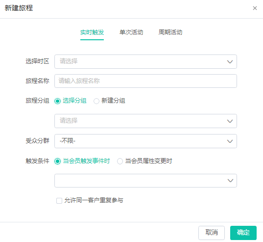
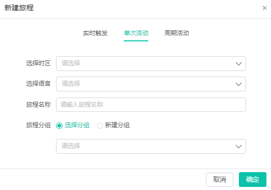
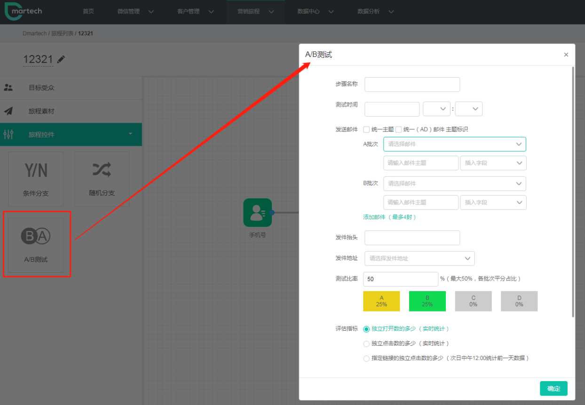
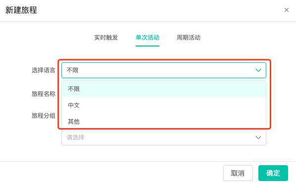

# 营销旅程

### 营销旅程特征

**1对1：以单个用户为核心**

1）每个用户的旅程进度都是相互独立的

2）旅程由用户互动事件实时按需触发，根据旅程计划流程自动完成一对一的推送沟通，绝不会对非目标用户造成任何骚扰，体验更好 

3）实时旅程包含全新的事件判断与流程操作组件，应用场景更加丰富

**多触点：连接每个互动**

1）将表单及二维码集成在线上线下营销场景的不同接触点中，监控用户的互动行为，并据此推送特定内容

**实时：事件实时回收**

1**）**微信互动事件 2）邮件打开事件 3）短信点击短链事件 4）用户属性更新事件

**整合：渠道数据整合**

1）打通线上粉丝与线下会员         2）构建标签体系完善用户画像

### 操作指南

**系统兼容性要求**

使用拖拽旅程编辑器需要满足以下条件： 

1）需要Windows7或更高版本，Chrome、QQ浏览器及高版本IE浏览器

2）需要MacOS10.13.1或更高版本，Chrome与Safari

是时候创建你的第一个营销旅程了！通过顶部导航栏中的营销旅程，进入营销旅程列表页，点击右上角【新建旅程】，可以看到有三种旅程类型：实时触发、单次活动、周期活动。

在Dmartech创建自动化营销旅程共分三个步骤：

步骤一：根据你所策划的活动流程，将控件区中相对应的控件拖入画布区，并依照流程步骤依次连结即可。

步骤二：按活动需求，设置控件内容。内容设置项可参见此处说明【营销旅程可使用控件】。

步骤三：点击【开始】，系统会自动检测你所设置的旅程是否正确，只有通过检测才可正式开始。

下面我们来了解一下三种类型的营销旅程：

1）实时触发旅程

实时旅程是由客户事件触发为开始条件，并由客户触发事件实时驱动的自动流程。创建实时旅程时，触发实时旅程开始条件时间的客户自动实时进入旅程，未触发的客户不会进入实时旅程，同时每一个进入旅程的客户因为事件触发的时间不同，旅程进度也会不同，客户事件分为会员触发事件和会员属性变更两类。

会员触发事件：

微信事件：关注公众号、取消关注公众号、点击公众号菜单、向公众号发消息、扫描带参二维码；

表单事件：打开表单、提交表单

自定义事件：下单、发货等

会员属性变更：标签变更、属性变更

实时旅程开始条件需设置时区、旅程名称、受众分群、触发条件、是否允许统一客户重复参与等。

注意：选中时区后，此旅程内需要选择的时间都是该时区下的。

旅程开始，将左侧控件按活动顺序拖拽至右侧画布区，依照流程连接各控件，并设置控件内容。

旅程绘制完成后，即可开始旅程。可以先测试再正式开始旅程，也可直接开始。

查看正在进行的实时旅程，可看到旅程概要，包含里程碑、触达情况、发送情况、其他情况等。 可查看每个旅程步骤参与人数明细。

实时旅程的几种状态：

草稿：旅程可以进行编辑，旅程内所设置的事件驱动机制不会生效启用，客户无法进入草稿旅程；

测试中：测试中的旅程，在旅程画布中的相关控件上显示的概要数据，不会生成报告，同时测试统计的临时数据会在正式开始前或下一次测试前清空；

测试结束：结束测试，允许查看测试概要数据；

进行中：旅程无法进行编辑，启用旅程内所设置的事件驱动机制，允许客户进入流程；

暂停：临时暂停目前旅程所有节点，暂停后旅程不可编辑，已进入旅程的客户停留在当前步骤；

注：实时旅程可通过旅程列表中的复制按钮进行复制，生成以“旅程名称\_复制”命名的新旅程。

1）单次活动旅程

单次活动只针对既定的目标受众进行多渠道推送，可设置条件分支。单次活动中所有进入旅程的用户进度是相同的，这点与实时旅程不同，绘制与运行流程和实时旅程相似。

3）周期活动旅程 周期活动相当于单次活动的周期性运行，重复周期可按天、按周、按月。绘制与运行流程和实时旅程相似。

1）实时旅程可用控件

| **控件类型** | **控件名称** | **控件说明** |
| :--- | :--- | :--- |
| 多渠推送 | 邮件 | 创建邮件推送任务 |
| 短信 | 创建短信推送任务 |  |
| 客服消息 | 创建微信客服消息推送任务（推送目标仅限48小时内与公众号有过互动的粉丝） |  |
| 模板消息 | 创建微信模板消息推送任务 |  |
| 操作流程 | 增加标签 | 添加会员标签 |
| 移除标签 | 移除会员标签 |  |
| 流程控制 | 事件判断 | 根据不同事件将用户细分 |
| 属性判断 | 根据不同属性将用户细分 |  |
| 标签判断 | 判断是否包含或不包含某标签 |  |
| 结束 | 代表旅程绘制结束 |  |

2）单次旅程与周期旅程可用控件

| **控件类型** | **控件名称** | **控件说明** |
| :--- | :--- | :--- |
| 目标受众 | 目标受众 | 选择用户分群中的群组作为目标受众群体加入本次旅程 |
| 多渠道推送 | 邮件 | 创建邮件推送任务 |
| 短信 | 创建短信推送任务 |  |
| 图文群发 | 创建微信图文消息推送任务 |  |
| 客服消息 | 创建微信客服消息推送任务（推送目标仅限48小时内与公众号有过互动的粉丝） |  |
| 模板消息 | 创建微信模板消息推送任务 |  |
| 流程控制 | 条件分支 | 根据条件判断将受众人群分支 |
| 随机分支 | 将受众人群随机划分为两个不同的群体进行发送 |  |

| **错误提示** | **错误说明** |
| :--- | :--- |
| 没有选择任何控件 | 旅程内容为空 |
| 受众来源没有输出源 | 受众来源在流程中缺少下一步 |
| AB测试没有输入源或输出源 | AB测试控件在流程中缺少上一步或下一步 |
| 条件分支没有输入源或输出源 | 条件控件在流程中缺少上一步或下一步 |
| 任务控件没有输入源 | 发送任务在流程中缺少上一步 |
| 旅程不能有两条线 | 旅程只能包含1个流程，不能包含复数个相互独立的流程 |
| 旅程构建失败 | 服务器未响应，需要联系技术服务人员 |
| 请选择任务时间 | 任务发送时间未设置 |
| 任务时间距离当前时间必须间隔3分钟 | 第一个任务的发送时间需要与当前时间间隔3分钟以上 |
| 请选择素材 | 任务未添加发送素材 |
| 请输入发件人 | 邮件任务没有输入发件人 |
| 请选择发送地址 | 邮件任务没有选择发送地址 |
| 请输入邮件主题 | 邮件任务没有输入邮件主题 |
| 请选择发送配置 | 短信任务没有选择签名 |
| 微信任务受众来源必须有微信公众号 | 没有选择公众号 |
| 条件分支选中任务已被删除 | 条件中所选择的任务已经被删除 |
| 当前任务时间必须在前置任务时间之后 | 下一步任务的发送时间不能早于上一步任务的发送时间 |
| 条件分支中有互动类型，任务时间需间隔一天 | 根据上一步任务的反馈行为作为触发条件，下一步任务发送时间必须与其间隔1天。 |
| 任务条件不能超过10个条件分支 | 基于目前效能，旅程暂时不能添加超过10个以上的条件分支控件。 |
| 任务一条分支只能有一个ABTest | 旅程中的任意一条分支只能添加1个ABTest控件 |

只有已开始的旅程（包含进行中、暂停、取消、已完成等四种状态的旅程）才会产生报告，未开始旅程、测试旅程没有报告。 有两种方式进入报告：

1）在旅程列表中点击单条旅程记录对应的操作栏处的报告图标 

2）进入旅程详情，点击功能区报告图标 

目前我们提供了以下报告： 1）多个旅程汇总/对比报告 2）单个旅程汇总报告 3）单个渠道发送报告（邮件/短信/微信）

## 定时旅程与周期旅程的A/B test

A/B test顾名思义，就是用户比较多封邮件的效果，确定最优方案，将效果最好的邮件发送给剩余客户。定时旅程和周期旅程中可以进行A/B测试。 

A/B测试控件设置：

 1）步骤名称：填写名称，仅起到备注作用； 

2）测试时间：在此时段内会进行A/B测试，发送多封测试邮件测试；

3）发送邮件：统一主题和统一（AB）邮件主键标识：选中则多封测试邮件共用A批次邮件的主题和主键标识，不选择代表不同的邮件使用不同的主题和标识； A批次、B批次：最多添加4个批次，每个批次代表一封测试邮件；

4）发送抬头：发送多封邮件的抬头，多封测试邮件共用此抬头；

5）发送地址 ：发送邮件的地址，多封测试邮件共用此地址；

6）测试比率：“分群内的总人数\*填写的比率”最终计算的人数，成为测试人群，这些测试人群按照测试邮件封数平分，不同用户收到对应的测试邮件（剩余无法平分的人群都按照A批次发送）； 

7）评估指标：选择某一个评估指标作为判断不同测试邮件的优劣，根据评估指标的结果，将最优的邮件发送给剩余人群；

8）评估时间：发送最优邮件的时间；若评估指标选择的是对打开数的多少或独立点击数的多少，则评估时间要大于测试时间两小时以上； 若评估指标选择的是指定链接的独立点击数的多少，则评估时间必须是测试时间的隔天。

## 旅程审批

当在“企业设置”—“系统设置”中开启了旅程审批，则所有的旅程都可以走审批流程。

 1）【申请人视角】 

创建好旅程后，点击右上角“申请审批”选择审批人提交审批，提交后的审批状态变为“待审批”，在被审批之前可“撤回” 。可在旅程分组“我申请的“查看审批情况。

2）【审批人视角】

 在旅程分组“待我审批的”可查看待审批旅程，点击“审批”有三种处理方式：同意申请、退回申请（可填写退回理由）、转交他人（选择转交的账户名） 注：若“同意申请”，旅程将直接开始，状态变为“进行中”。

## 定时旅程和周期旅程的语言设置

定时旅程和周期旅程，支持选择语言范围：不限、中文和其他三种类型。 

系统内置了国家（country）属性，当用户该属性字段值为“China”或“中国”时，旅程语言选择不限或者中文，用户可以进入旅程；当旅程语言选择其他，仅作用于字段值非“中国”或“China”，不符合规则时，旅程会提示报错。

注：不需要指定语言的客户，按照默认的选择“不限“即可。

